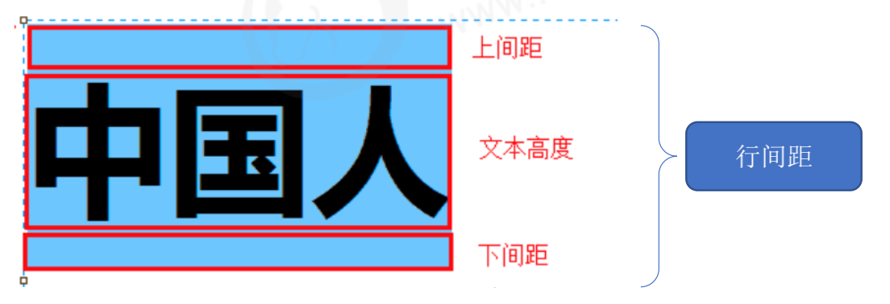
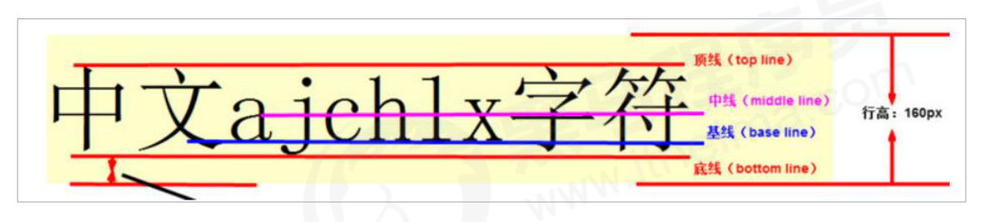

## css文本属性

color / font / text-decoration / text-align / vertical-align / white- space / break-word

### css 文本属性

如文本的颜色、对齐文本、装饰文本、文本缩进、行间距

```css
/* 文本的颜色 */
color: #fff;
/*  对齐文本 */
text-align: center|left|right;
/*  装饰文本 */
text-decoration：none|underline； 
/* 文本缩进 */
text-indent: 2em;
/* 行间距 */
line-height: 26px;
```



### CSS 字体属性

#### 字体系列

CSS 使用 font-family 属性定义文本的字体系列。

```css
p { font-family:"微软雅黑";} 

div {font-family: Arial,"Microsoft Yahei", "微软雅黑";}
```

1. 各种字体之间必须使用英文状态下的逗号隔开
2. 一般情况下,如果有空格隔开的多个单词组成的字体,加引号. 
3. 尽量使用系统默认自带字体，保证在任何用户的浏览器中都能正确显示
4. 最常见的几个字体：body {font-family: 'Microsoft YaHei',tahoma,arial,'Hiragino Sans GB'; }

#### 字体大小

CSS 使用 font-size 属性定义字体大小。

```css
font-size: 20px; 
```

1. px（像素）大小是我们网页的最常用的单位
2. 谷歌浏览器默认的文字大小为16px
3. 不同浏览器可能默认显示的字号大小不一致，我们尽量给一个明确值大小，不要默认大小
4. 可以给 body 指定整个页面文字的大小

#### 字体粗细

CSS 使用 font-weight 属性设置文本字体的粗细。

```css
/* 
bold 700
normal 400
*/
font-weight: bold;
font-weight: 700;
font-weight: normal;
font-weight: 400;
```

1. 学会让加粗标签（比如 h 和 strong 等) 不加粗，或者其他标签加粗 
2. 实际开发时，我们更喜欢用数字表示粗细

####  文字样式

CSS 使用 font-style 属性设置文本的风格。

```css
font-style: normal;
/* 斜体 */
font-style: italic;
```

**注意：** 平时我们很少给文字加斜体，反而要给斜体标签（em，i）改为不倾斜字体。

#### 字体属性复合写法

字体系列、大小、粗细、和文字样式(复合写法从右到左)

```css
body { 
	font: font-style font-weight font-size/line-height font-family; 
}
```

### 文字阴影

```css
text-shadow: h-shadow v-shadow blur color;
```

| 值       | 描述                           |
| -------- | ------------------------------ |
| h-shadow | 必须，水平阴影的位置，允许负值 |
| v-shadow | 必须，垂直阴影的位置，允许负值 |
| blur     | 可选，模糊距离                 |
| spread   | 可选，阴影尺寸                 |
| color    | 可选，阴影的颜色               |

###  vertical-align 属性应用

CSS 的 vertical-align 属性使用场景： 经常用于设置图片或者表单(行内块元素）和文字垂直对齐。

官方解释： 用于设置一个元素的垂直对齐方式，**但是它只针对于行内元素或者行内块元素有效。**

```css
vertical-align : baseline | top | middle | bottom
```



图片、表单都属于行内块元素，默认的 vertical-align 是基线对齐。

此时可以给图片、表单这些行内块元素的 vertical-align 属性设置为 middle 就可以让文字和图片垂直

居中对齐了。

#### 解决图片底部默认空白缝隙问题

bug：图片底侧会有一个空白缝隙，原因是行内块元素会和文字的基线对齐。

主要解决方法有两种：

1. 给图片添加 vertical-align:middle | top| bottom 等。 （提倡使用的）

2. 把图片转换为块级元素 display: block;

###  溢出的文字省略号显示

**单行文本溢出显示省略号--必须满足三个条件**

```css
/*1. 先强制一行内显示文本*/
white-space: nowrap; （ 默认 normal 自动换行）
/*2. 超出的部分隐藏*/
overflow: hidden;
/*3. 文字用省略号替代超出的部分*/
text-overflow: ellipsis;
```

**多行文本溢出显示省略号**

多行文本溢出显示省略号，有较大兼容性问题， 适合于webKit浏览器或移动端（移动端大部分是webkit内

核）

```css
overflow: hidden;
text-overflow: ellipsis;
/* 弹性伸缩盒子模型显示 */
display: -webkit-box;
/* 限制在一个块元素显示的文本的行数 */
-webkit-line-clamp: 2;
/* 设置或检索伸缩盒对象的子元素的排列方式 */
-webkit-box-orient: vertical;
```

