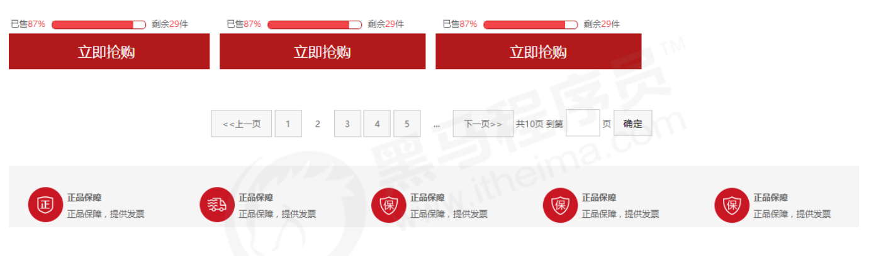

### 精灵图

#### 为什么需要精灵图

一个网页中往往会应用很多小的背景图像作为修饰，当网页中的图像过多时，服务器就会频繁地接收和发送

请求图片，造成服务器请求压力过大，这将大大降低页面的加载速度。

因此，**为了有效地减少服务器接收和发送请求的次数，提高页面的加载速度，**出现了 CSS 精灵技术（也称

CSS Sprites、CSS 雪碧）。

核心原理：将网页中的一些小背景图像整合到一张大图中 ，这样服务器只需要一次请求就可以了。

#### 使用精灵图核心：

1. 精灵技术主要针对于背景图片使用。就是把多个小背景图片整合到一张大图片中。

2. 这个大图片也称为 sprites 精灵图 或者 雪碧图

3. 移动背景图片位置， 此时可以使用 background-position 。

4. 移动的距离就是这个目标图片的 x 和 y 坐标。注意网页中的坐标有所不同

5. 因为一般情况下都是往上往左移动，所以数值是负值。

6. 使用精灵图的时候需要精确测量，每个小背景图片的大小和位置。


### 字体图标

字体图标使用场景： 主要用于显示网页中通用、常用的一些小图标。

字体图标 iconfont为前端工程师提供一种方便高效的图标使用方式，展示的是图标，本质属于字体。

####  字体图标的优点

1. 轻量级：一个图标字体要比一系列的图像要小。一旦字体加载了，图标就会马上渲染出来，减少了服务器请求
2. 灵活性：本质其实是文字，可以很随意的改变颜色、产生阴影、透明效果、旋转等 
3. 兼容性：几乎支持所有的浏览器，请放心使用

注意： 字体图标不能替代精灵技术，只是对工作中图标部分技术的提升和优化。

**总结：**

1. 如果遇到一些结构和样式比较简单的小图标，就用字体图标。

2. 如果遇到一些结构和样式复杂一点的小图片，就用精灵图。

#### 字体图标的使用

字体图标是一些网页常见的小图标，我们直接网上下载即可。 因此使用可以分为：

1. 字体图标的下载

2. 字体图标的引入 （引入到我们html页面中）

3. 字体图标的追加 （以后添加新的小图标）

#### 字体图标的下载

**推荐下载网站：**

 **icomoon 字库** http://icomoon.io 推荐指数 **★★★★★**

IcoMoon 成立于 2011 年，推出了第一个自定义图标字体生成器，它允许用户选择所需要的图标，使它们成

一字型。该字库内容种类繁多，非常全面，唯一的遗憾是国外服务器，打开网速较慢。 

**阿里 iconfont 字库** http://www.iconfont.cn/ 推荐指数 **★★★★★**

这个是阿里妈妈 M2UX 的一个 iconfont 字体图标字库，包含了淘宝图标库和阿里妈妈图标库。可以使用 AI

制作图标上传生成。 重点是，免费！

#### 字体图标的引入

**下载完毕之后，注意原先的文件不要删，后面会用。**

1. 把下载包里面的 fonts 文件夹放入页面根目录下


**字体文件格式**

不同浏览器所支持的字体格式是不一样的，字体图标之所以兼容，就是因为包含了主流浏览器支持的字体文件。

| 字体格式                        | 说明                       | Chrome   | Firefox     | Safari     | IE   | Opera      |
| ------------------------------- | -------------------------- | -------- | ----------- | ---------- | ---- | ---------- |
| TureType(.ttf字体)              | Windows和Mac的最常见的字体 | Chrome4+ | Firefox3.5+ | Safari3+   | IE9+ | Opera10+   |
| Web Open Font Format(.woff字体) |                            | Chrome6+ | Firefox3.5+ | Safari3.6+ | IE9+ | Opera11.1+ |
| Embedded Open Type(.eot字体)    | IE专用字体                 |          |             |            | IE4+ |            |
| SVG(.svg字体)                   | 基于SVG字体渲染的一种格式  | Chrome4+ |             | Safari3.1+ |      |            |

2. 在 CSS 样式中全局声明字体： 简单理解把这些字体文件通过css引入到我们页面中。

```css
@font-face {
	/* 图标字体名称 */
  font-family: 'icomoon';
  /* 一定注意字体文件路径的问题。  */
	/* eot图标字体库 IE专用 */
  src: url('fonts/icomoon.eot?7kkyc2');
  src: url('fonts/icomoon.eot?7kkyc2#iefix') format('embedded-opentype'),
	/* ttf图标字体库 最常见的字体 */
  url('fonts/icomoon.ttf?7kkyc2') format('truetype'),
	/* woff 图标字体库 web开放字体 */
  url('fonts/icomoon.woff?7kkyc2') format('woff'),
	/* svg 图标字体库 */
  url('fonts/icomoon.svg?7kkyc2#icomoon') format('svg');
  
  font-weight: normal;
  font-style: normal;
}


span {
  /*  给标签定义字体 */
	font-family: "icomoon";
}
```


2. html 标签内添加小图标。

```html
<span> </span>
```


#### 字体图标的追加

如果工作中，原来的字体图标不够用了，我们需要添加新的字体图标到原来的字体文件中。

把压缩包里面的 selection.json 从新上传，然后选中自己想要新的图标，从新下载压缩包，并替换原来的文件即可。


### CSS 三角

网页中常见一些三角形，使用 CSS 直接画出来就可以，不必做成图片或者字体图标。

一张图， 你就知道 CSS 三角是怎么来的了, 做法如下：


```css
/* 只有border的一个盒子 */
div {
  width: 0;
  height: 0;
  line-height: 0;
  font-size: 0;
  border: 50px solid transparent;
  border-left-color: pink;
}
```

### CSS 用户界面样式

所谓的界面样式，就是更改一些用户操作样式，以便提高更好的用户体验。

1. 更改用户的鼠标样式
2. 表单轮廓
3. 防止表单域拖拽

#### 更改用户的鼠标样式cursor

```css
/* 鼠标指针的光标形状 */
li {cursor: pointer; }
```

#### 表单轮廓outline

给表单添加 `outline: 0;` 或者 `outline: none;` 样式之后，就可以去掉默认的蓝色边框。

```css
input {outline: none; }
```

#### 防止表单域拖拽resize

实际开发中，我们文本域右下角是不可以拖拽的。

```css
textarea{ resize: none;}
```

### 常见布局技巧

巧妙利用一个技术更快更好的布局

#### 1.margin负值的运用


1.让每个盒子margin 往左侧移动 -1px 正好压住相邻盒子边框

2.鼠标经过某个盒子的时候，提高当前盒子的层级即可（如果没有有定位，则**加相对定位（保留位置）**，如

果有定位，则加z-index）

#### 2.文字围绕浮动元素

巧妙运用浮动元素不会压住文字的特性


#### 3.行内块的巧妙运用

页码在页面中间显示:

1. 把这些链接盒子转换为行内块， 之后给父级指定 text-align:center;

2. 利用行内块元素中间有缝隙，并且给父级添加 text-align:center; 行内块元素会水平会居中



#### 4.CSS三角强化


```css
width: 0;
height: 0;
/* 上 右 下 左 边框颜色 */
border-color: transparent red transparent transparent;
border-style: solid;
/* 上 右 下 左 边框宽度 */
border-width: 22px 8px 0 0;
```

