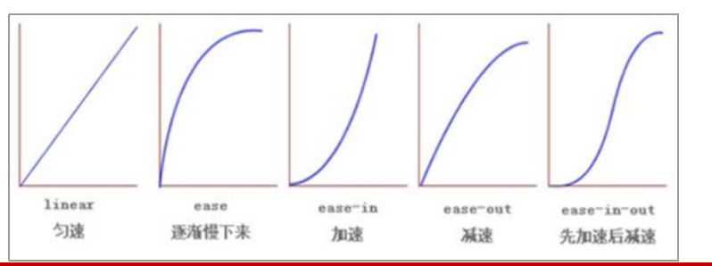

## CSS3 的新特性

### 新增选择器

#### E[att^="val"]属性选择器

| 选择符        | 说明                                    |
| ------------- | --------------------------------------- |
| E[att]        | 选择具有att属性的E元素                  |
| E[att="val"]  | 选择具有att属性且属性值等于val的E元素   |
| E[att^="val"] | 选择具有att属性且属性值以val开始的E元素 |
| E[att$="val"] | 选择具有att属性且属性值以val结束的E元素 |
| E[att*="val"] | 选择具有att属性且属性值包含val的E元素   |

**注意：类选择器、属性选择器、伪类选择器，结构伪类选择器 权重为 10。**

#### nth-child 结构伪类选择器

结构伪类选择器主要根据文档结构来选择器元素， 常用于根据父级选择器里面的子元素

| 选择符           | 说明                                            |
| ---------------- | ----------------------------------------------- |
| E:first-child    | 匹配父元素中的第一个子元素E                     |
| E:last-child     | 匹配父元素中的最后一个子元素E                   |
| E:nth-child(n)   | 匹配父元素中的第n个子元素E                      |
| E:first-of-type  | 匹配父元素中的指定类型的子元素，第一个子元素E   |
| E:last-of-type   | 匹配父元素中的指定类型的子元素，最后一个子元素E |
| E:nth-of-type(n) | 匹配父元素中的指定类型的子元素，第n个子元素E    |

**nth-child（n） 选择某个父元素的一个或多个特定的子元素（重点）**

n 可以是数字，关键字和公式

n 如果是数字，就是选择第 n 个子元素， 里面数字从1开始… 

n 可以是关键字：even 偶数，odd 奇数

n 可以是公式：常见的公式如下 ( 如果n是公式，则从0开始计算，但是第 0 个元素或者超出了元素的个数会被忽略 )

| 公式 | 取值                           |
| ---- | ------------------------------ |
| 2n   | 偶数                           |
| 2n+1 | 奇数                           |
| 5n   | 5  10  15  ....                |
| n+5  | 从第5个开始（包含第5个）到最后 |
| -n+5 | 前5个（包含第5个）             |

**区别：**

1. nth-child 对父元素里面所有孩子排序选择（序号是固定的） 先找到第n个孩子，然后看看是否和E匹配

2. nth-of-type 对父元素里面指定子元素进行排序选择。 先去匹配E ，然后再根据E 找第n个孩子

#### ::before, ::after 伪元素选择器

伪元素选择器可以帮助我们利用CSS创建新标签元素，而不需要HTML标签，从而简化HTML结构。

**注意：** 

1. before 和 after 创建一个元素，但是属于行内元素
2. 新创建的这个元素在文档树中是找不到的，所以我们称为伪元素
3. 语法： element::before {} 
4. before 和 after 必须有 content 属性
5. before 在父元素内容的前面创建元素，after 在父元素内容的后面插入元素
6. 伪元素选择器和标签选择器一样，权重为 1

**伪元素选择器使用场景1：伪元素字体图标**

```css
p::before {
  position: absolute;
  right: 20px;
  top: 10px;
  content: '\e91e';
  font-size: 20px;
}
```

**伪元素选择器使用场景2：仿土豆效果**

```css
/* 当我们鼠标经过了 土豆这个盒子，就让里面before遮罩层显示出来 */ 
.tudou:hover::before {
  /* 而是显示元素 */
  display: block;
}
```

**伪元素选择器使用场景3：伪元素清除浮动**

```css
.clearfix:after { 
  /*  伪元素必须写的属性*/
  content: ""; 
  // 转换为块级元素*/
  display: block; 
  /*  不要看见这个元素*/
  height: 0; 
  /*  清除浮动*/
  clear: both; 
  /*  不要看见这个元素*/
  visibility: hidden; 
}
```

```css
.clearfix:before,
.clearfix:after {
	content:"";
  /*  转换为块级元素并一行显示*/
	display:table; 
}
.clearfix:after {
	clear:both; 
}
```


### 盒子模型

#### box-sizing: border-box

CSS3 中可以通过 box-sizing 来指定盒模型

1. box-sizing: content-box 盒子大小为 width + padding + border （以前默认的）

2. box-sizing: border-box 盒子大小为 width

如果盒子模型我们改为了box-sizing: border-box ， 那padding和border就不会撑大盒子了（前提padding

和border不会超过width宽度）

### 其他特性

#### 图片变模糊

filter CSS属性将模糊或颜色偏移等图形效果应用于元素。

```css
/* filter: 函数(); 例如： 
blur模糊处理 数值越大越模糊 */
filter: blur(5px); 
```

#### 计算盒子宽度 width: calc 函数

calc() 此CSS函数让你在声明CSS属性值时执行一些计算。

```
width: calc(100% - 80px);
```

括号里面可以使用 + - * / 来进行计算。

#### transition 过渡

过渡（transition)是CSS3中具有颠覆性的特征之一，当元素从一种样式变换为另一种样式时为元素添加效果。

过渡动画： 是从一个状态 渐渐的过渡到另外一个状态

我们现在经常和 :hover 一起 搭配使用。

```css
transition: 要过渡的属性 花费时间 运动曲线 何时开始;
```

**1.属性** ： 想要变化的 css 属性， 宽度高度 背景颜色 内外边距都可以 。如果想要所有的属性都

变化过渡， 写一个all 就可以。

**2. 花费时间：** 单位是 秒（必须写单位） 比如 0.5s 

**3. 运动曲线：** 默认是 ease （可以省略）

**4.何时开始 ：**单位是 秒（必须写单位）可以设置延迟触发时间 默认是 0s （可以省略）

**记住过渡的使用口诀： 谁做过渡给谁加**

