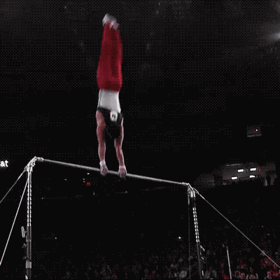

## CSS3 动画 2D转换 3D转换

### transform:translate 2D转换

转换（transform）是CSS3中具有颠覆性的特征之一，可以实现元素的移动、旋转、缩放等效果

#### 二维坐标系

2D转换是改变标签在二维平面上的位置和形状的一种技术


#### 移动：translate

```css
transform: translate(x,y); 
/* 或者分开写 */
transform: translateX(n);
transform: translateY(n);
```

**可以改变元素在页面中的位置，类似定位。**

1. 定义 2D 转换中的移动，沿着 X 和 Y 轴移动元素
2. translate最大的优点：不会影响到其他元素的位置
3. translate中的百分比单位是相对于自身元素的 translate:(50%,50%);
4. 对行内标签没有效果

#### 旋转：rotate

2D旋转指的是让元素在2维平面内**顺时针旋转或者逆时针旋转。**

```css
transform:rotate(度数)
```

1. rotate里面跟度数， 单位是 deg  比如  rotate(45deg)

2. 角度为正时，顺时针，负时，为逆时针

3. 默认旋转的中心点是元素的中心点

   

**案例：三角形**


```css
p::before {
  content: '';
  position: absolute;
  right: 20px;
  top: 10px;
  width: 10px;
  height: 10px;
  border-right: 1px solid #000;
  border-bottom: 1px solid #000;
  transform: rotate(45deg);
}
```

**转换中心点 transform-origin**

```css
transform-origin: x y;
```

1. 注意后面的参数 x 和 y 用空格隔开
2. x y 默认转换的中心点是元素的中心点 (50%  50%)
3. 还可以给x y 设置 像素 或者  方位名词  （top  bottom  left  right  center）

#### 缩放：scale

```css
transform:scale(x,y);
/* 宽和高都放大一倍，相对于没有放大 */
transform:scale(1,1);
/* 宽和高都放大了2倍 */
transform:scale(2,2)
/* 只写一个参数，第二个参数则和第一个参数一样，相当于 scale(2,2) */
transform:scale(2)
/* 缩小 */
transform:scale(0.5,0.5)
```

注意其中的x和y用逗号分隔
sacle缩放最大的优势：可以设置转换中心点缩放，默认以中心点缩放的，而且不影响其他盒子

#### 2D 转换综合写法

```css
transform: translate() rotate() scale();
```

1. 同时使用多个转换，其格式为：transform: translate() rotate() scale() ...等，
2. 其顺序会影转换的效果。（先旋转会改变坐标轴方向）
2. 当我们同时有位移和其他属性的时候，**记得要将位移放到最前**

### 动画 @keyframes, animation

动画（animation）是CSS3中具有颠覆性的特征之一，可通过设置多个节点来精确控制一个或一组动画，常用来实现复杂的动画效果。
**相比较过渡，动画可以实现更多变化，更多控制，连续自动播放等效果。**

制作动画分为两步：
先用keyframes定义动画
再使用（调用）动画

#### 用keyframes定义动画

```css
@keyframes 动画名称 {
   0%{
        width:100px;
   }  
   100%{
        width:200px;
   }
}
```

**动画序列**

1.  0% 是动画的开始，100% 是动画的完成。这样的规则就是动画序列。

2. 在 @keyframes 中规定某项 CSS 样式，就能创建由当前样式逐渐改为新样式的动画效果。

3. 动画是使元素从一种样式逐渐变化为另一种样式的效果。您可以改变任意多的样式任意多的次数。

4. 请用百分比来规定变化发生的时间，或用关键词 "from" 和 "to"，等同于 0% 和 100%。

   

#### 元素使用动画

```css
div {
  width: 200px;
  height: 200px;
  background-color: aqua;
  margin: 100px auto;
  /* 调用动画 */
  animation-name: 动画名称;
  /* 持续时间 */
  animation-duration: 持续时间;
}
```

**动画常用属性**

| **属性**                  | **描述**                                                     |
| ------------------------- | :----------------------------------------------------------- |
| @keyframes                | 规定动画。                                                   |
| animation                 | 所有动画属性的简写属性，除了animation-play-state属性。       |
| animation-name            | 规定@keyframes动画的名称。（必须的）                         |
| animation-duration        | 规定动画完成一个周期所花费的秒或毫秒，默认是0。（必须的）    |
| animation-timing-function | 规定动画的速度曲线，默认是“ease”。                           |
| animation-delay           | 规定动画何时开始，默认是0。                                  |
| animation-iteration-count | 规定动画被播放的次数，默认是1，还有infinite                  |
| animation-direction       | 规定动画是否在下一周期逆向播放，默认是“normal“,alternate逆播放 |
| animation-play-state      | 规定动画是否正在运行或暂停。默认是"running",还有"paused"。结合:hover伪类作鼠标悬停效果 |
| animation-fill-mode       | 规定动画结束后状态，保持forwards, 回到起始backwards          |

```css
/* animation：动画名称 持续时间 运动曲线  何时开始  播放次数  是否反方向  动画起始或者结束的状态; */
animation: myfirst 5s linear 2s infinite alternate;
```

1. 想要动画走回来 ，而不是直接跳回来：animation-direction   ：  alternate
2. 盒子动画结束后，停在结束位置：  animation-fill-mode  ：   forwards 

**简写属性里面不包含 animation-play-state **

暂停动画：animation-play-state:   puased;   经常和鼠标经过等其他配合使用

**速度曲线细节**

animation-timing-function：规定动画的速度曲线，默认是“ease”

| **值**      | **描述**                                       |
| ----------- | ---------------------------------------------- |
| linear      | 动画从头到尾的速度是相同的。匀速               |
| ease        | 默认。动画以低速开始，然后加快，在结束前变慢。 |
| ease-in     | 动画以低速开始。                               |
| ease-out    | 动画以低速结束。                               |
| ease-in-out | 动画以低速开始和结束。                         |
| steps()     | 指定了时间函数中的间隔数量（步长）             |

### transform:translate3d 3D转换

#### 3D特点

1. 近大远小。
2. 物体后面遮挡不可见

#### 三维坐标系

三维坐标系其实就是指立体空间，立体空间是由3个轴共同组成的。 

x轴：水平向右      注意： x 右边是正值，左边是负值 
y轴：垂直向下      注意： y 下面是正值，上面是负值
z轴：垂直屏幕      注意： 往外面是正值，往里面是负值 


#### 3D位移: translate3d(x,y,z)

3D移动在2D移动的基础上多加了一个可以移动的方向，就是z轴方向。 

```css
/* 仅仅是在x轴上移动 */
translform:translateX(100px);
/* 仅仅是在Y轴上移动 */
translform:translateY(100px);
/* 仅仅是在Z轴上移动（注意：translateZ一般用px单位） */
translform:translateZ(100px);
/* 其中 x、y、z 分别指要移动的轴的方向的距离   */
transform:translate3d(x,y,z);
```

#### 3D旋转: rotate3d(x,y,z)

3D旋转指可以让元素在三维平面内沿着 x轴，y轴，z轴或者自定义轴进行旋转。

```css
/* 沿着x轴正方向旋转 45度 */
transform:rotateX(45deg)
```



```css
/* 沿着y轴正方向旋转 45deg */
transform:rotateY(45deg)
```


```css
/* 沿着Z轴正方向旋转 45deg */
transform:rotateZ(45deg)
```


```css
/* 沿着自定义轴旋转 deg为角度（了解即可） */
transform:rotate3d(x,y,z,deg)
```

**对于元素旋转的方向的判断 使用左手准则。**

**以x轴为例**

1. 左手的手拇指指向 x轴的正方向
2. 其余手指的弯曲方向就是该元素沿着x轴旋转的方向


**以y轴为例**

1. 左手的手拇指指向 y轴的正方向
2. 其余手指的弯曲方向就是该元素沿着y轴旋转的方向（正值）


#### 透视: perspective

1. 如果想要在网页产生3D效果需要透视（理解成3D物体投影在2D平面内）。
2. 模拟人类的视觉位置，可认为安排一只眼睛去看  
3. 透视我们也称为视距：视距就是人的眼睛到屏幕的距离
4. 距离视觉点越近的在电脑平面成像越大，越远成像越小  
5. 透视的单位是像素

**透视写在被观察元素的父盒子上面的**
d：就是视距，视距就是一个距离人的眼睛到屏幕的距离。
z：就是 z轴，物体距离屏幕的距离，z轴越大（正值） 我们看到的物体就越大。


#### 3D呈现 transfrom-style

1. 控制子元素是否开启三维立体环境。。
2. transform-style: flat 子元素不开启3d立体空间  默认的
3. transform-style: preserve-3d; 子元素开启立体空间
4. 代码写给父级，但是影响的是子盒子
5. 这个属性很重要，后面必用