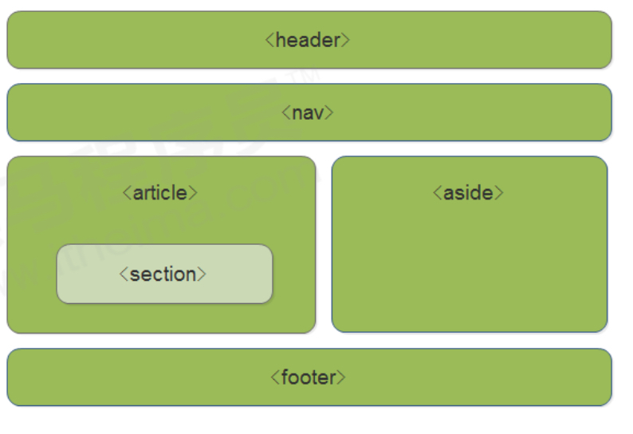

## HTML5基础

### 新的语义化标签

```css
<header>头部标签</header>
<nav>导航标签</nav>
<article>内容标签</article>
<section>：定义文档某个区域</section>
<aside>：侧边栏标签</aside>
<footer>：尾部标签</footer>
```



### 新的媒体标签

#### 视频 video 标签

当前 video元素支持三种视频格式： **尽量使用 mp4格式**

| 浏览器  | MP4                                                | WebM | Ogg  |
| ------- | -------------------------------------------------- | ---- | ---- |
| IE      | YES                                                | NO   | NO   |
| Chrome  | YES 从 Firefox 21 开始/Linux系统 从Firefox 30 开始 | YES  | YES  |
| Firefox | YES                                                | YES  | YES  |
| Safari  | YES 从 Opera 25 开始                               | NO   | NO   |
| Opera   | YES                                                | YES  | YES  |

**语法**：

```html
<video src="文件地址" controls="controls"></video>
```

```html
<video controls="controls" width="300">
<source src="move.ogg" type="video/ogg" >
<source src="move.mp4" type="video/mp4" >
您的浏览器暂不支持 <video> 标签播放视频
</ video >
```

**常见属性**

| 属性     | 值                                   | 描述                                                        |
| -------- | ------------------------------------ | ----------------------------------------------------------- |
| autoplay | autoplay                             | 视频就绪自动播放(谷歌浏览器需要添加muted来解决自动播放问题) |
| controls | controls                             | 向用户显示播放控件                                          |
| width    | px像素                               | 设置播放器宽度                                              |
| height   | px像素                               | 设置播放器高度                                              |
| loop     | loop                                 | 播放完是否继续播放该视频，循环播放                          |
| preload  | auto 预先加载视频/ none 不应加载视频 | 规定是否预先加载视频（如果设置了autoplay，就忽略该属性）    |
| src      | url                                  | 视频url地址                                                 |
| poster   | imgurl                               | 加载等待的画面图片                                          |
| muted    | muted                                | 静音播放                                                    |

#### 音频 audio 标签

当前 audio 元素支持三种视频格式： **尽量使用 mp3格式**

| 浏览器  | MP3  | Wav  | Ogg  |
| ------- | ---- | ---- | ---- |
| IE      | YES  | NO   | NO   |
| Chrome  | YES  | YES  | YES  |
| Firefox | YES  | YES  | YES  |
| Safari  | YES  | YES  | NO   |
| Opera   | YES  | YES  | YES  |

**语法**

```html
<audio src="文件地址" controls="controls"></audio>
```

```html
< audio controls="controls" >
<source src="happy.mp3" type="audio/mpeg" >
<source src="happy.ogg" type="audio/ogg" >
您的浏览器暂不支持 <audio> 标签。
</ audio>
```

**常见属性**

| 属性     | 值       | 描述                                                        |
| -------- | -------- | ----------------------------------------------------------- |
| autoplay | autoplay | 视频就绪自动播放(谷歌浏览器需要添加muted来解决自动播放问题) |
| controls | controls | 向用户显示播放控件                                          |
| loop     | loop     | 播放完是否继续播放该视频，循环播放                          |
| src      | url      | 视频url地址                                                 |

**谷歌浏览器把音频和视频自动播放禁止了**

 **多媒体标签总结**

1. 音频标签和视频标签使用方式基本一致
2. 浏览器支持情况不同
3. 谷歌浏览器把音频和视频自动播放禁止了
4. 我们可以给视频标签添加 muted 属性来静音播放视频，音频不可以（可以通过JavaScript解决） 
5. 视频标签是重点，我们经常设置自动播放，不使用 controls 控件，循环和设置大小属性

### 新增input类型

```html
<!-- Email类型 -->
<input type="email" name="" id="">
<!-- URL类型 -->
<input type="url" name="" id="">
<!-- 日期类型 -->
<input type="date" name="" id="">
<!-- 时间类型 -->
<input type="time" name="" id="">
<!-- 月类型 -->
<input type="month" name="" id="">
<!-- 周类型 -->
<input type="week" name="" id="">
<!-- 数字类型 -->
<input type="number" name="" id="">
<!-- 手机号码 -->
<input type="tel" name="" id="">
<!-- 搜索框 -->
<input type="search" name="" id="">
<!-- 颜色选择框 -->
<input type="color" name="" id="">
```

**重点记住： number tel search 这三个**

### 新的表单属性

| 属性         | 值        | 说明                                                         |
| ------------ | --------- | ------------------------------------------------------------ |
| required     | required  | 不能为空，必填                                               |
| placeholder  | 提示文本  | 提示信息，存在值将不显示                                     |
| autofocus    | autofocus | 自动聚焦，页面加载完自动聚焦到输入框                         |
| autocomplete | off/on    | 当用户开始输入时，浏览器根据之前输入的值显示之前的输入。默认已打开。需要有name属性并成功提交。 |
| multiple     | multiple  | 可以多选文件提交                                             |

```css
// 可以通过以下设置方式修改placeholder里面的字体颜色：
input::placeholder {
	color: pink;
}
```


