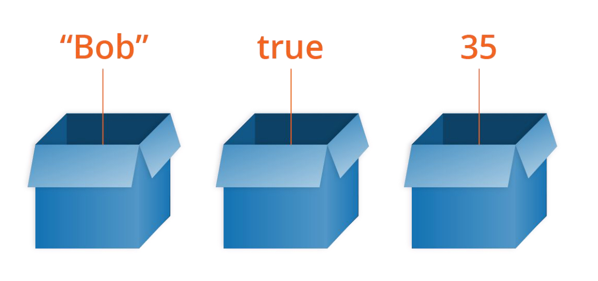
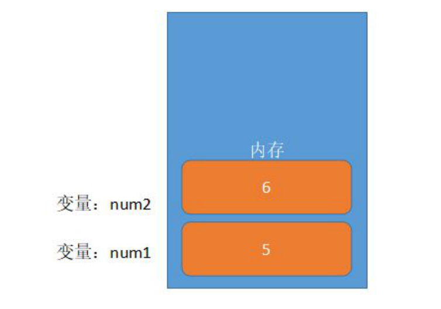
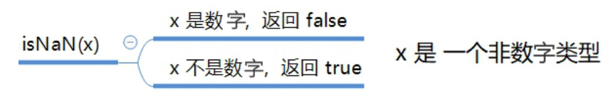
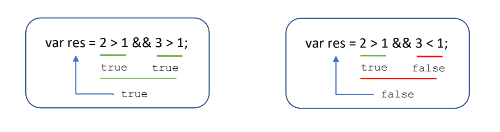
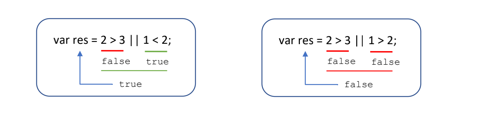
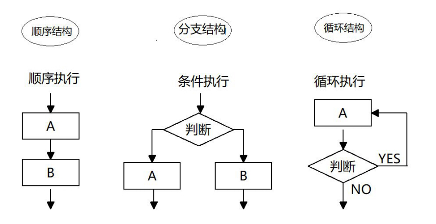
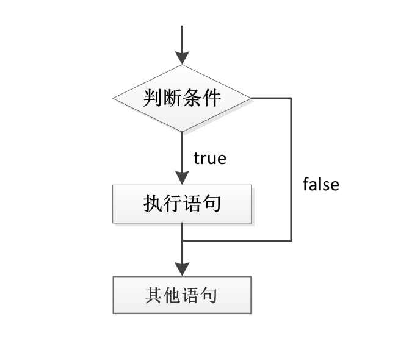
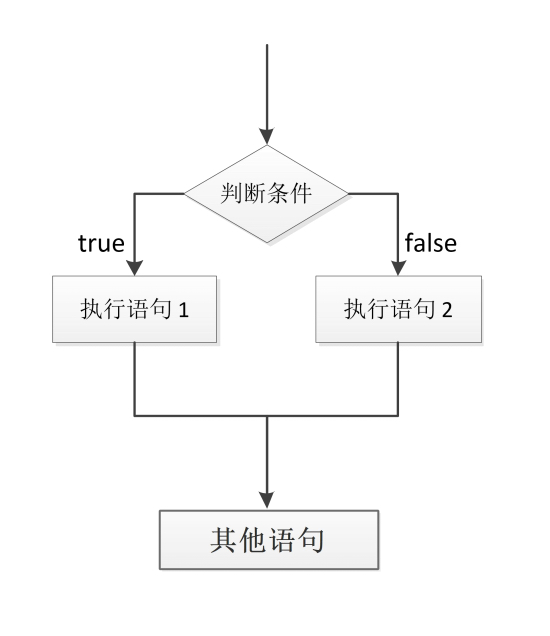
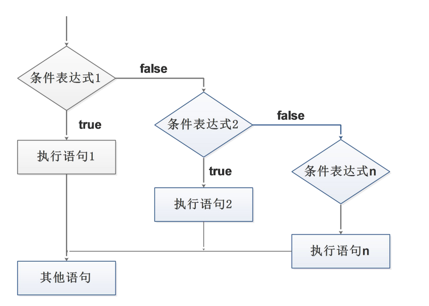

# JavaScript语法

## 变量

### 变量

白话：变量就是一个装东西的盒子。

通俗：变量是用于存放数据的容器。 我们通过 变量名 获取数据，甚至数据可以修改。



本质：变量是程序在内存中申请的一块用来存放数据的空间。

类似我们酒店的房间，一个房间就可以看做是一个变量。



### 变量的使用

变量在使用时分为两步： 

1. 声明变量 
2.  赋值

**声明变量**

```javascript
// 声明变量
var age; // 声明一个 名称为age 的变量
```

1. var 是一个 JS关键字，用来声明变量( variable 变量的意思 )。
2. 使用该关键字声明变量后，计算机会自动为变量分配内存空间，不需要程序员管 
3. age 是程序员定义的变量名，我们要通过变量名来访问内存中分配的空间

**赋值**

```javascript
age = 10; // 给 age 这个变量赋值为 10 
```

1. = 用来把右边的值赋给左边的变量空间中 此处代表赋值的意思
2. 变量值是程序员保存到变量空间里的值

**变量的初始化**

```javascript
var age = 18; // 声明变量同时赋值为 18
```


声明一个变量并赋值， 我们称之为变量的初始化。

### 变量语法扩展

**更新变量**

一个变量被重新复赋值后，它原有的值就会被覆盖，变量值将以最后一次赋的值为准。

```javascript
var age = 18;
age = 81; // 最后的结果就是81因为18 被覆盖掉了
```


**同时声明多个变量**

同时声明多个变量时，只需要写一个 var， 多个变量名之间使用英文逗号隔开。

```javascript
var age = 10, name = 'zs', sex = 2; 
```

 **声明变量特殊情况**

| **情况**                     | 说明                   | 结果      |
| ---------------------------- | ---------------------- | --------- |
| var age ; console.log (age); | 只声明 不赋值          | undefined |
| console.log(age)             | 不声明 不赋值 直接使用 | 报错      |
| age = 10; console.log (age); | 不声明 只赋值          | 10        |

### 变量命名规范

1. 由字母(A-Za-z)、数字(0-9)、下划线(_)、美元符号( $ )组成，如：usrAge, num01, _name
2. 严格区分大小写。var app; 和 var App; 是两个变量
3. 不能 以数字开头。 18age 是错误的
4. 不能 是关键字、保留字。例如：var、for、while
5. 变量名必须有意义。 MMD BBD nl → age 
6. 遵守驼峰命名法。首字母小写，后面单词的首字母需要大写。 myFirstName
7. 推荐翻译网站： 有道 爱词霸

## 数据类型

### 为什么需要数据类型

在计算机中，不同的数据所需占用的存储空间是不同的，为了便于**把数据分成所需内存大小不同的数据**，充分利用存储空间，于是定义了不同的数据类型。

简单来说，数据类型就是数据的类别型号。比如姓名“张三”，年龄18，这些数据的类型是不一样的。

### 变量的数据类型

变量是用来存储值的所在处，它们有名字和数据类型。变量的数据类型决定了如何将代表这些值的位存储到计算机的内存中。**JavaScript 是一种弱类型或者说动态语言。**这意味着不用提前声明变量的类型，在程序运行过程中，类型会被自动确定。

```javascript
var age = 10; // 这是一个数字型
var areYouOk = '是的'; // 这是一个字符串
```

在代码运行时，变量的数据类型是由 JS引擎 根据 = 右边变量值的数据类型来判断 的，运行完毕之后， 变量就确定了数据类型。

JavaScript 拥有动态类型，同时也意味着相同的变量可用作不同的类型：

```javascript
var x = 6; // x 为数字
var x = "Bill"; // x 为字符串
```

### 数据类型的分类

JS 把数据类型分为两类：

1. 简单数据类型 （Number,String,Boolean,Undefined,Null） 
2. 复杂数据类型 （object)

## 简单数据类型

### 简单数据类型（基本数据类型）

JavaScript 中的简单数据类型及其说明如下：

| 简单数据类型 | 说明                                               | 默认值    |
| ------------ | -------------------------------------------------- | --------- |
| Number       | 数字型，包含 整型值和浮点型值，如21, 0.21          | 0         |
| Boolean      | 布尔值类型，如true, false 等价于 1 和 0            | false     |
| String       | 字符串类型，如 "张三"                              | ""        |
| Undefined    | var a; 声明了变量 a 但是没赋值, 此时 a = undefined | undefined |
| Null         | var a = null; 声明了变量a为空值                    | null      |

### 数字型 Number

JavaScript 数字类型既可以用来保存整数值，也可以保存小数(浮点数）。

```javascript
var age = 21; // 整数
var Age = 21.3747; // 小数
```

#### 数字型进制

最常见的进制有二进制、八进制、十进制、十六进制。

```javascript
// 1.八进制数字序列范围：0~7
var num1 = 07; // 对应十进制的7
var num2 = 019; // 对应十进制的19
var num3 = 08; // 对应十进制的8
// 2.十六进制数字序列范围：0~9以及A~F
var num = 0xA;
```


现阶段我们只需要记住，**在JS中八进制前面加0，十六进制前面加 0x** 

#### 数字型范围

JavaScript中数值的最大和最小值

1. 最大值：Number.MAX_VALUE，这个值为： 1.7976931348623157e+308
2. 最小值：Number.MIN_VALUE，这个值为：5e-32

```javascript
alert(Number.MAX_VALUE); // 1.7976931348623157e+308
alert(Number.MIN_VALUE); // 5e-324
```


#### 数字型三个特殊值

1. Infinity ，代表无穷大，大于任何数值
2. -Infinity ，代表无穷小，小于任何数值
3. NaN ，Not a number，代表一个非数值

```javascript
alert(Infinity); // Infinity
alert(-Infinity); // -Infinity
alert(NaN); // NaN
```


####  isNaN() 



```javascript
var usrAge = 21;
var isOk = isNaN(userAge);
console.log(isNum); // false ，21 不是一个非数字
var usrName = "andy";
console.log(isNaN(userName)); // true ，"andy"是一个非数字
```

用来判断一个变量是否为非数字的类型，返回 true 或者 false

### 字符串型 String

字符串型可以是引号中的任意文本，其语法为 双引号 "" 和 单引号''

```javascript
var strMsg = "我爱北京天安门~"; // 使用双引号表示字符串
var strMsg2 = '我爱吃猪蹄~'; // 使用单引号表示字符串
// 常见错误
var strMsg3 = 我爱大肘子; // 报错，没使用引号，会被认为是js代码，但js没有这些语法
```


因为 HTML 标签里面的属性使用的是双引号，**JS 这里我们更推荐使用单引号**。

####  字符串引号嵌套

JS 可以用单引号嵌套双引号 ，或者用双引号嵌套单引号 (**外双内单，外单内双**)

```javascript
var strMsg = '我是"高帅富"程序猿'; // 可以用''包含""
var strMsg2 = "我是'高帅富'程序猿"; // 也可以用"" 包含'' 
// 常见错误
var badQuotes = 'What on earth?"; // 报错，不能 单双引号搭配
```


#### 字符串转义符

类似HTML里面的特殊字符，字符串中也有特殊字符，我们称之为转义符。

转义符都是 \ 开头的，常用的转义符及其说明如下：

| 转义符 | 解释说明                    |
| ------ | --------------------------- |
| `\n`   | 换行符，n 是 newline 的意思 |
| `\\`   | 斜杠 \                      |
| `\'`   | ' 单引号                    |
| `\"`   | ”双引号                     |
| `\t`   | tab 缩进                    |
| `\b`   | 空格 ，b 是 blank 的意思    |


####  字符串长度

字符串是由若干字符组成的，这些字符的数量就是字符串的长度。通过字符串的 length 属性可以获取整个字符

串的长度。

```javascript
var strMsg = "我是帅气多金的程序猿！";
alert(strMsg.length); // 显示 11
```


#### 字符串拼接

1. 多个字符串之间可以使用 + 进行拼接，其拼接方式为 字符串 + 任何类型 = 拼接之后的新字符串
2. 拼接前会把与字符串相加的任何类型转成字符串，再拼接成一个新的字符串

```javascript
//1.1 字符串 "相加" 
alert('hello' + ' ' + 'world'); // hello world
//1.2 数值字符串 "相加" 
alert('100' + '100'); // 100100
//1.3 数值字符串 + 数值
alert('11' + 12); // 1112
```

**+ 号总结口诀：数值相加 ，字符相连**

#### 字符串拼接加强

```javascript
console.log('pink老师' + 18); // 只要有字符就会相连
var age = 18;
// console.log('pink老师age岁啦'); // 这样不行哦
console.log('pink老师' + age); // pink老师18
console.log('pink老师' + age + '岁啦'); // pink老师18岁啦
```


1. 我们经常会将字符串和变量来拼接，因为变量可以很方便地修改里面的值 
2. 变量是不能添加引号的，因为加引号的变量会变成字符串
3. 如果变量两侧都有字符串拼接，口诀“引引加加 ”，删掉数字，变量写加中间

### 布尔型 Boolean

布尔类型有两个值：true 和 false ，其中 true 表示真（对），而 false 表示假（错）。

布尔型和数字型相加的时候， true 的值为 1 ，false 的值为 0。

```javascript
console.log(true + 1); // 2
console.log(false + 1); // 1
```


### Undefined 和 Null

一个声明后没有被赋值的变量会有一个默认值 undefined ( 如果进行相连或者相加时，注意结果）

```javascript
var variable;
console.log(variable); // undefined
console.log('你好' + variable); // 你好undefined
console.log(11 + variable); // NaN
console.log(true + variable); // NaN
```

一个声明变量给 null 值，里面存的值为空

```javascript
var vari = null;
console.log('你好' + vari); // 你好null
console.log(11 + vari); // 11
console.log(true + vari); // 1
```


## 获取变量数据类型

### 获取检测变量的数据类型

typeof 可用来获取检测变量的数据类型

```javascript
var num = 18;
console.log(typeof num) // 结果 number
```


不同类型的返回值

| 类型      | 例子             | 结果        |
| --------- | ---------------- | ----------- |
| String    | typeof "小白"    | "string"    |
| Number    | typeof 18        | "number"    |
| Boolean   | typeof true      | "boolean"   |
| Undefined | typeof undefined | "undefined" |
| Null      | typeof null      | "object"    |


### 字面量

字面量是在源代码中一个固定值的表示法，通俗来说，就是字面量表示如何表达这个值。

1. 数字字面量：8, 9, 10
2. 字符串字面量：'黑马程序员', "大前端"
3. 布尔字面量：true，false

## 数据类型转换

### 什么是数据类型转换

通俗来说，就是把一种数据类型的变量转换成另外一种数据类型。

我们通常会实现3种方式的转换： 

1. 转换为字符串类型
2. 转换为数字型
3. 转换为布尔型

### 转换为字符串类型

```javascript
var num = 1;
// toString()
// 转换为字符串
alert(num.toString());
// String()
// 强制转换
// 转换成字符串
alert(String(num));
// 隐式转换
// 加号拼接字符串
// 和字符串拼接的结果都是字符串
alert(num + "我是字符串");
```


1. toString() 和 String() 使用方式不一样。
2. 三种转换方式，我们更喜欢用第三种加号拼接字符串转换方式， 这一种方式也称之为隐式转换。

### 转换为数字型（重点）

```javascript
// parseInt(string)函数
// 将string类型转换成整数数值类型
parseInt('78');
// parseFloat(string) 函数
// 将string类型转换成浮点数数值类型
parseFloat('78.21');
// Number()强制转换函数
// 将string类型转换成数值类型
Number('12');
// js 隐式转换(- * /)
// 利用算术运算隐式转换成数值类型
'12' - 0;
```


1. 注意 parseInt 和 parseFloat 单词的大小写，这2个是重点
2. 隐式转换是我们在进行算数运算的时候，JS 自动转换了数据类型

### 转换为布尔型

1. 代表空、否定的值会被转换为 false ，如 ''、0、NaN、null、undefined 
2. 其余值都会被转换为 true

```javascript
// Boolean()函数
// 其他类型转换成布尔值
Boolean("true");
console.log(Boolean('')); // false
console.log(Boolean(0)); // false
console.log(Boolean(NaN)); // false
console.log(Boolean(null)); // false
console.log(Boolean(undefined)); // false
console.log(Boolean('小白')); // true
console.log(Boolean(12)); // true
```


## 操作符[运算符]

### 算数运算符

概念：算术运算使用的符号，用于执行两个变量或值的算术运算。

| 运算符 | 描述         | 实例                  |
| ------ | ------------ | --------------------- |
| +      | 加           | 10+20=30              |
| -      | 减           | 10-20=-10             |
| *      | 乘           | 10*20=200             |
| /      | 除           | 10/20=0.5             |
| %      | 取余数(取模) | 返回除法的余数  9%2=1 |

#### 浮点数的精度问题

浮点数值的最高精度是 17 位小数，但在进行算术计算时其精确度远远不如整数。

```javascript
var result = 0.1 + 0.2; // 结果不是 0.3，而是：0.30000000000000004
console.log(0.07 * 100); // 结果不是 7， 而是：7.000000000000001
```

所以：不要直接判断两个浮点数是否相等 ! 

#### 表达式和返回值

**表达式：**是由数字、运算符、变量等以能求得数值的有意义排列方法所得的组合

简单理解：是由数字、运算符、变量等组成的式子

表达式最终都会有一个结果，返回给我们，我们称为返回值

### 递增和递减运算符

如果需要反复给数字变量添加或减去1，可以使用**递增（++）和递减（ -- ）**运算符来完成。 

在 JavaScript 中，递增（++）和递减（ -- ）既可以放在变量前面，也可以放在变量后面。放在变量前面时，

我们可以称为前置递增（递减）运算符，放在变量后面时，我们可以称为后置递增（递减）运算符。

**注意：**递增和递减运算符必须和变量配合使用。


#### 前置递增运算符

++num 前置递增，就是自加1，类似于 num = num + 1，但是 ++num 写起来更简单。

使用口诀：先自加，后返回值

```javascript
var num = 10;
alert(++num + 10); // 21
```


#### 后置递增运算符

num++ 后置递增，就是自加1，类似于 num = num + 1 ，但是 num++ 写起来更简单。

使用口诀：先返回原值，后自加

```javascript
var num = 10;
alert(10 + num++); // 20
```


### 比较运算符

概念：比较运算符（关系运算符）是两个数据进行比较时所使用的运算符，比较运算后，会返回一个布尔值

（true / false）作为比较运算的结果。

| 运算符名称 | 说明                       | 案例      | 结果  |
| ---------- | -------------------------- | --------- | ----- |
| <          | 小于号                     | 1<2       | true  |
| <=         | 小于等于号 (小于或等于)    | 3<=2      | false |
| >          | 大于号                     | 1>2       | false |
| >=         | 大于等于号(大于或等于)     | 2>=2      | true  |
| ==         | 判等号(会转型)             | 37==37    | true  |
| !=         | 不等于                     | 37!=37    | false |
| ===   !==  | 全等  要求值和数据类型一致 | 37==='37' | false |

#### =小结

| 符号 | 作用 | 用法                                   |
| ---- | ---- | -------------------------------------- |
| =    | 赋值 | 把右边给左边                           |
| ==   | 判断 | 判断两边值是否相等(注意此时有隐形转换) |
| ===  | 全等 | 判断两边的值和数据类型是否完全相同     |

```javascript
console.log(18 == '18');
console.log(18 === '18');
```


### 逻辑运算符 

用来进行布尔值运算的运算符，其返回值也是布尔值。后面开发中经常用于多个条件的判断

| 逻辑运算符 | 说明               | 案例            |
| ---------- | ------------------ | --------------- |
| &&         | 逻辑与 简称 与 and | true && false   |
| \|\|       | 逻辑或 简称 或 or  | true \|\| false |
| !          | 逻辑非 简称 非 not | !true           |

#### 逻辑与&&

两边都是 true才返回 true，否则返回 false



#### 逻辑或 ||

两边都为 false 才返回 false，否则都为true



#### 逻辑非 ！

逻辑非（!）也叫作取反符，用来取一个布尔值相反的值，如 true 的相反值是 false

```javascript
var isOk = !true;
console.log(isOk); // false
```


#### 短路运算（逻辑中断）

**短路运算的原理：**当有多个表达式（值）时,左边的表达式值可以确定结果时,就不再继续运算右边的表达式的值;

#####  逻辑与 

1. 语法： 表达式1 && 表达式2 
2. 如果第一个表达式的值为真，则返回表达式2 
3. 如果第一个表达式的值为假，则返回表达式1

```javascript
console.log( 123 && 456 ); // 456
console.log( 0 && 456 ); // 0
console.log( 123 && 456&& 789 ); // 789
```


##### 逻辑或

1. 语法： 表达式1 || 表达式2 
2. 如果第一个表达式的值为真，则返回表达式1 
3. 如果第一个表达式的值为假，则返回表达式2

```javascript
console.log( 123 || 456 ); // 123
console.log( 0 || 456 ); // 456
console.log( 123 || 456 || 789 ); // 123

var num = 0;
console.log(123 || num++);
console.log(num);
```


### 赋值运算符

用来把数据赋值给变量的运算符。

| 赋值运算符       | 说明                | 案例                         |
| ---------------- | ------------------- | ---------------------------- |
| `=`              | 直接赋值            | var userName = "我是值";     |
| `+=`   `-=`      | 加 减一个数后再赋值 | var age = 10; age += 5; //15 |
| `*=`   `/=` `%=` | 乘 除 取模 后再赋值 | var age = 2; age *= 5;// 10  |


```javascript
var age = 10;
age += 5; // 相当于 age = age + 5;
age -= 5; // 相当于 age = age - 5;
age *= 10; // 相当于 age = age * 10;
```


### 运算符优先级

| 优先级 | 运算符     | 顺序                  |
| ------ | ---------- | --------------------- |
| 1      | 小括号     | `()`                  |
| 2      | 一元运算符 | `++` `--` `!`         |
| 3      | 算术运算符 | 先 `*` `%` 后 `+` `-` |
| 4      | 关系运算符 | `>` `>=` `<` `<=`     |
| 5      | 相等运算符 | `==` `!=` `===` `!==` |
| 6      | 逻辑运算符 | 先`&&` 后 `||`        |
| 7      | 赋值运算符 | `=`                   |
| 8      | 逗号运算符 | `,`                   |

一元运算符里面的逻辑非优先级很高

逻辑与比逻辑或优先级高

## 流程控制分支

**流程控制**

在一个程序执行的过程中，各条代码的执行顺序对程序的结果是有直接影响的。很多时候我们要通过控制代码的执行顺序来实现我们要完成的功能。

简单理解： 流程控制就是来控制我们的代码按照什么结构顺序来执行

流程控制主要有三种结构，分别是**顺序结构、分支结构和循环结构**，这三种结构代表三种代码执行的顺序。



**顺序结构**是程序中最简单、最基本的流程控制，它没有特定的语法结构，程序会按照代码的先后顺序，依次执行，

程序中大多数的代码都是这样执行的。

**分支结构**由上到下执行代码的过程中，根据不同的条件，执行不同的路径代码（执行代码多选一的过程），从而得到不同的结果

JS 语言提供了两种分支结构语句

if 语句

switch 语句

### 分支流程控制 if 语句

**单分支语句语法结构**

```javascript
// 条件成立执行代码，否则什么也不做
if (条件表达式) {
 // 条件成立执行的代码语句
}
```



 **if else语句（双分支语句）语法结构**

```javascript
// 条件成立 执行 if 里面代码，否则执行else 里面的代码
if (条件表达式) {
// [如果] 条件成立执行的代码
} else {
// [否则] 执行的代码
}
```



 **if else if 语句(多分支语句)  语法结构** 

```javascript
// 适合于检查多重条件。
if (条件表达式1) {
语句1；
} else if (条件表达式2) {
语句2；
} else if (条件表达式3) {
语句3；
 ....
} else {
 // 上述条件都不成立执行此处代码
}
```



### 三元表达式 

三元表达式也能做一些简单的条件选择。 有三元运算符组成的式子称为三元表达式

**语法结构**

```javascript
表达式1 ? 表达式2 : 表达式3;
```

**执行思路**

如果表达式1为 true ，则返回表达式2的值，如果表达式1为 false，则返回表达式3的值 

简单理解： 就类似于 if else （双分支） 的简写

### 分支流程控制 switch 语句

**语法结构**

switch 语句也是多分支语句，它用于基于不同的条件来执行不同的代码。当要针对变量设置一系列的特定值的选项时，就可以使用 switch。

```javascript
switch( 表达式 ){ 
 case value1:
 // 表达式 等于 value1 时要执行的代码
 break;
 case value2:
 // 表达式 等于 value2 时要执行的代码
 break;
 default:
 // 表达式 不等于任何一个 value 时要执行的代码
}
```

1. switch ：开关 转换 ， case ：小例子 选项
2. 关键字 switch 后面括号内可以是表达式或值， 通常是一个变量
3. 关键字 case , 后跟一个选项的表达式或值，后面跟一个冒号
4. switch 表达式的值会与结构中的 case 的值做比较
5. 如果存在匹配全等(===) ，则与该 case 关联的代码块会被执行，并在遇到 break 时停止，整个 switch 语句代码执行结束
6. 如果所有的 case 的值都和表达式的值不匹配，则执行 default 里的代码

**注意：** 执行case 里面的语句时，如果没有break，则继续执行下一个case里面的语句。

**switch 语句和 if else if 语句的区别**

① 一般情况下，它们两个语句可以相互替换

② switch...case 语句通常处理 case为比较确定值的情况， 而 if…else…语句更加灵活，常用于范围判断(大于、

等于某个范围) 

③ switch 语句进行条件判断后直接执行到程序的条件语句，效率更高。而if…else 语句有几种条件，就得判断多

少次。

④ 当分支比较少时，if… else语句的执行效率比 switch语句高。 

⑤ 当分支比较多时，switch语句的执行效率比较高，而且结构更清晰。

## 流程控制循环

**循环目的**

在实际问题中，有许多具有规律性的重复操作，因此在程序中要完成这类操作就需要重复执行某些语句

 **JS 中的循环**

在Js 中，主要有三种类型的循环语句：

1. for 循环
2. while 循环
3. do...while 循环

### for 循环

在程序中，一组被重复执行的语句被称之为循环体，能否继续重复执行，取决于循环的终止条件。由循环体

及循环的终止条件组成的语句，被称之为**循环语句**

**语法结构**

for 循环主要用于把某些代码循环若干次，通常跟计数有关系。其语法结构如下：

```javascript
for(初始化变量; 条件表达式; 操作表达式 ){

 //循环体

}
```

**初始化变量：**通常被用于初始化一个计数器，该表达式可以使用 var 关键字声明新的变量，这个变量帮我们来记录次数。

**条件表达式：**用于确定每一次循环是否能被执行。如果结果是 true 就继续循环，否则退出循环。

**操作表达式：**每次循环的最后都要执行的表达式。通常被用于更新或者递增计数器变量。当然，递减变量也是可以的。

**执行过程：**

1. 初始化变量，初始化操作在整个 for 循环只会执行一次**。** 

2. 执行条件表达式，如果为true，则执行循环体语句，否则退出循环，循环结束。

3. 执行操作表达式，此时第一轮结束。

4. 第二轮开始，直接去执行条件表达式（不再初始化变量），如果为 true ，则去执行循环体语句，否则退出循环。

5. 继续执行操作表达式，第二轮结束。

6. 后续跟第二轮一致，直至条件表达式为假，结束整个 for 循环。

### 双重 for 循环

**循环嵌套**是指在一个循环语句中再定义一个循环语句的语法结构，例如在for循环语句中，可以再嵌套一个

for 循环，这样的 for 循环语句我们称之为双重for循环。

```javascript
for (外循环的初始; 外循环的条件; 外循环的操作表达式) {
 for (内循环的初始; 内循环的条件; 内循环的操作表达式) { 
需执行的代码;
 }
}
```

1. 内层循环可以看做外层循环的语句
2. 内层循环执行的顺序也要遵循 for 循环的执行顺序 
3. 外层循环执行一次，内层循环要执行全部次数

### while 循环

while 语句可以在条件表达式为真的前提下，循环执行指定的一段代码，直到表达式不为真时结束循环。 

while语句的语法结构如下：

```javascript
while (条件表达式) {
 // 循环体代码
}
```

**执行思路：** 

① 先执行条件表达式，如果结果为 true，则执行循环体代码；如果为 false，则退出循环，执行后面代码

② 执行循环体代码

③ 循环体代码执行完毕后，程序会继续判断执行条件表达式，如条件仍为true，则会继续执行循环体，直到循

环条件为 false 时，整个循环过程才会结束

**注意：**

① 使用 while 循环时一定要注意，它必须要有退出条件，否则会成为死循环

② while 循环和 for 循环的不同之处在于 while 循环可以做较为复杂的条件判断，比如判断用户名和密码

### do while 循环

do... while 语句其实是 while 语句的一个变体。该循环会先执行一次代码块，然后对条件表达式进行判断，如

果条件为真，就会重复执行循环体，否则退出循环。

do... while 语句的语法结构如下：

```javascript
do {
 // 循环体代码 - 条件表达式为 true 时重复执行循环体代码
} while(条件表达式);
```


**执行思路：**

① 先执行一次循环体代码

② 再执行条件表达式，如果结果为 true，则继续执行循环体代码，如果为 false，则退出循环，继续执行后面

代码

**注意：**先再执行循环体，再判断，我们会发现 do…while 循环语句**至少会执行一次循环体代码**

### continue break

#### continue 关键字

**continue 关键字**用于立即**跳出本次循环**，**继续下一次循环**（本次循环体中 continue 之后的代码就会少执行

一次）。

例如，吃5个包子，第3个有虫子，就扔掉第3个，继续吃第4个第5个包子，其代码实现如下：

```javascript
for (var i = 1; i <= 5; i++) {
    if (i == 3) {
        console.log('这个包子有虫子，扔掉');
        continue; // 跳出本次循环，跳出的是第3次循环
    }
    console.log('我正在吃第' + i + '个包子呢');
}
```


#### break 关键字

**break 关键字用于**立即**跳出整个循环**（循环结束）。

例如，吃5个包子，吃到第3个发现里面有半个虫子，其余的不吃了，其代码实现如下：

```javascript
for (var i = 1; i <= 5; i++) {
    if (i == 3) {
        break; // 直接退出整个for 循环，跳到整个for下面的语句
    }
    console.log('我正在吃第' + i + '个包子呢');
}
```


## 函数

在 JS 里面，可能会定义非常多的相同代码或者功能相似的代码，这些代码可能需要大量重复使用。

虽然 for循环语句也能实现一些简单的重复操作，但是比较具有局限性，此时我们就可以使用 JS 中的函数。

**函数：**就是封装了一段可被重复调用执行的**代码块**。通过此代码块可以实现大量代码的重复使用。

### 函数的使用

函数在使用时分为两步：声明函数和调用函数。

#### 声明函数

```javascript
// 声明函数
function 函数名() {
    //函数体代码
}
```


1. function 是声明函数的关键字,必须小写
2. 由于函数一般是为了实现某个功能才定义的， 所以通常我们将函数名命名为动词，比如 getSum 

#### 调用函数

```javascript
// 调用函数
函数名(); // 通过调用函数名来执行函数体代码
```


1. 调用的时候千万不要忘记添加小括号
2. 口诀：函数不调用，自己不执行。

**注意：**声明函数本身并不会执行代码，只有调用函数时才会执行函数体代码。

####  函数的封装

1. 函数的封装是把一个或者多个功能通过**函数的方式封装起来**，对外只提供一个简单的函数接口
2. 简单理解：封装类似于将电脑配件整合组装到机箱中 ( 类似快递打包）

### 函数的参数

####  形参和实参

在声明函数时，可以在函数名称后面的小括号中添加一些参数，这些参数被称为**形参**，而在调用该函数时，

同样也需要传递相应的参数，这些参数被称为**实参**。

**参数的作用** : 在**函数内部**某些值不能固定，我们可以通过参数在**调用函数时传递**不同的值进去。

| 参数 | 说明                                                       |
| ---- | ---------------------------------------------------------- |
| 形参 | 形式上的参数。函数定义的时候传递的参数，当前并不知道是什么 |
| 实参 | 实际上的参数。函数调用的时候传递的参数，实参是传递给形参的 |

```javascript
// 带参数的函数声明
function 函数名(形参1, 形参2, 形参3...) { // 可以定义任意多的参数，用逗号分隔
    // 函数体
}
// 带参数的函数调用
函数名(实参1, 实参2, 实参3...);
```


#### 函数参数的传递过程

```javascript
// 声明函数
function getSum(num1, num2) {
    console.log(num1 + num2);
}
// 调用函数
getSum(1, 3); // 4
getSum(6, 5); // 11
```


1. 调用的时候实参值是传递给形参的

2. 形参简单理解为：**不用声明的变量**

3. 实参和形参的多个参数之间用逗号（,）分隔

#### 函数形参和实参个数不匹配问题

| 参数个数             | 说明                               |
| -------------------- | ---------------------------------- |
| 实参个数等于形参个数 | 输出正确结果                       |
| 实参个数多于形参个数 | 只取到形参的个数                   |
| 实参个数少于形参个数 | 多的形参定义为undefined，结果为NaN |

```javascript
function sum(num1, num2) {
    console.log(num1 + num2);
}
sum(100, 200); // 形参和实参个数相等，输出正确结果
sum(100, 400, 500, 700); // 实参个数多于形参，只取到形参的个数
sum(200); // 实参个数少于形参，多的形参定义为undefined，结果为NaN
```


**注意：**在JavaScript中，形参的默认值是undefined。

### 函数的返回值 

####  return 语句

有的时候，我们会希望函数将值返回给调用者，此时通过使用 return 语句就可以实现。

return 语句的语法格式如下：

```javascript
// 声明函数
function 函数名（） {
    ...
    return 需要返回的值；

}
// 调用函数
函数名(); // 此时调用函数就可以得到函数体内return 后面的值
```

1. 在使用 return 语句时，函数会停止执行，并返回指定的值 
2. 如果函数没有 return ，返回的值是 undefined

####  return 终止函数

return 语句之后的代码不被执行。

```javascript
function add(num1， num2) {
    //函数体
    return num1 + num2; // 注意：return 后的代码不执行
    alert('我不会被执行，因为前面有 return');
}
var resNum = add(21, 6); // 调用函数，传入两个实参，并通过 resNum 接收函数返回值
alert(resNum); // 27
```


#### return 的返回值

**return 只能返回一个值**。如果用逗号隔开多个值，以最后一个为准。

```javascript
function add(num1， num2) {
    //函数体
    return num1， num2;
}
var resNum = add(21, 6); // 调用函数，传入两个实参，并通过 resNum 接收函数返回值
alert(resNum); // 6
```


#### 函数没有 return 返回 undefined

函数都是有返回值的

1. 如果有return 则返回 return 后面的值

2. 如果没有return 则返回 undefined

#### break ,continue ,return 的区别

1. break ：结束当前的循环体（如 for、while） 
2. continue ：跳出本次循环，继续执行下次循环（如 for、while） 
3. return ：不仅可以退出循环，还能够返回 return 语句中的值，同时还可以结束当前的函数体内的代码

### arguments的使用

当我们不确定有多少个参数传递的时候，可以用 arguments 来获取。在 JavaScript 中，arguments 实际上

它是当前函数的一个内置对象。所有函数都内置了一个 arguments 对象，arguments 对象中存储了传递的

所有实参。 

**arguments展示形式是一个伪数组**，因此可以进行遍历。伪数组具有以下特点：

1. 具有 length 属性
2. 按索引方式储存数据
3. 不具有数组的 push , pop 等方法

### 函数案例


### 函数的两种声明方式 

#### 自定义函数方式(命名函数)

利用函数关键字 function 自定义函数方式。

```javascript
// 声明定义方式
function fn() {... }
// 调用
fn();
```

1. 因为有名字，所以也被称为命名函数
2. 调用函数的代码既可以放到声明函数的前面，也可以放在声明函数的后面

#### 函数表达式方式(匿名函数）

利用函数表达式方式的写法如下：

```javascript
// 这是函数表达式写法，匿名函数后面跟分号结束
var fn = function() {... };
// 调用的方式，函数调用必须写到函数体下面
fn();
```

1. 因为函数没有名字，所以也被称为匿名函数
2. 这个fn 里面存储的是一个函数
3. 函数表达式方式原理跟声明变量方式是一致的 
4. 函数调用的代码必须写到函数体后面


## 对象

在 JavaScript 中，对象是一组无序的相关属性和方法的集合，所有的事物都是对象，例如字符串、数值、数组、

函数等。

对象是由属性和方法组成的。

1. 属性：事物的**特征，**在对象中用**属性**来表示（常用名词）
2. 方法：事物的**行为，**在对象中用**方法**来表示（常用动词）

### 为什么需要对象

保存一个值时，可以使用**变量，**保存多个值（一组值）时，可以使用**数组。**如果要保存一个人的完整信息呢？

例如，将“张三疯”的个人的信息保存在数组中的方式为：

```javascript
var arr = ['张三疯', '男', 128, 154];
```


JS 中的对象表达结构更清晰，更强大。张三疯的个人信息在对象中的表达结构如下：

```javascript
// 张三疯.姓名 = '张三疯';
// 张三疯.性别 = '男';
// 张三疯.年龄 = 128;
// 张三疯.身高 = 154;
person.name = '张三疯';
person.sex = '男';
person.age = 128;
person.height = 154;
```


### 创建对象的三种方式

在 JavaScript 中，现阶段我们可以采用三种方式创建对象（object）： 

1. 利用字面量创建对象
2. 利用 new Object 创建对象
3. 利用构造函数创建对象

#### 利用字面量创建对象

**对象字面量：**就是花括号 { } 里面包含了表达这个具体事物（对象）的属性和方法。

{ } 里面采取**键值对**的形式表示

键：相当于属性名

值：相当于属性值，可以是任意类型的值（数字类型、字符串类型、布尔类型，函数类型等）

```javascript
var star = {
    name: 'pink',
    age: 18,
    sex: '男',
    sayHi: function() {
        alert('大家好啊~');
    }
};
```

**对象的调用**

1. 对象里面的属性调用 : 对象.属性名 ，这个小点 . 就理解为“ 的 **”** 
2. 对象里面属性的另一种调用方式 : 对象[‘属性名’]**，**注意方括号里面的属性必须加引号，我们后面会用
3. 对象里面的方法调用：对象.方法名() **，**注意这个方法名字后面一定加括号

```javascript
console.log(star.name); // 调用名字属性
console.log(star['name']); // 调用名字属性
star.sayHi(); // 调用 sayHi 方法,注意，一定不要忘记带后面的括号
```


**变量、属性、函数、方法总结**

1. 变量：单独声明赋值，单独存在
2. 属性：对象里面的变量称为属性，不需要声明，用来描述该对象的特征
3. 函数：单独存在的，通过“函数名()”的方式就可以调用
4. 方法：对象里面的函数称为方法，方法不需要声明，使用“对象.方法名()”的方式就可以调用，方法用来描述该对象的行为和功能。


#### 利用 new Object 创建对象

跟我们前面学的 new Array() 原理一致

```javascript
var andy = new Obect();
andy.name = 'pink';
andy.age = 18;
andy.sex = '男';
andy.sayHi = function() {
    alert('大家好啊~');
}
```


1. Object() ：第一个字母大写
2. new Object() ：需要 new 关键字
3. 使用的格式：对象.属性 = 值;


#### 利用构造函数创建对象

**构造函数 ：**是一种特殊的函数，主要用来初始化对象，即为对象成员变量赋初始值，它总与 new 运算符一起

使用。我们可以把对象中一些公共的属性和方法抽取出来，然后封装到这个函数里面。 

在 js 中，使用构造函数要时要注意以下两点：

1. 构造函数用于创建某一类对象，其首字母要大写
2. 构造函数要和 new 一起使用才有意义

```javascript
function Person(name, age, sex) {
    this.name = name;
    this.age = age;
    this.sex = sex;
    this.sayHi = function() {
        alert('我的名字叫：' + this.name + '，年龄：' + this.age + '，性别：' + this.sex);
    }
}
var bigbai = new Person('大白', 100, '男');
var smallbai = new Person('小白', 21, '男');
console.log(bigbai.name);
console.log(smallbai.name);
```

**注意**

1. 构造函数约定首字母大写。 

2. 函数内的属性和方法前面需要添加 this ，表示当前对象的属性和方法。

3. 构造函数中不需要 return 返回结果。

4. 当我们创建对象的时候，必须用 new 来调用构造函数。

**构造函数和对象**

1. 构造函数，如 Stars()，抽象了对象的公共部分，封装到了函数里面，它泛指某一大类（class） 
2. 创建对象，如 new Stars()，特指某一个，通过 new 关键字创建对象的过程我们也称为对象实例化

### new关键字

**new 在执行时会做四件事情：** 

1. 在内存中创建一个新的空对象。 

2. 让 this 指向这个新的对象。 

3. 执行构造函数里面的代码，给这个新对象添加属性和方法。 

4. 返回这个新对象（所以构造函数里面不需要return）。 

**New 和构造函数确认了眼神**

1. 他们俩生了一个宝宝。

2. 这个宝宝必须是亲生的 this指向。 

3. 教孩子读书一肚子墨水。
4. 长大挣钱回报父母。

### 遍历对象属性

for...in 语句用于对数组或者对象的属性进行循环操作。

其语法如下：

```javascript
for (变量 in 对象名字) {
    // 在此执行代码
}
```


语法中的变量是自定义的，它需要符合命名规范，通常我们会将这个变量写为 k 或者 key。

```javascript
for (var k in obj) {
    console.log(k); // 这里的 k 是属性名
    console.log(obj[k]); // 这里的 obj[k] 是属性值
}
```


