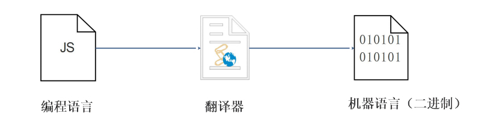
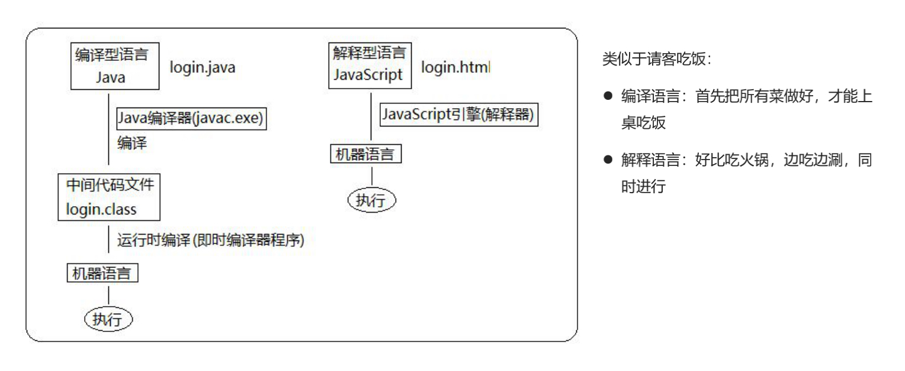
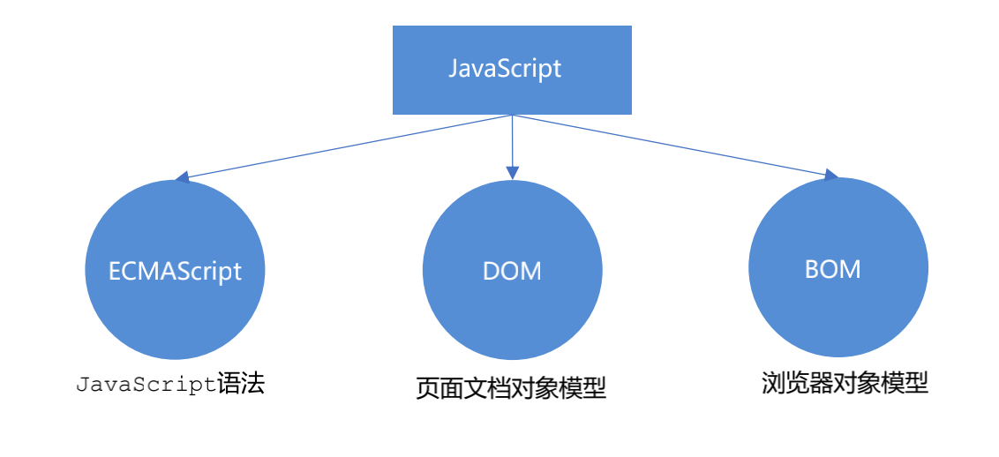

# javascript基础

## 编程

### 计算机程序

计算机所执行的一系列的指令集合，而程序全部都是用我们所掌握的语言来编写的，所以人们要控制计算机一定要通过计算机语言向计算机发出命令。

计算机：任何能够执行代码的设备，可能是智能手机、ATM机、黑莓PI、服务器等等。

高级语言所编制的程序不能直接被计算机识别，必须经过转换才能被执行，为此，我们需要一个翻译器。

翻译器可以将我们所编写的源代码转换为机器语言，这也被称为二进制化。 记住1和 0。

### 解释型语言和编译型语言

计算机不能直接理解任何除机器语言以外的语言，所以必须要把程序员所写的程序语言翻译成机器语言才能执行

程序。程序语言翻译成机器语言的工具，被称为翻译器。 



翻译器翻译的方式有两种：一个是编译，另外一个是解释。两种方式之间的区别在于翻译的时间点不同

1. 编译器是在代码执行之前进行编译，生成中间代码文件
2. 解释器是在运行时进行及时解释，并立即执行(当编译器以解释方式运行的时候，也称之为解释器)

####  执行过程



### 标识符、关键字、保留字

#### 标识符

标识(zhi)符：就是指开发人员为变量、属性、函数、参数取的名字。

标识符不能是关键字或保留字。

#### 关键字

关键字：是指 JS本身已经使用了的字，不能再用它们充当变量名、方法名。

包括：break、case、catch、continue、default、delete、do、else、finally、for、function、if、in、

instanceof、new、return、switch、this、throw、try、typeof、var、void、while、with 等。

#### 保留字

保留字：实际上就是预留的“关键字”，意思是现在虽然还不是关键字，但是未来可能会成为关键字，同样不能

使用它们当变量名或方法名。

包括：boolean、byte、char、class、const、debugger、double、enum、export、extends、

fimal、float、goto、implements、import、int、interface、long、mative、package、

private、protected、public、short、static、super、synchronized、throws、transient、

volatile 等。

注意：如果将保留字用作变量名或函数名，那么除非将来的浏览器实现了该保留字，否则很可能收不到任何错

误消息。当浏览器将其实现后，该单词将被看做关键字，如此将出现关键字错误。

## javascript

### JavaScript 的作用

1. 表单动态校验（密码强度检测） （ JS 产生最初的目的 ）
2. 网页特效
3. 服务端开发(Node.js)
4. 桌面程序(Electron)
5. App(Cordova) 
6. 控制硬件-物联网(Ruff)
7. 游戏开发(cocos2d-js)

### 浏览器分成两部分：渲染引擎和 JS 引擎

**渲染引擎**：用来解析HTML与CSS，俗称内核，比如 chrome 浏览器的 blink ，老版本的 webkit

**JS 引擎**：也称为 JS 解释器。 用来读取网页中的JavaScript代码，对其处理后运行，比如 chrome 浏览器的 V8

浏览器本身并不会执行JS代码，而是通过内置 JavaScript 引擎(解释器) 来执行 JS 代码 。JS 引擎执行代码时逐行解释

每一句源码（转换为机器语言），然后由计算机去执行，所以 JavaScript 语言归为脚本语言，会逐行解释执行。

### JS 的组成



**ECMAScript** 是由ECMA 国际（ 原欧洲计算机制造商协会）进行标准化的一门编程语言，这种语言在万维网上应用广泛，它往往被称为 JavaScript 或 JScript，但实际上后两者是ECMAScript 语言的实现和扩展。

ECMAScript 规定了JS的编程语法和基础核心知识，是所有浏览器厂商共同遵守的一套JS语法工业标准。

**文档对象模型**（Document Object Model，简称DOM），是W3C组织推荐的处理可扩展标记语言的标准编程接口。

通过 DOM 提供的接口可以对页面上的各种元素进行操作（大小、位置、颜色等）。

**BOM** (Browser Object Model，简称BOM) 是指浏览器对象模型，它提供了独立于内容的、可以与浏览器窗口进行

互动的对象结构。通过BOM可以操作浏览器窗口，比如弹出框、控制浏览器跳转、获取分辨率等。

### JS 有3种书写位置，分别为行内、内嵌和外部。

**行内js**

```html
<input type="button" value="点我试试" onclick="alert('Hello World')" />
```

1. 可以将单行或少量 JS 代码写在HTML标签的事件属性中（以 on 开头的属性），如：onclick
2. 注意单双引号的使用：在HTML中我们推荐使用双引号, JS 中我们推荐使用单引号
3. 可读性差， 在html中编写JS大量代码时，不方便阅读；
4. 引号易错，引号多层嵌套匹配时，非常容易弄混；
5. 特殊情况下使用

**内嵌 JS**

```html
 <script>
 alert('Hello World~!');
 </script>
```

1. 可以将多行JS代码写到 `<script>` 标签中
2. 内嵌 JS 是学习时常用的方式

 **外部 JS文件**

```html
<script src="my.js"></script>
```

1. 利于HTML页面代码结构化，把大段 JS代码独立到 HTML 页面之外，既美观，也方便文件级别的复用
2. 引用外部 JS文件的 script 标签中间不可以写代码
3. 适合于JS 代码量比较大的情况

### JavaScript注释

**单行注释**

```javascript
// 用来注释单行文字（ 快捷键 ctrl + / ）
```

**多行注释**

```javascript
/*
默认快捷键 alt + shift + a
获取用户年龄和姓名
并通过提示框显示出来
*/
```

### JavaScript 输入输出语句

| **方法**         | 说明                           | 归属   |
| ---------------- | ------------------------------ | ------ |
| alert(msg)       | 浏览器弹出警示框               | 浏览器 |
| console.log(msg) | 浏览器控制台打印输出信息       | 浏览器 |
| prompt(info)     | 浏览器弹出输入框，用户可以输入 | 浏览器 |

**注意：**alert() 主要用来显示消息给用户，console.log() 用来给程序员自己看运行时的消息。