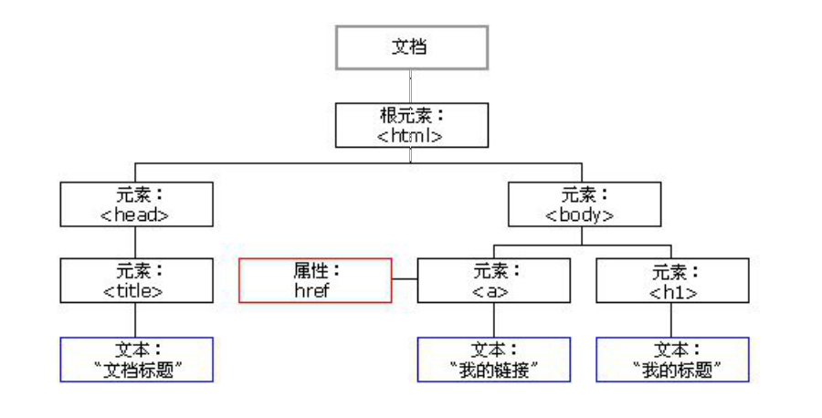
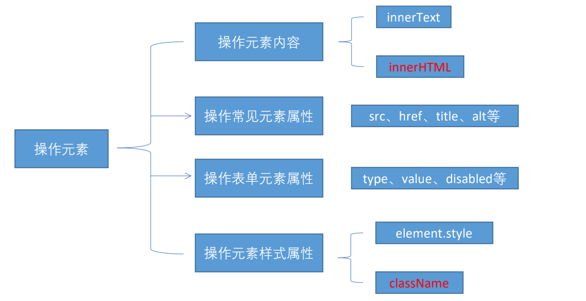
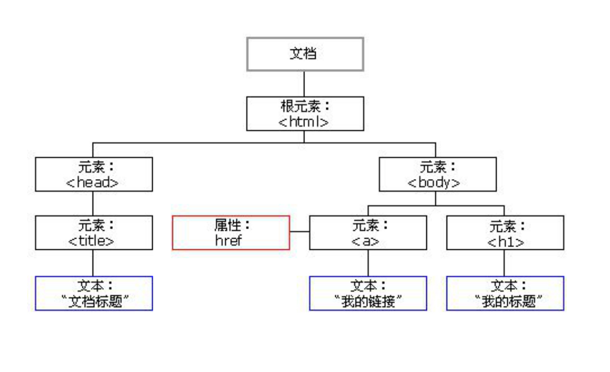

# DOM基础

## DOM 简介

文档对象模型（Document Object Model，简称 DOM），是 W3C 组织推荐的处理可扩展标记语言（HTML

或者XML）的标准编程接口。 

W3C 已经定义了一系列的 DOM 接口，通过这些 DOM 接口可以改变网页的内容、结构和样式。



1. 文档：一个页面就是一个文档，DOM 中使用 document 表示
2. 元素：页面中的所有标签都是元素，DOM 中使用 element 表示
3. 节点：网页中的所有内容都是节点（标签、属性、文本、注释等），DOM 中使用 node 表示

**DOM 把以上内容都看做是对象**

## 获取元素

### 如何获取页面元素

DOM在我们实际开发中主要用来操作元素。

我们如何来获取页面中的元素呢?

获取页面中的元素可以使用以下几种方式: 

1. 根据 ID 获取
2. 根据标签名获取
3. 通过 HTML5 新增的方法获取
4. 特殊元素获取


###  根据 ID 获取

使用 getElementById() 方法可以获取带有 ID 的元素对象。

```javascript
document.getElementById('id');
```


使用 console.dir() 可以打印我们获取的元素对象，更好的查看对象里面的属性和方法。


### 根据标签名获取

使用 getElementsByTagName() 方法可以返回带有指定标签名的对象的集合。

```javascript
document.getElementsByTagName('标签名');
```


注意：

1. 因为得到的是一个对象的集合，所以我们想要操作里面的元素就需要遍历。

2. 得到元素对象是动态的

### 通过 HTML5 新增的方法获取

```javascript
document.getElementsByClassName('类名'); // 根据类名返回元素对象集合
document.querySelector('选择器'); // 根据指定选择器返回第一个元素对象
document.querySelectorAll('选择器'); // 根据指定选择器返回
```


**注意：**

querySelector 和 querySelectorAll里面的选择器需要加符号,比如:`document.querySelector('#nav');`


### 获取特殊元素（body，html）

**获取body元素**

```javascript
doucumnet.body // 返回body元素对象
```


**获取html元素**

```javascript
document.documentElement // 返回html元素对象
```


## 事件基础

JavaScript 使我们有能力创建动态页面，而事件是可以被 JavaScript 侦测到的行为。

简单理解： 触发--- 响应机制。

网页中的每个元素都可以产生某些可以触发 JavaScript 的事件，例如，我们可以在用户点击某按钮时产生一个事件，然后去执行某些操作。

### 事件三要素

1. 事件源 （谁）

2. 事件类型 （什么事件）

3. 事件处理程序 （做啥）

###  执行事件的步骤

1. 获取事件源

2. 注册事件（绑定事件）

3. 添加事件处理程序（采取函数赋值形式）

### 常见的鼠标事件

|    鼠标事件 | 触发条件         |
| ----------: | ---------------- |
|     onclick | 鼠标点击左键触发 |
| onmouseover | 鼠标经过触发     |
|  onmouseout | 鼠标离开触发     |
|     onfocus | 获得鼠标焦点触发 |
|      onblur | 失去鼠标焦点触发 |
| onmousemove | 鼠标移动触发     |
|   onmouseup | 鼠标弹起触发     |
| onmousedown | 鼠标按下触发     |


## 操作元素

JavaScript 的 DOM 操作可以改变网页内容、结构和样式，我们可以利用 DOM 操作元素来改变元素里面的内容 、属性等。注意以下都是属性

### 改变元素内容

```javascript
element.innerText;
```

从起始位置到终止位置的内容, 但它去除 html 标签， 同时空格和换行也会去掉


```javascript
element.innerHTML;
```

起始位置到终止位置的全部内容，包括 html 标签，同时保留空格和换行

### 常用元素的属性操作

```javascript
// 1. innerText、innerHTML 改变元素内容
// 2. src 图片路径、href 连接到页面位置
// 3. id  元素ID、alt 图片加载失败显示的文字、title 鼠标悬停在图片上的标题
```


### 表单元素的属性操作

利用 DOM 可以操作如下表单元素的属性：

```javascript
// 1. type 输入框类型
// 2. value 输入框的值
// 3. checked 复选框的选中状态
// 4. selected 下拉框的选中状态
// 5. disabled 输入框的禁用
```


### 样式属性操作

我们可以通过 JS 修改元素的大小、颜色、位置等样式。

```javascript
// 1. element.style 行内样式操作
// 2. element.className 类名样式操作
```

#### 行内样式操作

1. JS 里面的样式采取驼峰命名法 比如 fontSize、 backgroundColor
2. JS 修改 style 样式操作，产生的是行内样式，CSS 权重比较高


#### 类名样式操作

1. 如果样式修改较多，可以采取操作类名方式更改元素样式。

2. class因为是个保留字，因此使用className来操作元素类名属性

3. className 会直接更改元素的类名，会覆盖原先的类名。

### 操作元素是 DOM 核心内容




### 排他思想

如果有同一组元素，我们想要某一个元素实现某种样式， 需要用到循环的排他思想算法：

1. 所有元素全部清除样式（干掉其他人）

2. 给当前元素设置样式 （留下我自己）

3. 注意顺序不能颠倒，首先干掉其他人，再设置自己


### 自定义属性的操作

#### 1. 获取属性值

1. element.属性 获取属性值。
2. element.getAttribute('属性');

**区别：**

1. element.属性 获取内置属性值（元素本身自带的属性）
2. element.getAttribute(‘属性’); 主要获得自定义的属性 （标准） 程序员自定义的属性


#### 2. 设置属性值 

1. element.属性 = ‘值’ 设置内置属性值。
2. element.setAttribute('属性', '值');

**区别：**

element.属性 设置内置属性值 

element.setAttribute(‘属性’); 主要设置自定义的属性 （标准）


#### 3.移除属性

element.removeAttribute('属性');


###  H5自定义属性

**自定义属性目的：是为了保存并使用数据。有些数据可以保存到页面中而不用保存到数据库中。**

自定义属性获取是通过getAttribute(‘属性’) 获取。

但是有些自定义属性很容易引起歧义，不容易判断是元素的内置属性还是自定义属性。

H5给我们新增了自定义属性：

#### 1. 设置H5自定义属性

H5规定自定义属性data-开头做为属性名并且赋值。

比如 `<div data-index="1"></div>`

或者使用 JS 设置

`element.setAttribute(‘data-index’, 2)`


#### 2. 获取H5自定义属性

1. 兼容性获取 `element.getAttribute(‘data-index’);`

2. H5新增 `element.dataset.index` 或者 `element.dataset[‘index’]` ie 11才开始支持


## 节点操作

###  为什么学节点操作

获取元素通常使用两种方式：

1. 利用 DOM 提供的方法获取元素
2. 利用节点层级关系获取元素


#### 利用 DOM 提供的方法获取元素 

```javascript
document.getElementById();
document.getElementsByTagName();
document.querySelector;
```

逻辑性不强、繁琐


#### 利用节点层级关系获取元素

1. 利用父子兄节点关系获取元素
2. 逻辑性强， 但是兼容性稍差

这两种方式都可以获取元素节点，我们后面都会使用，但是节点操作更简单


### 节点概述

网页中的所有内容都是节点（标签、属性、文本、注释等），在DOM 中，节点使用 node 来表示。HTML DOM 树中的所有节点均可通过 JavaScript 进行访问，所有 HTML 元素（节点）均可被修改，也可以创建或删除。

一般地，节点至少拥有nodeType（节点类型）、nodeName（节点名称）和nodeValue（节点值）这三个基本属性。 

1. 元素节点 nodeType 为 1 
2. 属性节点 nodeType 为 2 
3. 文本节点 nodeType 为 3 （文本节点包含文字、空格、换行等）

我们在实际开发中，节点操作主要操作的是**元素节点**


### 节点层级

利用 DOM 树可以把节点划分为不同的层级关系，常见的是**父子兄层级关系**。




#### 父级节点

```javascript
node.parentNode;
```

1. parentNode 属性可返回某节点的父节点，注意是最近的一个父节点
2. 如果指定的节点没有父节点则返回 null 


#### 子节点

##### 标准方式

```javascript
// 1. parentNode.childNodes（标准）
```

parentNode.childNodes 返回包含指定节点的子节点的集合，该集合为即时更新的集合。

**注意：**返回值里面包含了所有的子节点，包括元素节点，文本节点等。

如果只想要获得里面的元素节点，则需要专门处理。 所以我们一般不提倡使用childNodes

```javascript
var ul = document.querySelector('ul');
for (var i = 0; i < ul.childNodes.length; i++) {
    if (ul.childNodes[i].nodeType == 1) {
        // ul.childNodes[i] 是元素节点
        console.log(ul.childNodes[i]);
    }
}
```


##### 非标准方式

```javascript
// 2. parentNode.children（ 非标准）
```

parentNode.children 是一个只读属性，返回所有的子元素节点。它只返回子元素节点，其余节点不返回 （**这个是我们重点掌握的**）。

虽然children 是一个非标准，但是得到了各个浏览器的支持，因此我们可以放心使用


##### 第一个字节点/最后一个字节点[标准]

```javascript
// 3. parentNode.firstChild
```

firstChild 返回第一个子节点，找不到则返回null。同样，也是包含所有的节点。

```javascript
// 4. parentNode.lastChild
```

lastChild 返回最后一个子节点，找不到则返回null。同样，也是包含所有的节点。

##### 第一个字节点/最后一个字节点[非标准]

```javascript
// 5. parentNode.firstElementChild
```

firstElementChild 返回第一个子元素节点，找不到则返回null。

```javascript
// 6. parentNode.lastElementChild
```

lastElementChild 返回最后一个子元素节点，找不到则返回null。

注意：这两个方法有兼容性问题，IE9 以上才支持。


##### 第一个字节点/最后一个字节点[实际开发中]

实际开发中，firstChild 和 lastChild 包含其他节点，操作不方便，而 firstElementChild 和

lastElementChild 又有兼容性问题，那么我们如何获取第一个子元素节点或最后一个子元素节点呢？

**解决方案：**

1. 第一个子元素节点，可以使用 `parentNode.chilren[0]`
2. 最后一个子元素节点，可以使用 `parentNode.chilren[parentNode.chilren.length - 1]` 


#### 兄弟节点

##### 标准方式

```javascript
// 1. node.nextSibling
```

nextSibling 返回当前元素的下一个兄弟元素节点，找不到则返回null。同样，也是包含所有的节点。

```javascript
// 2. node.previousSibling
```

previousSibling 返回当前元素上一个兄弟元素节点，找不到则返回null。同样，也是包含所有的节点。


##### 非标准方式

```javascript
// 3. node.nextElementSibling
```

nextElementSibling 返回当前元素下一个兄弟元素节点，找不到则返回null。

```javascript
// 4. node.previousElementSibling
```

previousElementSibling 返回当前元素上一个兄弟节点，找不到则返回null。

注意：这两个方法有兼容性问题， IE9 以上才支持。


##### 开发中解决兼容性问题

自己封装一个兼容性的函数

```javascript
function getNextElementSibling(element) {
    var el = element;
    while (el = el.nextSibling) {
        if (el.nodeType === 1) {
            return el;
        }
    }
    return null;
}
```


### 创建节点

```javascript
document.createElement('tagName');
```

document.createElement() 方法创建由 tagName 指定的 HTML 元素。因为这些元素原先不存在，是根据我们的需求动态生成的，所以我们也称为动态创建元素节点。

### 添加节点

```javascript
// 1. node.appendChild(child);
```

node.appendChild() 方法将一个节点添加到指定父节点的子节点列表末尾。类似于 CSS 里面的 after 伪元素。

```javascript
// 2. node.insertBefore(child, 指定元素);
```

node.insertBefore() 方法将一个节点添加到父节点的指定子节点前面。类似于 CSS 里面的 before 伪元素。


###  删除节点

```javascript
node.removeChild(child);
```

node.removeChild() 方法从 DOM 中删除一个子节点，返回删除的节点。


### 复制节点(克隆节点)

```javascript
node.cloneNode();
```

node.cloneNode() 方法返回调用该方法的节点的一个副本。 也称为克隆节点/拷贝节点

**注意：**

1. 如果括号参数为空或者为 false ，则是浅拷贝，即只克隆复制节点本身，不克隆里面的子节点。

2. 如果括号参数为 true ，则是深度拷贝，会复制节点本身以及里面所有的子节点。


### 三种动态创建元素区别

1. document.write()
2. element.innerHTML
3. document.createElement()

**区别**

1. document.write 是直接将内容写入页面的内容流，但是文档流执行完毕，则它会导致页面全部重绘

2. innerHTML 是将内容写入某个 DOM 节点，不会导致页面全部重绘

3. innerHTML 创建多个元素效率更高（**不要拼接字符串，采取数组形式拼接**），结构稍微复杂

4. createElement() 创建多个元素效率稍低一点点，但是结构更清晰

**总结**：不同浏览器下，innerHTML 效率要比 creatElement 高


##  DOM 重点核心

### 创建元素

1. document.write

2. innerHTML

3. createElement


### 增加元素

1. appendChild

2. insertBefore


### 删除元素

1. removeChild


### 修改元素

主要修改dom的元素属性，dom元素的内容、样式，表单的属性, 表单的值等

1. 修改元素属性： src、href、title等

2. 修改普通元素内容： innerHTML 、innerText

3. 修改表单元素： value、type、disabled等

4. 修改元素样式： style、className


### 查询元素

主要获取查询dom的元素

1. DOM提供的API 方法： getElementById、getElementsByTagName 古老用法 不太推荐

2. H5提供的新方法： querySelector、querySelectorAll 提倡

3. 利用节点操作获取元素： 父(parentNode)、子(children)、兄(previousElementSibling、nextElementSibling) 提倡


### 属性操作

主要针对于自定义属性。

1. setAttribute：设置dom的属性值

2. getAttribute：得到dom的属性值

3. removeAttribute移除属性


### 事件操作

给元素注册事件， 采取 事件源.事件类型 = 事件处理程序

|    鼠标事件 | 触发条件         |
| ----------: | ---------------- |
|     onclick | 鼠标点击左键触发 |
| onmouseover | 鼠标经过触发     |
|  onmouseout | 鼠标离开触发     |
|     onfocus | 获得鼠标焦点触发 |
|      onblur | 失去鼠标焦点触发 |
| onmousemove | 鼠标移动触发     |
|   onmouseup | 鼠标弹起触发     |
| onmousedown | 鼠标按下触发     |

