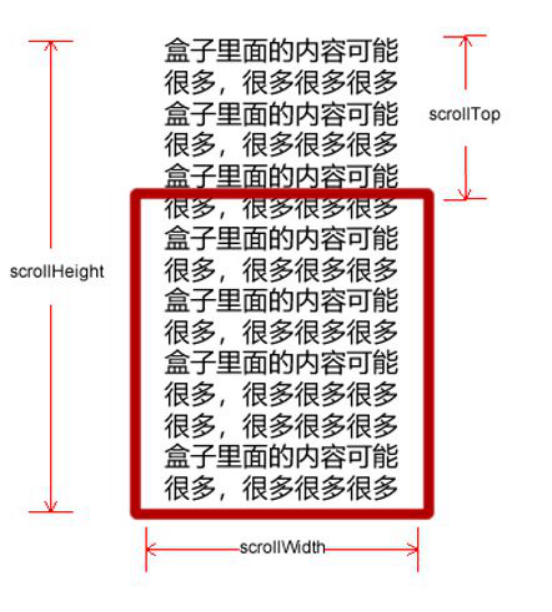

# PC 端网页特效

## 元素偏移量 offset 系列

###  offset 概述

offset 翻译过来就是偏移量， 我们使用 offset 系列相关属性可以动态的得到该元素的位置（偏移）、大小等。

1. 获得元素距离带有定位父元素的位置
2. 获得元素自身的大小（宽度高度） 
3. 注意： 返回的数值都不带单位

offset 系列常用属性：

|       offset系列属性 | 作用                                                       |
| -------------------: | ---------------------------------------------------------- |
| element.offsetParent | 返回该元素带有定位的父级元素，如果父级元素没有定位返回body |
|    element.offsetTop | 返回元素相对于带有定位父元素上边框的偏移量                 |
|   element.offsetLeft | 返回元素相对于带有定位父元素左边框的偏移量                 |
|  element.offsetWidth | 返回自身包括padding、边框、内容区的宽度，返回数值不带单位  |
| element.offsetHeight | 返回自身包括padding、边框、内容区的高度，返回数值不带单位  |


### offset 与 style 区别

#### offset

1. offset 可以得到任意样式表中的样式值
2. offset 系列获得的数值是没有单位的
3. offsetWidth 包含padding+border+width
4. offsetWidth 等属性是只读属性，只能获取不能赋值
5. 所以，我们想要获取元素大小位置，用offset更合适


####  style

1. style 只能得到行内样式表中的样式值
2. style.width 获得的是带有单位的字符串
3. style.width 获得不包含padding和border 的值
4. style.width 是可读写属性，可以获取也可以赋值
5. 所以，我们想要给元素更改值，则需要用style改变


## 元素可视区 client 系列

client 翻译过来就是客户端，我们使用 client 系列的相关属性来获取元素可视区的相关信息。通过 client 系列的相关属性可以动态的得到该元素的边框大小、元素大小等。

|       client系列属性 | 作用                                                         |
| -------------------: | ------------------------------------------------------------ |
|    element.clientTop | 返回元素上边框的大小                                         |
|   element.clientLeft | 返回元素左边框的大小                                         |
|  element.clientWidth | 返回自身包括padding、内容区的宽度，不包含边框，返回数值不带单位 |
| element.clientHeight | 返回自身包括padding、内容区的高度，不包含边框，返回数值不带单位 |


## 元素滚动 scroll 系列

### 元素 scroll 系列属性

scroll 翻译过来就是滚动的，我们使用 scroll 系列的相关属性可以动态的得到该元素的大小、滚动距离等。

|       scroll系列属性 | 作用                                           |
| -------------------: | ---------------------------------------------- |
|    element.scrollTop | 返回被卷去的上侧距离，返回值不带单位           |
|   element.scrollLeft | 返回被卷去的左侧距离，返回值不带单位           |
|  element.scrollWidth | 返回自身实际的宽度，不含边框，返回数值不带单位 |
| element.scrollHeight | 返回自身实际的高度，不含边框，返回数值不带单位 |



### 页面被卷去的头部

如果浏览器的高（或宽）度不足以显示整个页面时，会自动出现滚动条。当滚动条向下滚动时，页面上面被隐藏掉的高度，我们就称为页面被卷去的头部。滚动条在滚动时会触发 onscroll 事件。

### 页面被卷去的头部兼容性解决方案

需要注意的是，页面被卷去的头部，有兼容性问题，因此被卷去的头部通常有如下几种写法：

1. 声明了 DTD，使用 document.documentElement.scrollTop

2. 未声明 DTD，使用 document.body.scrollTop

3. 新方法 window.pageYOffset 和 window.pageXOffset，IE9 开始支持

```javascript
function getScroll() {
    return {
        left: window.pageXOffset || document.documentElement.scrollLeft || document.body.scrollLeft || 0,
        top: window.pageYOffset || document.documentElement.scrollTop || document.body.scrollTop || 0
    };
}
// 使用的时候 getScroll().left
```


## 三大系列总结


|    三大系列大小对比 | 作用                                                         |
| ------------------: | ------------------------------------------------------------ |
| element.offsetWidth | 返回自身包括padding、边框、内容区的宽度，返回的数值不带单位  |
| element.clientWidth | 返回自身包括padding、内容区的宽度，不含边框，返回的数值不带单位 |
| element.scrollWidth | 返回自身实际的宽度，不含边框，返回数值不带单位               |


他们主要用法：

1. offset系列 经常用于获得元素位置 offsetLeft offsetTop

2. client 经常用于获取元素大小 clientWidth clientHeight

3. scroll 经常用于获取滚动距离 scrollTop scrollLeft 

4. 注意页面滚动的距离通过 window.pageXOffset 获得


## mouseenter 和mouseover的区别

### mouseenter 鼠标事件

当鼠标移动到元素上时就会触发 mouseenter 事件类似 mouseover，它们两者之间的差别是

1. mouseover 会冒泡，mouseenter不会冒泡
2. mouseover 鼠标经过自身盒子会触发，经过子盒子还会触发。
3. mouseenter 只会经过自身盒子触发

鼠标进入 mouseenter、鼠标离开 mouseleave 都不会冒泡


## 动画函数封装

### 动画实现原理

**核心原理**：通过定时器 setInterval() 不断移动盒子位置。

实现步骤：

1. 获得盒子当前位置

2. 让盒子在当前位置加上1个移动距离

3. 利用定时器不断重复这个操作

4. 给定时器加一个结束的条件

5. 注意此元素需要添加定位，才能使用`element.style.left`

### 动画函数简单封装

注意函数需要传递2个参数，**动画对象和移动到的距离**。

### 动画函数给不同元素记录不同定时器

如果多个元素都使用这个动画函数，每次都要var 声明定时器。我们可以给不同的元素使用不同的定时器（自己专门用自己的定时器）。

核心原理：利用 JS 是一门动态语言，可以很方便的给当前对象添加属性。

###  缓动效果原理

缓动动画就是让元素运动速度有所变化，最常见的是让速度慢慢停下来

思路：

1. 让盒子每次移动的距离慢慢变小，速度就会慢慢落下来。

2. 核心算法： (目标值 - 现在的位置 ) / 10 做为每次移动的距离 步长

3. 停止的条件是： 让当前盒子位置等于目标位置就停止定时器

4. 注意步长值需要取整

### 动画函数多个目标值之间移动

可以让动画函数从 800 移动到 500。

当我们点击按钮时候，判断步长是正值还是负值

1. 如果是正值，则步长 往大了取整

2. 如果是负值，则步长 向小了取整

### 动画函数添加回调函数

**回调函数原理**：函数可以作为一个参数。将这个函数作为参数传到另一个函数里面，当那个函数执行完之后，再执行传进去的这个函数，这个过程就叫做回调。 

回调函数写的位置：定时器结束的位置。

### 动画函数封装到单独JS文件里面

因为以后经常使用这个动画函数，可以单独封装到一个JS文件里面，使用的时候引用这个JS文件即可。

1. 单独新建一个JS文件。

2. HTML文件引入 JS 文件。

## 常见网页特效案例


