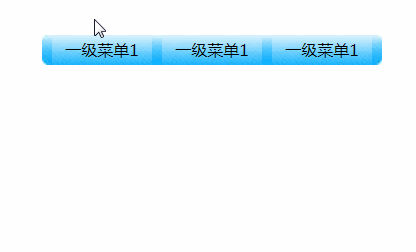
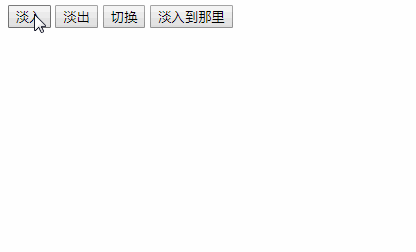

## jquery 基本认识

### 为什么要学jquery

使用javascript开发过程中，有许多的缺点：

1. 查找元素的方法单一，麻烦。
2. 遍历数组很麻烦，通常要嵌套一大堆的for循环。
3. 有兼容性问题。
4. 想要实现简单的动画效果，也很麻烦
5. 代码冗余。

### 体验jquery的使用

```javascript
// 1. 查找元素的方法多种多样，非常灵活
// 2. 拥有隐式迭代特性，因此不再需要手写for循环了。
// 3. 完全没有兼容性问题。
// 4. 实现动画非常简单，而且功能更加的强大。
// 5. 代码简单、粗暴。
$(document).ready(function() {
    $("#btn1").click(function() {
        $("div").show(200);
    });
    $("#btn2").click(function() {
        $("div").text("我是内容");
    });
});
```


### jquery到底是什么

> jQuery的官网 http://jquery.com/
> jQuery就是一个js库，使用jQuery的话，会比使用JavaScript更简单。

js库：把一些常用到的方法写到一个单独的js文件，使用的时候直接去引用这js文件就可以了。
（animate.js、common.js）

jQuery其实就是一个js文件，里面封装了一大堆的方法方便开发，
其实就是一个加强版的common.js，jQuery这个js文件中封装的一大堆方法。

### jquery的版本问题

> 官网下载地址：http://jquery.com/download/
> jQuery版本有很多，分为1.x 2.x 3.x
> 1.x和2.x版本jquery都不再更新版本了，现在只更新3.x版本。

大版本分类：

- 1.x版本：能够兼容IE678浏览器
- 2.x版本：不能兼容IE678浏览器
- 3.x版本：不能兼容IE678浏览器，更加的精简（在国内不流行，因为国内使用jQuery的主要目的就是兼容IE678）

关于压缩版和未压缩版：

- jquery-1.12.4.min.js:压缩版本，适用于生产环境，因为文件比较小，去除了注释、换行、空格等东西，但是基本没有颗阅读性。
- jquery-1.12.4.js:未压缩版本，适用于学习与开发环境，源码清晰，易阅读。

### jquery的入口函数

使用jQuery的三个步骤：

1. 引入jQuery文件
2. 入口函数
3. 功能实现

关于jQuery的入口函数：

```javascript
//第一种写法
$(document).ready(function() {
	
});
//第二种写法
$(function() {
	
});

```

DOM 结构渲染完毕即可执行内部代码，不必等到所有外部资源加载完成，jQuery 帮我们完成了封装。
相当于原生 js 中的 DOMContentLoaded。不同于原生 js 中的 load 事件是等页面文档、外部的 js 文件、css文件、图片加载完毕才执行内部代码。
更推荐使用第一种方式。

jQuery入口函数与js入口函数的对比：

1. JavaScript的入口函数要等到页面中所有资源（包括图片、文件）加载完成才开始执行。
2. jQuery的入口函数只会等待文档树加载完成就开始执行，并不会等待图片、文件的加载。

```javascript
//1.$是什么?
//如果报了这个错误:$ is not defined,就说明没有引入jQuery文件.
$(function() {

});

//2.查看jQuery文件结构.
//jQuery其实是一个自执行函数.
(function() {
    window.jQuery = window.$ = jQuery;
}());

//3.分析jQuery文件
//a.引入一个js文件,是会执行这js文件中的代码的.
console.log(num); //10
//b.jQuery文件是一个自执行函数,执行这个jQUERY文件中的代码,其实就是执行这个自执行函数.
//c.这个自执行文件就是给window对象添加一个jQuery属性和$属性.
console.log(window);
//d.$其实和jQuery是等价的,是一个函数.
console.log(window.jQuery === window.$); //true
console.log(Object.prototype.toString.call($)); //'[object Function]'

//4.$是一个函数
//参数传递不同,效果也不一样.
//4.1 如果参数传递的是一个匿名函数-入口函数
$(function() {});
//4.2 如果参数传递的是一个字符串-选择器/创建一个标签
$('#one');
$('<div>啦啦,我是一个div</div>');
//4.3 如果参数是一个dom对象,那他就会把dom对象转换成jQuery对象.
$(dom对象);
```


### jq对象和dom对象(重要)

1. DOM对象：使用JavaScript中的方法获取页面中的元素返回的对象就是dom对象。
2. jQuery对象：jquery对象就是使用jquery的方法获取页面中的元素返回的对象就是jQuery对象。
3. jQuery对象其实就是DOM对象的包装,包装了DOM对象的集合（伪数组）
4. DOM对象与jQuery对象的方法不能混用。

```javascript
// DOM对象转换成jQuery对象
var $obj = $(domObj);
// $(document).ready(function(){});就是典型的DOM对象转jQuery对象

// jQuery对象转换成DOM对象
var $li = $("li");
//第一种方法（推荐使用）
$li[0];
//第二种方法
$li.get(0);
```


## jquery选择器

### 什么是jQuery选择器

1. jQuery选择器是jQuery为我们提供的一组方法，让我们更加方便的获取到页面中的元素。

   注意：jQuery选择器返回的是jQuery对象。

2. jQuery选择器有很多，基本兼容了CSS1到CSS3所有的选择器，并且jQuery还添加了很多扩展性的选择器。

   【查看jQuery文档】

3. jQuery选择器虽然很多，但是选择器之间可以相互替代，就是说获取一个元素，你会有很多种方法获取到。

所以我们平时真正能用到的只是少数的最常用的选择器。

### 基本选择器

| 名称       | 用法               | 描述                                 |
| ---------- | ------------------ | ------------------------------------ |
| ID选择器   | $(“#id”);          | 获取指定ID的元素                     |
| 类选择器   | $(“.class”);       | 获取同一类class的元素                |
| 标签选择器 | $(“div”);          | 获取同一类标签的所有元素             |
| 并集选择器 | $(“div,p,li”);     | 使用逗号分隔，只要符合条件之一就可。 |
| 交集选择器 | $(“div.redClass”); | 获取class为redClass的div元素         |

>
> 总结：跟css的选择器用法一模一样。

### 层级选择器

| 名称       | 用法        | 描述                                                        |
| ---------- | ----------- | ----------------------------------------------------------- |
| 子代选择器 | $(“ul>li”); | 使用>号，获取儿子层级的元素，注意，并不会获取孙子层级的元素 |
| 后代选择器 | $(“ul li”); | 使用空格，代表后代选择器，获取ul下的所有li元素，包括孙子等  |

> 总结：跟css的选择器用法一模一样。

### 过滤选择器

| 名称       | 用法                               | 描述                                                        |
| ---------- | ---------------------------------- | ----------------------------------------------------------- |
| :eq(index) | $(“li:eq(2)”).css(“color”, ”red”); | 获取到的li元素中，选择索引号为2的元素，索引号index从0开始。 |
| :odd       | $(“li:odd”).css(“color”, ”red”);   | 获取到的li元素中，选择索引号为奇数的元素                    |
| :even      | $(“li:even”).css(“color”, ”red”);  | 获取到的li元素中，选择索引号为偶数的元素                    |

> 总结：这类选择器都带冒号

### 筛选选择器(方法)

| 名称               | 用法                        | 描述                             |
| ------------------ | --------------------------- | -------------------------------- |
| children(selector) | $(“ul”).children(“li”)      | 相当于$(“ul>li”)，子类选择器     |
| find(selector)     | $(“ul”).find(“li”);         | 相当于$(“ul li”),后代选择器      |
| siblings(selector) | $(“#first”).siblings(“li”); | 查找兄弟节点，不包括自己本身。   |
| parent()           | $(“#first”).parent();       | 查找父亲                         |
| eq(index)          | $(“li”).eq(2);              | 相当于$(“li:eq(2)”),index从0开始 |
| next()             | $(“li”).next()              | 找下一个兄弟                     |
| prev()             | $(“li”).prev()              | 找上一次兄弟                     |

> 总结：筛选选择器的功能与过滤选择器有点类似，但是用法不一样，筛选选择器主要是方法。

## 元素设置

### 样式设置

```javascript
//1.设置一个样式
//1.1两个参数  设置的样式属性,具体样式
$('li').css('color', 'red');
//1.2传入对象（设置的样式属性:具体样式）
$('li').css({ 'color': 'red' });

//2.设置多个样式
$('li').css({
    'color': 'green',
    'font-size': '20px'
});
```


### 类名设置

```javascript
//1.添加一个类
$('li').addClass('now');
//2.删除一个类
$('li').removeClass('now');
//3.切换一个类  有就删除没有就添加
$('li').toggleClass('now');
//4.匹配一个类  判断是否包含某个类  如果包含返回true否知返回false
$('li').hasClass('now');
```


### 属性设置

```javascript
//1.获取属性
$('li').attr('name');
//2.设置属性
$('li').attr('name', 'tom');
//3.设置多个属性
$('li').attr({
    'name': 'tom',
    'age': '18'
});
//4.删除属性
$('li').removeAttr('name');
```


### prop方法

```javascript
// 设置或获取元素固有属性值 prop()
$("#checkbox").prop("checked");
$("#checkbox").prop("checked", true);
$("#checkbox").prop("checked", false);
$("#checkbox").removeProp("checked");
```


## 动画

### 基本动画

```javascript
// 注意：动画的本质是改变容器的大小和透明度
// 注意：如果不传参数是看不到动画
// 注意：可传入特殊的字符  fast normal slow
// 注意：可传入数字 单位毫秒
// 1.展示动画
$('li').show();
// 2.隐藏动画
$('li').hide();
// 3.切换展示和隐藏
$('li').toggle();
```


### 滑入滑出

```javascript
// 注意：动画的本质是改变容器的高度
// 1.滑入动画
$('li').slideDown();
// 2.滑出动画
$('li').slideUp();
// 3.切换滑入滑出
$('li').slideToggle();
```



### 淡入淡出

```javascript
// 注意：动画的本质是改变容器的透明度
// 1.淡入动画
$('li').fadeIn();
// 2.淡出动画
$('li').fadeOut();
// 3.切换淡入淡出
$('li').fadeToggle();
$('li').fadeTo('speed', 'opacity');
```



### 自定义动画

```javascript
// 自定义动画
// 参数1： 需要做动画的属性
// 参数2： 需要执行动画的总时长
// 参数3： 执行动画的时候的速度
// 参数4： 执行动画完成之后的回调函数
$('#box1').animate({ left: 800 }, 5000);
$('#box2').animate({ left: 800 }, 5000, 'linear');
$('#box3').animate({ left: 800 }, 5000, 'swing', function() {
    console.log('动画执行完成');
});
```


### 动画队列

 jQuery中有个动画队列的机制。

1. 当我们对一个对象添加多次动画效果时后添加的动作就会被放入这个动画队列中，  等前面的动画完成后再开始执行。
2. 可是用户的操作往往都比动画快，  如果用户对一个对象频繁操作时不处理动画队列就会造成队列堆积，影响到效果。

### stop使用

```javascript
// 1.停止当前动画  如果动画队列当中还有动画立即执行
$('div').stop();
// 2.和stop()效果一致  说明这是默认设置
$('div').stop(false, false);
// 3.停止当前动画  清除动画队列
$('div').stop(true, false);
// 4.停止当前动画  清除了动画队列,并且动画停止到结束位置
$('div').stop(true, true);
// 5.停止当前动画  如果动画队列当中还有动画立即执行，并且动画停止到结束位置
$('div').stop(false, true);
```

