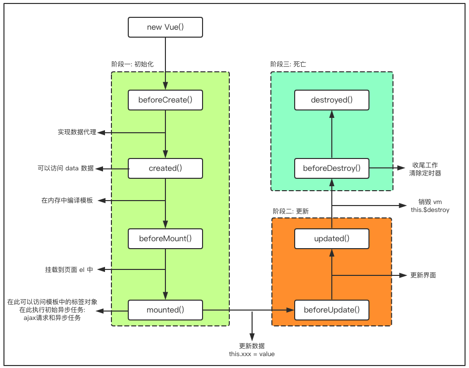

# VUE基础

## 认识Vuejs

### 为什么学习Vuejs

### 简单认识一下Vuejs

#### Vue是一个渐进式的框架

1. 渐进式意味着你可以将Vue作为你应用的一部分嵌入其中。
2. 使用Vue的核心库以及其生态系统实现业务逻辑，比如Core+Vue-router+Vuex。

#### Vue有很多特点和Web开发中常见的高级功能

1. 解耦视图和数据
2. 可复用的组件
3. 前端路由技术
4. 状态管理
5. 虚拟DOM

## Vuejs安装方式

### CDN引入

```html
<!-- 开发环境版本，包含了有帮助的命令行警告 --> 
<script src="https://cdn.jsdelivr.net/npm/vue/dist/vue.js"></script>
<!-- 生产环境版本，优化了尺寸和速度 -->
<script src="https://cdn.jsdelivr.net/npm/vue"></script>
```

### 下载和引入

开发环境 https://v2.vuejs.org/js/vue.js

生产环境 https://v2.vuejs.org/js/vue.min.js

### NPM安装管理

## Vuejs入门

### Hello Vuejs

```html
<div id="app">
  <h2>hello {{name}}</h2>
</div>
<script src="js/vue.js"></script>
<script>
  let app = new Vue({
    el: '#app',
    data: {
      name: 'VueJS'
    }
  });
</script>
```

创建Vue对象，传入options对象
options对象包含了

el属性：该属性决定了这个Vue对象挂载到哪一个元素上。这里挂载到了id为app的元素上

data属性：该属性中通常会存储一些数据。这些数据可以是直接定义出来的，比如像上面这样。也可能是来自网络，从服务器加载的。
详细选项解析： https://cn.vuejs.org/v2/api/#%E9%80%89%E9%A1%B9-%E6%95%B0%E6%8D%AE
el: 
类型：string | HTMLElement
作用：决定之后Vue实例会管理哪一个DOM。
data: 
类型：Object | Function （组件当中data必须是一个函数）
作用：Vue实例对应的数据对象。
methods: 
类型：{ [key: string]: Function }
作用：定义属于Vue的一些方法，可以在其他地方调用，也可以在指令中使用。

### Vue列表展示

```html
<div id="app">
  <ul>
    <li v-for="item in movies">
      {{item}}
    </li>
  </ul>
</div>
<script src="js/vue.js"></script>
<script>
  let app = new Vue({
    el: '#app',
    data: {
      movies: ['唐三藏', '孙悟空', '猪八戒', '沙和尚', '小白龙']
    }
  });
</script>
```

### 案例：计数器

用到的属性与指令

1. 新的属性：methods，该属性用于在Vue对象中定义方法。
2. 新的指令：@click, 该指令用于监听某个元素的点击事件，并且需要指定当发生点击时，执行的方法(方法通常是methods中定义的方法)

```html
<div id="app">
  <h2>当前计数:{{counter}}</h2>
  <button @click="increment">+</button>
  <button @click="decrement">-</button>
</div>
<script src="js/vue.js"></script>
<script>
  let app = new Vue({
    el: '#app',
    data: {
      counter: 0
    },
    methods: {
      increment() {
        this.counter++;
      },
      decrement() {
        this.counter--;
      }
    }
  });
</script>
```


## Vuejs中的MVVM

### Vue中的MVVM

#### 什么是MVVM呢？

看维基百科https://zh.wikipedia.org/wiki/MVVM

Vue的MVVM


View层[视图层]：

在前端开发中，通常就是DOM层。主要的作用是给用户展示各种信息。

Model层[数据层]：

直接定义的数据，来自后端服务器，从网络上请求下来的数据。

VueModel层[视图模型层]：

视图模型层是View和Model沟通的桥梁。

1. 一方面它实现了Data Binding，也就是数据绑定，将Model的改变实时的反应到View中
2. 另一方面它实现了DOM Listener，也就是DOM监听，当DOM发生一些事件(点击、滚动、touch等)时，可以监听到，并在需要的情况下改变对应的Data。

#### 计数器的MVVM

1. View依然是DOM
2. Model就是我们我们抽离出来的obj
3. ViewModel就是我们创建的Vue对象实例

##### 它们之间如何工作呢？

1. 首先ViewModel通过Data Binding让obj中的数据实时的在DOM中显示。
2. 其次ViewModel通过DOM Listener来监听DOM事件，并且通过methods中的操作，来改变obj中的数据。

Vue完成了VueModel层的任务，在后续的开发，我们就可以专注于数据的处理，以及DOM的编写工作了。

### VUE的生命周期





