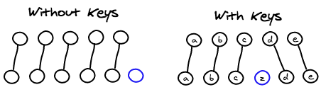

# VUE基础语法

## 插值操作

### Mustache语法

通过Mustache语法(也就是双大括号)

```html
<h2>hello {{name}}</h2>
<h2>{{firstName}} {{lastName}}</h2>
<h2>{{counter*2}}</h2>
```


### v-once

1. 后面不需要跟任何表达式(比如v-for后面跟表达式)
2. 表示元素和组件只渲染一次，不会随着数据的改变而改变。

```html
<h2 v-once>{{message}}</h2>
```


### v-html

1. 后面往往会跟上一个string类型
2. 会将string的html解析出来并且进行渲染

```html
<div id="app">
	<h2>{{link}}</h2>
  <h2 v-html="link"></h2>
</div>
<script src="js/vue.js"></script>
<script>
  let app = new Vue({
    el: '#app',
    data: {
      link: '<a href="https://github.com">github</a>'
    }
  });
</script>

```


### v-text

v-text作用和Mustache一致

v-text通常情况下，接受一个string类型

```html
<h2>{{message}}</h2>
<h2 v-text="message"></h2>
```


### v-pre

v-pre用于跳过这个元素和它子元素的编译过程，用于显示原本的Mustache语法。

```html
<h2>{{message}}</h2>
<!-- 不编译 直接显示 {{message}} -->
<h2 v-pre>{{message}}</h2>
```


### v-cloak

在某些情况下，我们浏览器可能会直接显示出未编译的Mustache标签。

```html
<h2 v-cloak>{{message}}</h2>
<style>
  [v-cloak] {
    display: none;
  }
</style>
```


## 绑定属性

### v-bind基础

v-bind指令：
作用：动态绑定属性
缩写：`:`
预期：any (with argument) | Object (without argument)
参数：attrOrProp (optional)

比如动态绑定 a元素的href属性，img元素的src属性，类名，样式

```html
<div id="app">
  <a v-bind:href="link">VueJS</a>
  
  <a :href="link">VueJS</a>
  
</div>

<script src="js/vue.js"></script>
<script>
  let app = new Vue({
    el: '#app',
    data: {
      logoURL: 'https://v2.vuejs.org/images/logo.svg',
      link: 'https://v2.vuejs.org'
    }
  });
</script>
```


### v-bind绑定class

绑定class有两种方式：

1. 对象语法
2. 数组语法

#### 对象语法

class后面跟的是一个对象。

用法一：直接通过`{}`绑定一个类

```html
<h2 :class="{'active': isActive}">Hello World</h2>
```


用法二：也可以通过判断，传入多个值

```html
<h2 :class="{'active': isActive, 'line': isLine}">Hello World</h2>
```

用法三：和普通的类同时存在，并不冲突
注：如果isActive和isLine都为true，那么会有title/active/line三个类

```html
<h2 class="title" :class="{'active': isActive, 'line': isLine}">Hello World</h2>
```

用法四：如果过于复杂，可以放在一个methods或者computed中
注：classes是一个计算属性

```html
<h2 class="title" :class="classes">Hello World</h2>
```


#### 数组语法

class后面跟的是一个数组。

用法一：直接通过`{}`绑定一个类

```html
<h2 :class="['active']">Hello World</h2>
```


用法二：也可以传入多个值

```html
<h2 :class=“[‘active’, 'line']">Hello World</h2>
```

用法三：和普通的类同时存在，并不冲突
注：会有title/active/line三个类

```html
<h2 class="title" :class=“[‘active’, 'line']">Hello World</h2>
```

用法四：如果过于复杂，可以放在一个methods或者computed中
注：classes是一个计算属性

```html
<h2 class="title" :class="classes">Hello World</h2>
```


### v-bind绑定style

利用v-bind:style来绑定一些CSS内联样式。

在写CSS属性名的时候，比如font-size

1. 使用驼峰式 (camelCase)  fontSize 
2. 使用短横线分隔 (kebab-case，记得用单引号括起来) ‘font-size’

绑定class有两种方式：

1. 对象语法
2. 数组语法

#### 对象语法

```html
<div :style="{color: currentColor, fontSize: fontSize + 'px'}"></div>
```

style后面跟的是一个对象类型

对象的key是CSS属性名称

对象的value是具体赋的值，值可以来自于data中的属性


#### 数组语法

```html
<div v-bind:style="[baseStyles, overridingStyles]"></div>
```

style后面跟的是一个数组类型。多个值以，分割即可

## 计算属性

### 计算属性的基本使用

对数据进行一些转化后再显示或者将多个数据结合起来进行显示

比如我们有firstName和lastName两个变量，我们需要显示完整的名称。但是如果多个地方都需要显示完整的名称，我们就需要写多个{{firstName}} {{lastName}}

我们可以将上面的代码换成计算属性：计算属性是写在实例的computed选项中的。

```html
<div id="app">
  <h2>{{fullName}}</h2>
</div>
<script src="../js/vue.js"></script>
<script>
  const vm = new Vue({
    el: '#app',
    data: {
      firstName: '三藏',
      lastName: '唐'
    },
    computed: {
      fullName() {
        return this.firstName + ' ' + this.lastName;
      }
    }
  });
</script>
```


### 计算属性的复杂操作

```html
<div id="app">
  <h2>唐三藏师徒总年纪:{{totalAge}}</h2>
</div>
<script src="../js/vue.js"></script>
<script>
  const vm = new Vue({
    el: '#app',
    data: {
      stylites: [{
        name: '唐三藏',
        age: 30
      }, {
        name: '孙悟空',
        age: 500
      }, {
        name: '猪八戒',
        age: 400
      }, {
        name: '沙和尚',
        age: 300
      }, {
        name: '小白龙',
        age: 200
      }, ]
    },
    computed: {
      totalAge() {
        return this.stylites.reduce((total, stylite) => {
          return total + stylite.age;
        }, 0);
      }
    }
  });
</script>
```


### 计算属性setter方法（不常用）

```html
<div id="app">
  <h2>{{fullName}}</h2>
</div>
<script src="../js/vue.js"></script>
<script>
  const vm = new Vue({
    el: '#app',
    data: {
      firstName: '三藏',
      lastName: '唐'
    },
    computed: {
      fullName: {
        get() {
          return this.firstName + ' ' + this.lastName;
        },
        set(newValue) {
          const names = newValue.split(' ');
          this.firstName = names[0];
          this.lastName = names[1];
        }
      }
    }
  });
</script>
```


### 计算属性的缓存

methods和computed看起来都可以实现我们的功能，那么为什么还要多一个计算属性这个东西呢？

原因：计算属性会进行缓存，如果多次使用时，计算属性只会调用一次。

## 事件监听

### v-on基础

#### v-on介绍

作用：绑定事件监听器
缩写：@
预期：Function | Inline Statement | Object
参数：event

```html
<div id="app">
  <h2>点击次数：{{counter}}</h2>
  <button v-on:click="counter++">按钮点击1</button>
  <button v-on:click="btnClick">按钮点击2</button>

  <button @click="counter++">按钮点击1</button>
  <button @click="btnClick">按钮点击2</button>
</div>
<script src="../js/vue.js"></script>
<script>
  const vm = new Vue({
    el: '#app',
    data: {
      counter: 0
    },
    methods: {
      btnClick() {
        this.counter++;
      }
    }
  });
</script>
```


### v-on参数

情况一：如果该方法不需要额外参数，那么方法后的()可以不添加。
但是注意：如果方法本身中有一个参数，那么会默认将原生事件event参数传递进去
情况二：如果需要同时传入某个参数，同时需要event时，可以通过$event传入事件。

```html
<div id="app">
  <h2>点击次数: {{counter}}</h2>
  <button @click="handleAdd">+1</button>
  <button @click="handleAddTen(10, $event)">+10</button>
</div>
<script src="../js/vue.js"></script>
<script>
  const vm = new Vue({
    el: '#app',
    data: {
      counter: 0
    },
    methods: {
      handleAdd(event) {
        this.counter++;
      },
      handleAddTen(count, event) {
        this.counter += count;
      }
    }
  });
</script>
```


### v-on修饰符

在某些情况下，我们拿到event的目的可能是进行一些事件处理。

Vue提供了修饰符来帮助我们方便的处理一些事件：

1. .stop - 调用 event.stopPropagation()。
2. .prevent - 调用 event.preventDefault()。
3. .{keyCode | keyAlias} - 只当事件是从特定键触发时才触发回调。
4. .native - 监听组件根元素的原生事件。
5. .once - 只触发一次回调。

```html
<!-- 停止冒泡 -->
<button @click.stop="doThis"></button>
<!-- 阻止默认行为 -->
<button @click.prevent="doThis"></button>
<!-- 阻止默认行为 没有表达式 -->
<form @submit.prevent></form>
<!-- 串联修饰符 -->
<button @click.stop.prevent="doThis"></button>
<!-- 键修饰符 键别名 -->
<input type="text" @keyup.enter="onEnter">
<!-- 键修饰符 键代码 -->
<input type="text" @keyup.13="onEnter">
<!-- 点击回调只会触发一次 -->
<button @click.once="doThis"></button>
```


## 条件判断

v-if、v-else-if、v-else 这三个指令与JavaScript的条件语句if、else、else if类似。

Vue的条件指令可以根据表达式的值在DOM中渲染或销毁元素或组件

v-if后面的条件为false时，对应的元素以及其子元素不会渲染。也就是根本没有不会有对应的标签出现在DOM中。

```html
<div id="app">
  <p v-if="score >= 90 ">优秀</p>
  <p v-else-if="score >= 80">良好</p>
  <p v-else-if="score >= 70">中等</p>
  <p v-else-if="score >= 60">及格</p>
  <p v-else>不及格</p>
</div>
<script src="../js/vue.js"></script>
<script>
  const vm = new Vue({
    el: '#app',
    data: {
      score: 36
    }
  });
</script>
```

### 登陆切换案例

用户再登录时，可以切换使用用户账号登录还是邮箱地址登录。

Vue在进行DOM渲染时，出于性能考虑，会尽可能的**复用已经存在的元素**，而不是重新创建新的元素。

如果我们不希望Vue出现类似重复利用的问题，可以给对应的input添加key，并且我们需要**保证key的不同**

```html
<div id="app">
  <span v-if="type === 'username' ">
    <label for="username">账号</label>
    <input id="username" type="text" placeholder="账号" key="username-input">
  </span>
  <span v-else>
    <label for="email">邮箱</label>
    <input id="email" type="text" placeholder="邮箱" key="email-input">
  </span>
  <button @click="handleToggle">切换类型</button>
</div>

<script src="../js/vue.js"></script>
<script>
  const vm = new Vue({
    el: '#app',
    data: {
      type: 'username'
    },
    methods: {
      handleToggle() {
        this.type = this.type === 'email' ? 'username' : 'email';
      }
    }
  })
</script>
```


### v-if和v-show对比

v-if和v-show都可以决定一个元素是否渲染

1. v-if当条件为false时，压根不会有对应的元素在DOM中。
2. 当只有一次切换时，通过使用v-if
3. v-show当条件为false时，仅仅是将元素的display属性设置为none而已。
4. 当需要在显示与隐藏之间切片很频繁时，使用v-show


## 循环遍历

### v-for遍历数组

```html
<li v-for="item in movies">
  {{item}}
</li>
<li v-for="(item, index) in movies">
  {{index}}.{{item}}
</li>
```


### v-for遍历对象

```html
<li v-for="(value, key, index) in info">
  {{index}}.{{key}}.{{value}}
</li>
```


### 组件的key属性

key的作用主要是为了高效的更新虚拟DOM。





Vue的虚拟DOM的Diff算法。

当某一层有很多相同的节点时， 要插入一个新的节点。如：在B和C之间加一个F，Diff算法默认执行起来是这样的。

1. 没有使用key时，更新C节点随后的所有节点。即把C更新成F，D更新成C，E更新成D，最后再插入E，是不是很没有效率？
2. 使用key来给每个节点做一个唯一标识时，Diff算法就可以正确的识别此节点，找到正确的位置区插入新的节点。

所以一句话，key的作用主要是为了高效的更新虚拟DOM。


### 检测数组更新

Vue是响应式的，所以当数据发生变化时，Vue会自动**检测数据变化**，视图会发生对应的更新。

Vue中包含了一组**观察数组编译**的方法，使用它们改变数组也会触发视图的更新。

1. push()
2. pop()
3. shift()
4. unshift()
5. splice()
6. sort()
7. reverse()


## 阶段案例

### 图书购物车


## v-model

### 表单绑定v-model

表单控件在实际开发中是非常常见的。特别是对于用户信息的提交，需要大量的表单。

Vue中使用v-model指令来实现表单元素和数据的双向绑定。

```html
<div id="app">
  <input type="text" v-model="message">
  <h2>内容：{{message}}</h2>
  <textarea name="content" id="content" cols="30" rows="10" v-model="content"></textarea>
  <p>内容：{{content}}</p>
</div>
<script src="../js/vue.js"></script>
<script>
  const vm = new Vue({
    el: '#app',
    data: {
      message: '',
      content: ''
    }
  })
</script>
```


### v-model原理

v-model其实是一个语法糖，它的背后本质上是包含两个操作：

1. v-bind绑定一个value属性
2. v-on指令给当前元素绑定input事件

也就是说下面的代码：等同于下面的代码：

```html
<input type="text" v-model="message">
<!-- 等同于 -->
<input type="text" v-bind:value="message" v-on:input="message = $event.target.value">
```


### v-model：radio

### v-model：checkbox

### v-model：select

```html
<div id="app">
  <label for="male">
    <input type="radio" value="male" v-model="gender" id="male"> 男
  </label>

  <label for="female">
    <input type="radio" value="female" v-model="gender" id="female"> 女
  </label>
  <p>性别：{{gender}}</p>

  <label for="check">
    <input type="checkbox" v-model="checked" id="check">同意协议
  </label>
  <label for=""><input type="checkbox" v-model="hobbies" value="篮球">篮球</label>
  <label for=""><input type="checkbox" v-model="hobbies" value="足球">足球</label>
  <label for=""><input type="checkbox" v-model="hobbies" value="台球">台球</label>
  <p>爱好：{{hobbies}}</p>

  <select v-model="mySelect">
    <option value="apple">苹果</option>
    <option value="orange">橘子</option>
    <option value="banana">香蕉</option>
  </select>
  <p>喜欢的水果：{{mySelect}}</p>
  <select v-model="mySelects" multiple>
    <option value="apple">苹果</option>
    <option value="orange">橘子</option>
    <option value="banana">香蕉</option>
  </select>
  <p>喜欢的水果：{{mySelects}}</p>
</div>

<script src="../js/vue.js"></script>
<script>
  const vm = new Vue({
    el: '#app',
    data: {
      gender: '',
      checked: false,
      hobbies: [],
      mySelect: '',
      mySelects: []
    }
  })
</script>
```


### 修饰符

#### lazy修饰符：

默认情况下，v-model默认是在input事件中同步输入框的数据的。也就是说，一旦有数据发生改变对应的data中的数据就会自动发生改变。

lazy修饰符可以让数据在失去焦点或者回车时才会更新：

#### number修饰符：

默认情况下，在输入框中无论我们输入的是字母还是数字，都会被当做字符串类型进行处理。但是如果我们希望处理的是数字类型，那么最好直接将内容当做数字处理。

number修饰符可以让在输入框中输入的内容自动转成数字类型：

#### trim修饰符：

如果输入的内容首尾有很多空格，通常我们希望将其去除

trim修饰符可以过滤内容左右两边的空格
