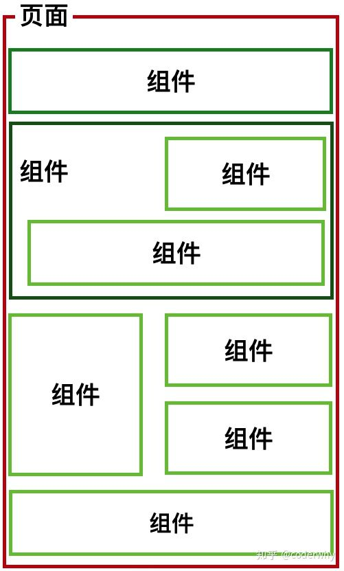
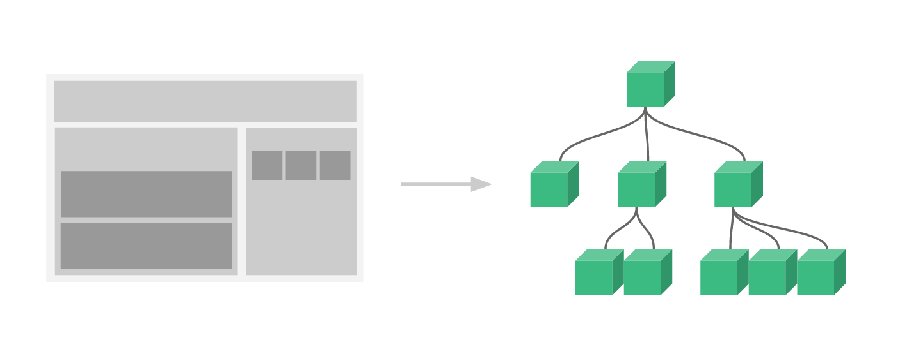
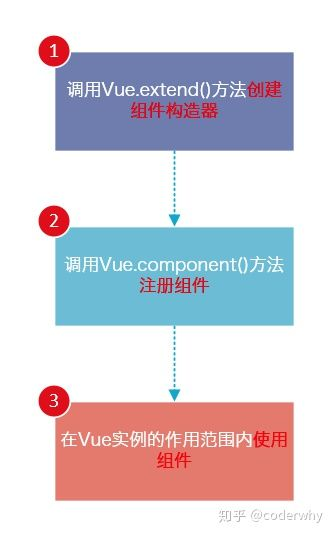
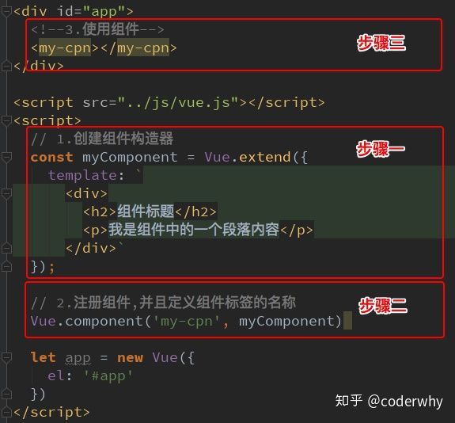
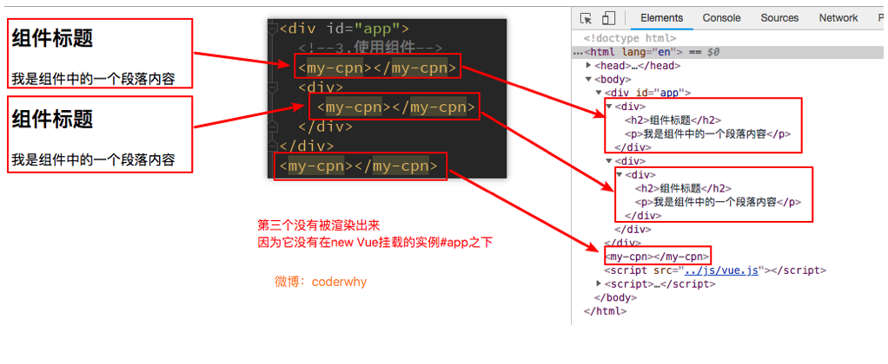
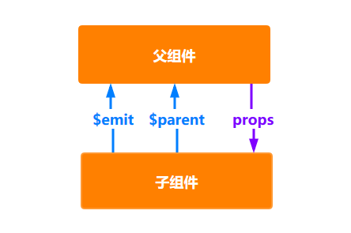

# VUE组件化开发

## 认识组件化

将一个页面拆分成一个个小的功能块，每个功能块完成属于自己这部分独立的功能，那么之后整个页面的管理和维护就变得非常容易了。




### Vue组件化思想

1. 它提供了一种抽象，让我们可以开发出一个个独立可复用的小组件来构造我们的应用。
2. 任何的应用都会被抽象成一颗组件树。




## 注册组件

组件的使用分成三个步骤：

1. 创建组件构造器
2. 注册组件
3. 使用组件






1.Vue.extend()：

调用Vue.extend()创建一个组件构造器。 

通常在创建组件构造器时，传入template代表我们自定义组件的模板。该模板就是在使用到组件的地方，要显示的HTML代码。

2.Vue.component()：

调用Vue.component()是将刚才的组件构造器注册为一个组件，并且给它起一个组件的标签名称。所以需要传递两个参数：1、注册组件的标签名 2、组件构造器

3.组件必须挂载在某个Vue实例下，否则它不会生效




第三次`<my-cpn></my-cpn>`其实并没有生效：


### 全局组件和局部组件

当我们通过调用Vue.component()注册组件时，组件的注册是全局的这意味着该组件可以在任意Vue示例下使用。

```html
<div id="app1">
  <my-cpn></my-cpn>
</div>
<div id="app2">
  <my-cpn></my-cpn>
</div>
<script src="../js/vue.js"></script>
<script>
  const myComponent = Vue.extend({
    template: `
            <div>
                <h2>组件标题</h2>
                <p>组件正文</p>
            </div>
            `
  });
Vue.component('my-cpn', myComponent);
const app1 = new Vue({
  el: '#app1'
});
const app2 = new Vue({
  el: '#app2'
});
</script>
```

如果我们注册的组件是挂载在某个实例中, 那么就是一个局部组件。

```html
<div id="app1">
  <my-cpn></my-cpn>
</div>
<div id="app2">
  <my-cpn></my-cpn>
</div>
<script src="../js/vue.js"></script>
<script>
  const myComponent = Vue.extend({
    template: `
            <div>
                <h2>组件标题</h2>
                <p>组件正文</p>
            </div>
            `
  });
// Vue.component('my-cpn', myComponent);
const app1 = new Vue({
  el: '#app1',
  components: {
    'my-cpn': myComponent
  }
});
const app2 = new Vue({
  el: '#app2'
});
</script>
```

**局部注册的组件在其子组件中不可用**如果你希望 `ComponentA` 在 `ComponentB` 中可用，则你需要这样写：

```javascript
var ComponentA = Vue.extend({
  template: `
            <div>
                <h2>组件标题</h2>
                <p>组件正文</p>
            </div>
            `
});

var ComponentB = {
  components: {
    'component-a': ComponentA
  },
  // ...
}
```


### 父组件/子组件

子组件注册到父组件的components时，Vue会编译好父组件的模块。

该模板的内容已经决定了父组件将要渲染的HTML（相当于父组件中已经有了子组件中的内容了）。

`<child-cpn></child-cpn>`是只能在父组件中被识别的。

```html
<div id="app">
  <parent-cpn></parent-cpn>
</div>
<script src="../js/vue.js"></script>
<script>
  const childComponent = Vue.extend({
    template: `
            <div>子组件</div>
            `
  });
  const parentComponent = Vue.extend({
    template: `
                <div>
                    父组件
                    <h2>父组件标题</h2>
                    <child-cpn></child-cpn>
  </div>
                `,
    components: {
      'child-cpn': childComponent
    }
  });
  const vm = new Vue({
    el: '#app',
    components: {
      'parent-cpn': parentComponent
    }
  });
</script>
```


### 注册组件语法糖

主要是省去了调用Vue.extend()的步骤，而是可以直接使用一个对象来代替。

#### 全局组件

```javascript
const myComponent = {
  template: `
            <div>
                <h2>组件标题</h2>
                <p>组件正文</p>
            </div>
            `
};
Vue.component('my-cpn', myComponent);
```


#### 局部组件

```javascript
const myComponent = {
  template: `
            <div>
                <h2>组件标题</h2>
                <p>组件正文</p>
            </div>
            `
};
// Vue.component('my-cpn', myComponent);
const app1 = new Vue({
  el: '#app1',
  components: {
    'my-cpn': myComponent
  }
});
```


### 模板的分离写法

Vue提供了两种方案来定义HTML模块内容：

使用`<script>`标签

```html
<script type="text/x-template" id="script_template">
  <div>
    <h2>script 模版</h2>
  </div>
</script>
```

使用`<template>`标签

```html
<template id="my_template">
  <div>
    <h2>template模版</h2>
  </div>
</template>
```


```javascript
//  Vue.component('my-cpn', {template: '#my_template'});  
const vm = new Vue({
    el: '#app',
    components: {
      'script-template': {
        template: '#script_template'
      },
      'my-template': {
        template: '#my_template'
      }
    }
  });
```


## 组件其他补充


## 组件数据存放

### 组件不可以访问Vue实例数据

1. 组件对象也有一个data属性
2. 只是这个data属性必须是一个函数
3. 而且这个函数返回一个对象，对象内部保存着数据

```html
<div id="app">
  <my-cpn></my-cpn>
</div>
<template id="myCpn">
  <div>消息：{{message}}</div>
</template>
<script src="../js/vue.js"></script>
<script>
  const vm = new Vue({
    el: '#app',
    data: {
      message: 'vue 数据'
    },
    components: {
      'my-cpn': {
        template: '#myCpn',
        data() {
          return {
            message: 'my cpn 数据'
          };
        }
      }
    }
  })
</script>
```


### data在组件中必须是一个函数

1. 首先，如果不是一个函数，Vue直接就会报错。
2. 其次，原因是在于Vue让每个组件对象都返回一个新的对象，因为如果是同一个对象的，组件在多次使用后会相互影响。

```html
<div id="app">
  <my-cpn></my-cpn>
  <my-cpn></my-cpn>
  <my-cpn></my-cpn>
</div>

<template id="myCpn">
  <div>
    <button @click="btnClick">点击按钮</button>
    <span>当前数据：{{counter}}</span>
  </div>
</template>

<script src="../js/vue.js"></script>
<script>
  // 对象单独抽离
  // 共享对象
  // 引用
  const obj = {
    counter: 0
  }
  const app = new Vue({
    el: '#app',
    components: {
      'my-cpn': {
        template: '#myCpn',
        data() {
          // return obj;
          // 
          // 组件独享数据
          return {
            counter: 0
          };
        },
        methods: {
          btnClick() {
            this.counter++;
          }
        }
      }
    }
  })
</script>
```


## 父子组件通信

在开发中，往往一些数据确实需要从上层传递到下层：

比如在一个页面中，我们从服务器请求到了很多的数据。

其中一部分数据，并非是我们整个页面的大组件来展示的，而是需要下面的子组件进行展示。

这个时候，并不会让子组件再次发送一个网络请求，而是直接让大组件(父组件)将数据传递给小组件(子组件)。

### 如何进行父子组件间的通信

1. 通过props向子组件传递数据
2. 通过事件向父组件发送消息



### props基本用法

在组件中，使用选项props来声明需要从父级接收到的数据。

props的值有两种方式：

方式一：字符串数组，数组中的字符串就是传递时的名称。

方式二：对象，对象可以设置传递时的类型，也可以设置默认值等。

```html
<div id="app">
  <child-cpn :child_message="message"></child-cpn>
</div>

<template id="childCpn">
  <div>子组件显示信息：{{child_message}}</div>
</template>

<script src="../js/vue.js"></script>

<script>
  const vm = new Vue({
    el: '#app',
    data: {
      message: 'vue 父组件信息 msg'
    },
    components: {
      'child-cpn': {
        template: '#childCpn',
        props: ['child_message']
      }
    }
  })
</script>
```


当需要对props进行类型等验证时，就需要对象写法了。

验证都支持哪些数据类型呢？

1. String
2. Number
3. Boolean
4. Array
5. Object
6. Date
7. Function
8. Symbol

当我们有自定义构造函数时，验证也支持自定义的类型

```javascript
function Person(firstName, lastName) {
  this.firstName = firstName;
  this.lastName = lastName;
}
Vue.component('my-component', {
  props: {
    // 自定义类型
    author: Person,
    // 基础数据类型检查(null 匹配任何类型)
    propA: Number,
    // 多个可能类型
    propB: [String, Number],
    // 必填的字符串
    propC: {
      type: String,
      required: true
    },
    // 带有默认值的数字
    propD: {
      type: Number,
      default: 100
    },
    // 带有默认值的对象
    // 类型是对象或者数组时, 默认值必须是一个函数
    propE: {
      type: Object,
      default: function() {
        return {
          message: 'hello'
        };
      }
    },
    // 自定义验证函数
    propF: {
      validator: function(value) {
        return ['success', 'warning', 'danger'].indexof(value) !== -1;
      }
    }
  }
})
```


## 父级向子级传递


## 子级向父级传递

当子组件需要向父组件传递数据时，就要用到自定义事件了。

v-on不仅仅可以用于**监听DOM事件**，也可以用于**组件间的自定义事件**。

自定义事件的流程：

1. 在子组件中，通过$emit()来触发事件。
2. 在父组件中，通过v-on来监听子组件事件。

我们来看一个简单的例子：
我们之前做过一个两个按钮+1和-1，点击后修改counter。
我们整个操作的过程还是在子组件中完成，但是之后的展示交给父组件。
这样，我们就需要将子组件中的counter，传给父组件的某个属性，比如total。

```javascript
// 触发 increment 事件 
this.$emit('increment', this.counter);
// 触发 decrement 事件 
this.$emit('decrement', this.counter);
```


```html
<!-- 监听 increment 事件 -->
<!-- 监听 decrement 事件 -->
<child-cpn @increment="changeTotal" @decrement="changeTotal"></child-cpn>
```


### 父子组件的访问方式

父组件访问子组件：使用`$children`或`$refs`

子组件访问父组件：使用`$parent`


this.$children是一个数组类型，它包含所有子组件对象。


$children的缺陷：
通过$children访问子组件时，是一个数组类型，访问其中的子组件必须通过索引值。
但是当子组件过多，我们需要拿到其中一个时，往往不能确定它的索引值，甚至还可能会发生变化。
有时候，我们想明确获取其中一个特定的组件，这个时候就可以使用$refs
$refs的使用：

$refs和ref指令通常是一起使用的。
首先，我们通过ref给某一个子组件绑定一个特定的ID。
其次，通过this.$refs.ID就可以访问到该组件了。


如果我们想在子组件中直接访问父组件，可以通过$parent
注意事项：
尽管在Vue开发中，我们允许通过$parent来访问父组件，但是在真实开发中尽量不要这样做。
子组件应该尽量避免直接访问父组件的数据，因为这样耦合度太高了。
如果我们将子组件放在另外一个组件之内，很可能该父组件没有对应的属性，往往会引起问题。
另外，更不好做的是通过$parent直接修改父组件的状态，那么父组件中的状态将变得飘忽不定，很不利于我的调试和维护。


## 非父子组件通信

通过中央事件总线，也就是一个中介来完成。


## 插槽slot

### 编译作用域

父组件模板的所有东西都会在父级作用域内编译；子组件模板的所有东西都会在子级作用域内编译。

### slot基本使用

在子组件中，使用特殊的元素`<slot>`就可以为子组件开启一个插槽。

该插槽插入什么内容取决于父组件如何使用。

```html
<!-- 定义插槽模版 -->
<template id="myCpn">
	<div>
    <slot>插槽默认内容</slot>
  </div>
</template>

<!-- 使用插槽模版 -->
<my-cpn></my-cpn>
<my-cpn>
  <h2>替换插槽内容</h2>
  <p>替换插槽内容</p>
</my-cpn>
```


### 具名插槽slot

```html
<!-- 定义具名插槽模版 -->
<slot name='myslot'></slot>
<!-- 使用具名插槽模版 -->
<my-cpn>
	<span slot="myslot">替换插槽</span>
</my-cpn>
```


### 作用域插槽

使用场景：需要在多个界面进行展示

1. 某些界面是以水平方向一一展示的
2. 某些界面是以列表形式展示的
3. 某些界面直接展示一个数组

父组件替换插槽的标签，但是内容由子组件来提供。

在父组件使用我们的子组件时，从子组件中拿到数据：
我们通过`<template slot-scope="slotProps">`获取到slotProps属性
在通过slotProps.data就可以获取到刚才我们传入的data了

```html
<!-- 定义 作用域插槽 -->
<template id="myCpn">
  <div>
    <slot :data="pLanguages"></slot>
  </div>
</template>
<script src="../js/vue.js"></script>
<script>
  Vue.component('my-cpn', {
    template: '#myCpn',
    data() {
      return {
        pLanguages: ['js', 'go', 'php']
      };
    }
  })
</script>
```

```html
<!-- 使用 作用域插槽 -->
<div id="app">
  <my-cpn>
    <template slot-scope="slotProps">
      <ul>
        <li v-for="info in slotProps.data">{{info}}</li>
      </ul>
    </template>
  </my-cpn>
</div>
```

