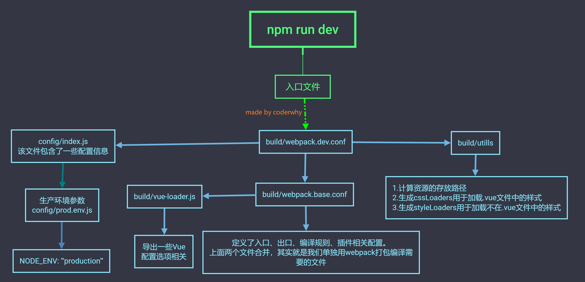

# Vue CLI相关

## 什么是Vue CLI

开发大型项目必然需要使用Vue CLI

使用Vue.js开发大型应用时，我们需要考虑代码目录结构、项目结构和部署、热加载、代码单元测试等事情。

通常我们会使用一些脚手架工具来帮助完成这些事情。
CLI是Command-Line Interface, 翻译为命令行界面, 但是俗称脚手架.

Vue CLI是一个官方发布 vue.js 项目脚手架

使用 vue-cli 可以快速搭建Vue开发环境以及对应的webpack配置.

## Vue CLI使用前提

### Node

安装NodeJS

可以直接在官方网站中下载安装。网址: http://nodejs.cn/download/

检测安装的版本。默认情况下自动安装Node和NPM

`node -v` `npm -v`

Node环境要求8.9以上或者更高版本

NPM的全称是Node Package Manager。是一个NodeJS包管理和分发工具，已经成为了非官方的发布Node模块（包）的标准。

### Webpack

Vue.js官方脚手架工具就使用了webpack模板对所有的资源会压缩等优化操作

它在开发过程中提供了一套完整的功能，能够使得我们开发过程中变得高效。

Webpack的全局安装

`npm install webpack -g`


## Vue CLI的使用

安装Vue脚手架 vue cli3
`npm install -g @vue/cli`

```sh
npm install -g @vue/cli@3.12.1
```

安装vue cli2桥接工具

`npm install -g @vue/cli-init `

```sh
npm install -g @vue/cli-init@3.12.1
```

Vue CLI2初始化项目

`vue init webpack my-project`

Vue CLI3初始化项目
`vue create my-project`

## Vue CLI2详解


## 目录结构详解


## Runtime-Compiler和Runtime-only的区别

简单总结
如果在之后的开发中，你依然使用template，就需要选择Runtime-Compiler
如果你之后的开发中，使用的是.vue文件夹开发，那么可以选择Runtime-only


## render和template

Runtime-Compiler 和 Runtime-only


## Vue程序运行过程


## render函数的使用


## npm run build


## npm run dev




## 修改配置：webpack.base.conf.js起别名


## 认识Vue CLI3

vue-cli 3 与 2 版本有很大区别

1. vue-cli 3 是基于 webpack 4 打造，vue-cli 2 还是 webapck 3
2. vue-cli 3 的设计原则是“0配置”，移除的配置文件根目录下的，build和config等目录
3. vue-cli 3 提供了 vue ui 命令，提供了可视化配置，更加人性化
4. 移除了static文件夹，新增了public文件夹，并且index.html移动到public中

## Vue CLI3


## 目录结构详解


## 配置去哪里了


```sh
# 启动本地服务
vue ui
```


## 自定义配置：起别名


### vue.config.js配置

> Vue.config.js是一个可选的配置文件，如果项目的根目录存在这个文件，那么它就会被 `@vue/cli-service` 自动加载。你也可以使用package.json中的vue字段，但要注意严格遵守JSON的格式来写。这里使用配置vue.config.js的方式进行处理。

# 一、vue.config.js文件配置

> 在项目根目录下自己手动新建`vue.config.js`文件，会被`@vue/cli-service`自动加载。
> [参考的官方文档](https://cli.vuejs.org/zh/config/#vue-config-js)


## 1、配合webpack的配置[改动少]

> ***简单配置\***
>  调整webpack配置最简单的方式就是在`vue.config.js`中的`configureWebpack`选项提供一个对象。该对象将会被`webpack-merge`合并如最终的webpack配置。
>  在`configureWebpack`里可以配置webpack的`loader`和`plugins`等


```js
//vue.config.js
module.exports = {
  //1.简单配置
  configureWebpack : {
    plugins: [
      new MyAwesomeWebpackPlugin(),
    ]
  }

  //2.链式操作：允许对内部的webpack配置进行更细粒度的修改
  chainWebpack : config => {

  }

  //3.webpack的css的一些loader
  css : {
    module : false,
    extract : false ,
    sourceMap : false,
    loaderOptions: { //向css相关的loader传递选项，
    //支持的loader:css-loader,postcss-loader,sass-loader,less-loader,stylus-loader
    css : {
      //这里的选项会传递给 css-loader
    },
    postcss : {
     //这里的选项会传递给 postcss-loader
    }
    },
  }

  //4.所有webpack的devServer的选项都支持
  devServer : {
    proxy : {
      '/api' : {
        target : 'http://localhost:4000',
        ws : true,
        changeOrigin : true,
      }
    }
  }
}
```


## 2.完整配置文件

> 下方配置项的值都是默认值


```js
//vue.config.js
module.exports = {
  //1.从vue cli3.3开始已弃用，请使用publicPath
  baseUrl : '/',

  /*
    2.1部署应用包时的基本URL。用法和webpack本身的output.publicPath一致。
但在cli的其它地方也会用到这个值，所以请不要直接修改webpack的output.publicPath。
    2.2默认情况下,Vue Cli会假设你的应用是被部署在一个域名的根路径。
如我本地的应用的路径是“D:\WORK\study\vue\vue_cli3_test\demo1”，则在这个应用中，根路径就是“D:\WORK\study\vue\vue_cli3_test\demo1”
  */
  publicPath : '/',

  //3.当运行vue-cli-service build时生成的生产环境构建环境的目录。用法和webpack的output.path一样，不要修改output.path
  outputDir :'dist',

  //4.放置打包后生成的静态资源（js、css、img、fonts）的目录，该目录相对于outputDir。
  assetsDir:' ',

  //5.指定生成的index.html的输出路径，相对于outputDir。也可以是一个绝对路径。
  indexPath : 'index.html',

  //6.
  filenameHashing : true,

  //7.多页应用模式下构建应用
  pages : undefined,

  //8.安装@vue/cli-plugin-eslint后生效。为true时将检查错误输出为编译警告输出到命令行，编译不会失败。
  //为"error"时，将检查错误直接显示在浏览器中。强制eslint-loader将lint错误输出为编译错误，编译会失败。
  lintOnSave : true,

  //9.
  tuntimeCompiler : false,
  //10.
  transpileDependencies : [],
  //11.如果你不需要生产环境的 source map，可以将其设置为 false 以加速生产环境构建
  productionSourceMap : true,
  //12.
  crossorigin : undefined,
  //13.
  integrity : false,
  //14.
  parallel : require('os').cpus().length > 1 ,
  //15.向PWA插件传递选项
  pwa : {}
  //16.不进行任何schema验证的对象，可以用来传递任何第三方插件选项，不是webpack的plugins
  pluginOptions : {},

  //17.和wenpack相关的配置参考最上面代码
}
```

