# vue-router详解

## 认识路由

单页面富应用阶段SPA最主要的特点就是在前后端分离的基础上加了一层前端路由。

也就是前端来维护一套路由规则。改变URL，但是页面不进行整体的刷新。

### URL的hash

URL的hash也就是锚点(#), 本质上是改变window.location的href属性.

我们可以通过直接赋值location.hash来改变href, 但是页面不发生刷新

history接口是HTML5新增的, 它有五种模式改变URL而不刷新页面.

history.pushState()

### HTML5的history模式：pushState


### HTML5的history模式：replaceState


### HTML5的history模式：go


## vue-router基本使用

vue-router是Vue.js官方的路由插件，它和vue.js是深度集成的，适合用于构建单页面应用。

vue-router是基于路由和组件的

路由用于设定访问路径, 将路径和组件映射起来.

在vue-router的单页面应用中, 页面的路径的改变就是组件的切换.

### 安装和使用vue-router

步骤一: 安装vue-router

`npm install vue-router --save`

步骤二: 在模块化工程中使用它(因为是一个插件, 所以可以通过Vue.use()来安装路由功能)

1. 第一步：导入路由对象，并且调用 Vue.use(VueRouter)
2. 第二步：创建路由实例，并且传入路由映射配置
3. 第三步：在Vue实例中挂载创建的路由实例

使用vue-router的步骤:

1. 第一步: 创建路由组件
2. 第二步: 配置路由映射: 组件和路径映射关系
3. 第三步: 使用路由: 通过`<router-link>`和`<router-view>`

### 创建router实例

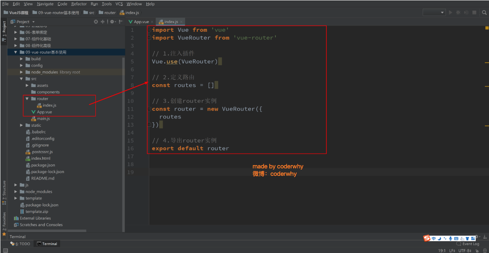

### 挂载到Vue实例中

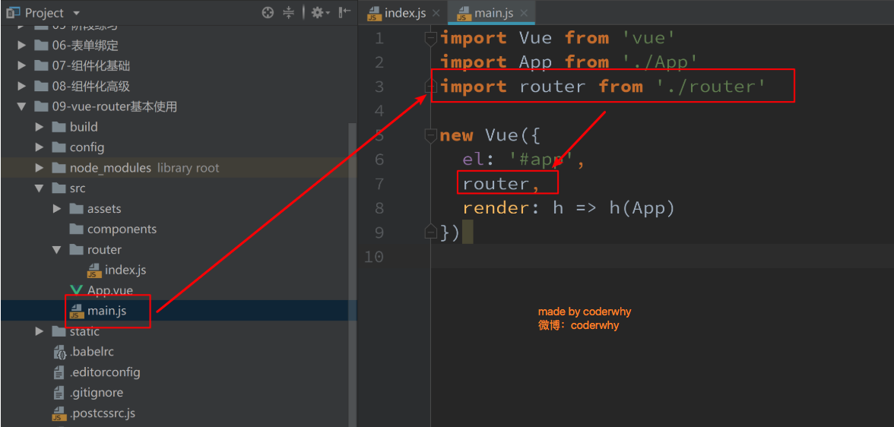

### 步骤一：创建路由组件

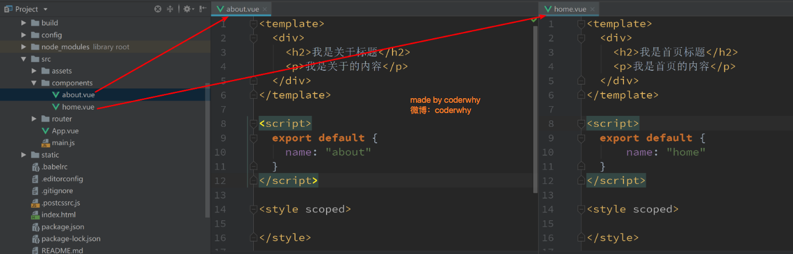


### 步骤二：配置组件和路径的映射关系

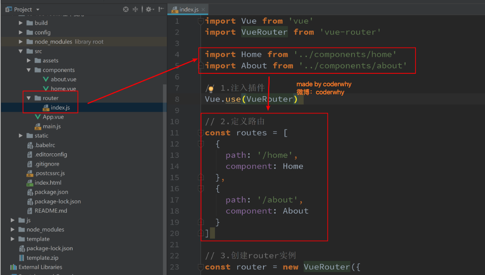


### 步骤三：使用路由

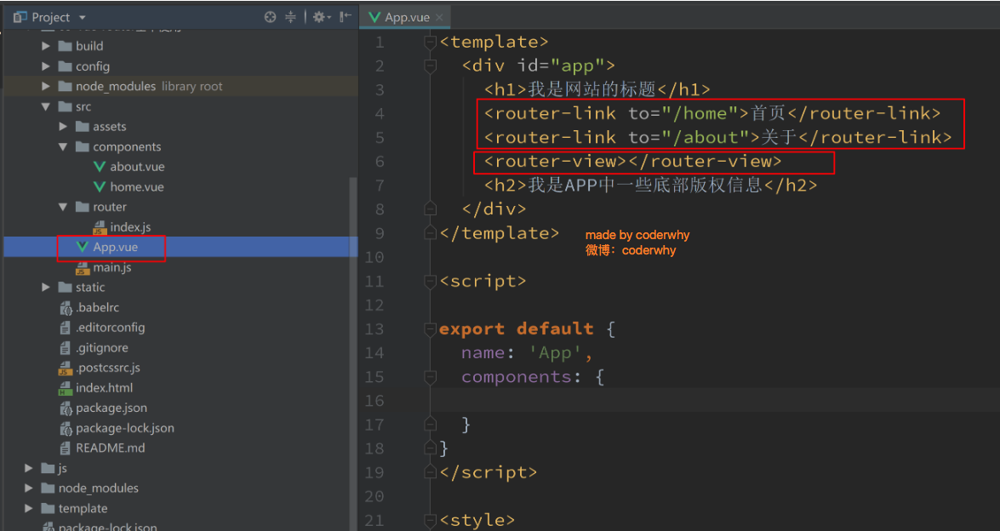


`<router-link>`: 该标签是一个vue-router中已经内置的组件, 它会被渲染成一个`<a>`标签.

`<router-view>`: 该标签会根据当前的路径, 动态渲染出不同的组件.

网页的其他内容, 比如顶部的标题/导航, 或者底部的一些版权信息等会和`<router-view>`处于同一个等级.

在路由切换时, 切换的是`<router-view>`挂载的组件, 其他内容不会发生改变。

### 最终效果如下

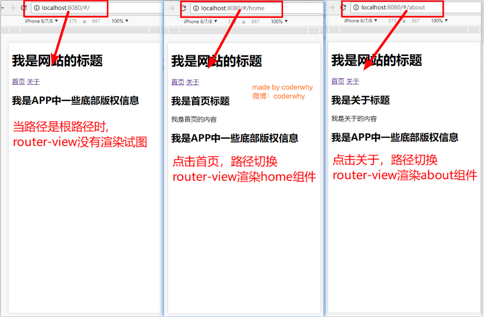


### 路由的默认路径

默认情况下, 进入网站的首页, 我们希望`<router-view>`渲染首页的内容.

让路径默认跳到到首页, 并且`<router-view>`渲染首页组件

非常简单, 我们只需要配置多配置一个映射就可以了.

```javascript
// router/index.js
const routes = [
  {
    path: '/',
    redirect: '/home'
  }
];
```

1. 
   path配置的是根路径: `/`
2. redirect是重定向 `/home`

将根路径重定向到/home的路径下, 这样就可以得到我们想要的结果了.


### HTML5的History模式

改变路径的方式有两种:

1. URL的hash
2. HTML5的history
3. 默认情况下, 路径的改变使用的URL的hash.

如果希望使用HTML5的history模式, 非常简单, 进行如下配置即可:

```javascript
// router/index.js
const router = new VueRouter({
  routes,
  mode: 'history'
});
```


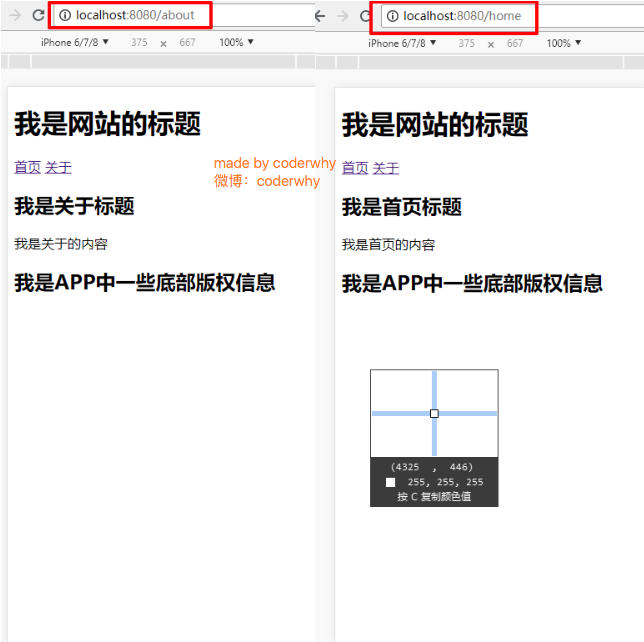


### router-link补充

```html
<router-link to='/home' tag='li'>
```


`<router-link>`还有一些其他属性:

1. tag: tag可以指定`<router-link>`之后渲染成什么组件, 比如上面的代码会被渲染成一个`<li>`元素, 而不是`<a>`
2. replace: replace不会留下history记录, 所以指定replace的情况下, 后退键返回不能返回到上一个页面中
3. active-class: 当`<router-link>`对应的路由匹配成功时, 会自动给当前元素设置一个router-link-active的class。

设置active-class可以修改默认的名称.

1. 在**高亮显示**的导航菜单或者底部tabbar时, 会使用到该类.
2. 默认class名称: router-link-active. 


#### 修改linkActiveClass

该class具体的名称也可以通过router实例的属性进行修改【全局修改】

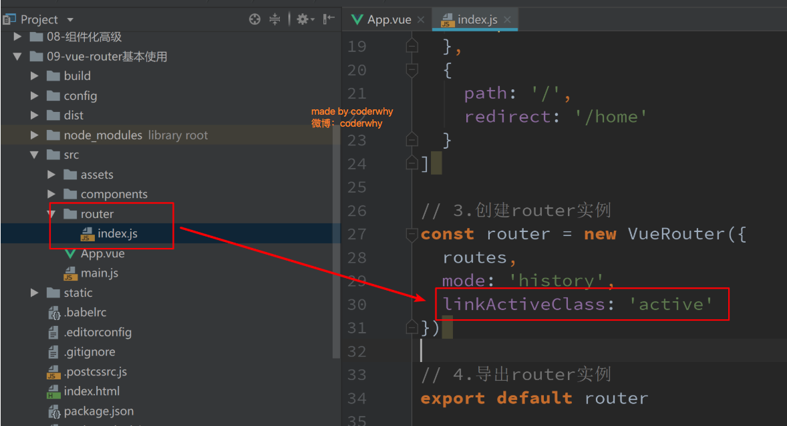


exact-active-class 类似于 active-class , 只是在精准匹配下才会出现的 class.


### 路由代码跳转

执行JavaScript代码 进行 页面的跳转

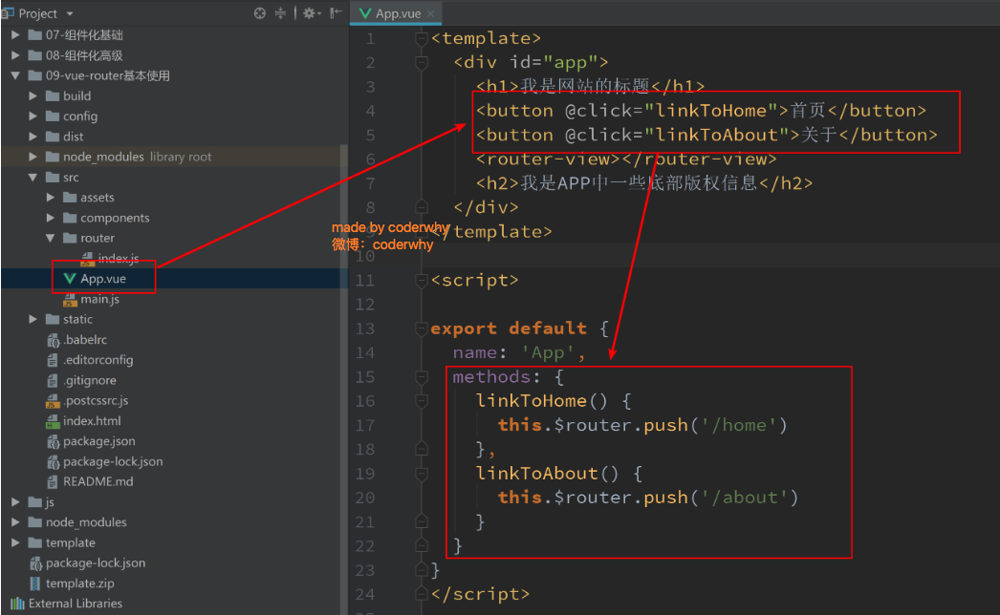


### 动态路由

path路径可能是不确定的，比如我们进入用户界面时，希望是如下的路径：

/user/aaaa或/user/bbbb

除了有前面的/user之外，后面还跟上了用户的ID

这种path和Component的匹配关系，我们称之为动态路由(也是路由传递数据的一种方式)。

```json
{
	path: '/user/:id',
  component: User
}
```


```html
<div>
  <h2>
    {{$route.params.id}}
  </h2>
</div>
```


```html
<router-link to="/user/123">用户</router-link>
```


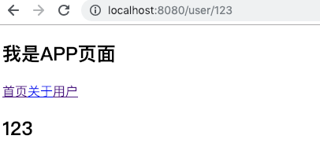


### 认识路由的懒加载

把不同路由对应的组件分割成不同的代码块，然后当路由被访问的时候才加载对应组件，这样就更加高效了。

1. 首先, 我们知道路由中通常会定义很多不同的页面.
2. 这个页面最后被打包在哪里呢? 一般情况下, 是放在一个js文件中.
3. 但是, 页面这么多放在一个js文件中, 必然会造成这个页面非常的大.
4. 如果我们一次性从服务器请求下来这个页面, 可能需要花费一定的时间, 甚至用户的电脑上还出现了短暂空白的情况.

#### 路由懒加载

1. 路由懒加载的主要作用就是将路由对应的组件打包成一个个的js代码块.
2. 只有在这个路由被访问到的时候, 才加载对应的组件

**普通路由加载**

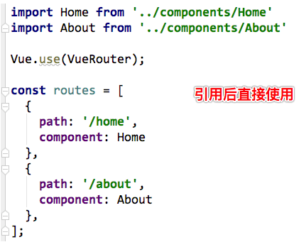


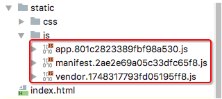


**路由懒加载**

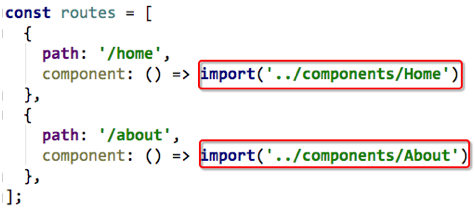


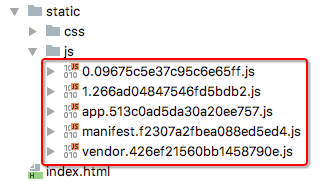


### 懒加载的方式

方式一: 结合Vue的异步组件和Webpack的代码分析.

```javascript
const Home = resolve => { require.ensure(['../components/Home.vue'], () => { resolve(require('../components/Home.vue')) })};
```


方式二: AMD写法

```javascript
const About = resolve => require(['../components/About.vue'], resolve);
```


方式三: 在ES6中, 我们可以有更加简单的写法来组织Vue异步组件和Webpack的代码分割.

```javascript
const Home = () => import('../components/Home.vue')
```


## vue-router嵌套路由

### 认识嵌套路由


嵌套路由是一个很常见的功能

比如在home页面中, 我们希望通过/home/news和/home/message访问一些内容.

一个路径映射一个组件, 访问这两个路径也会分别渲染两个组件.

路径和组件的关系如下:

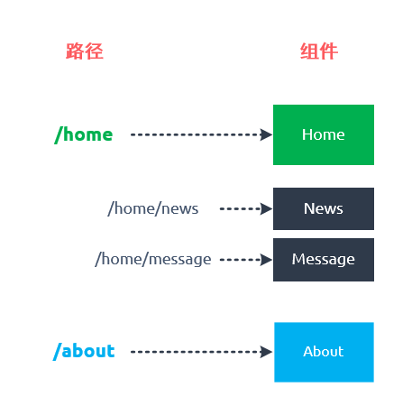


实现嵌套路由有两个步骤:

创建对应的子组件, 并且在路由映射中配置对应的子路由.

在组件内部使用`<router-view>`标签.


#### 嵌套路由实现

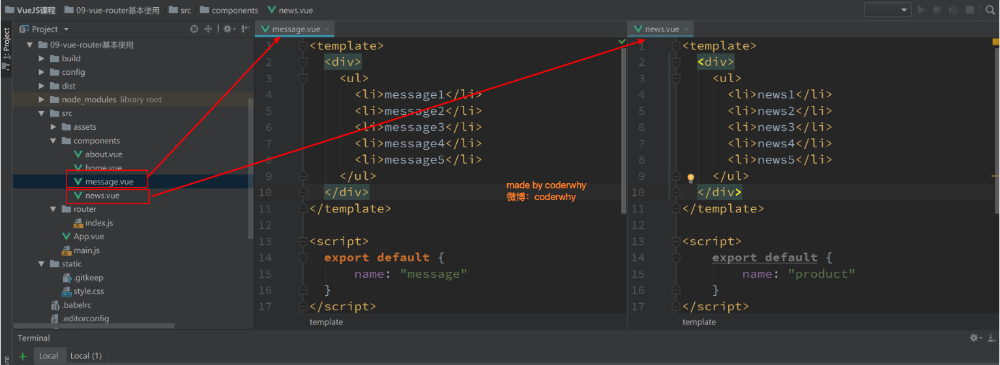


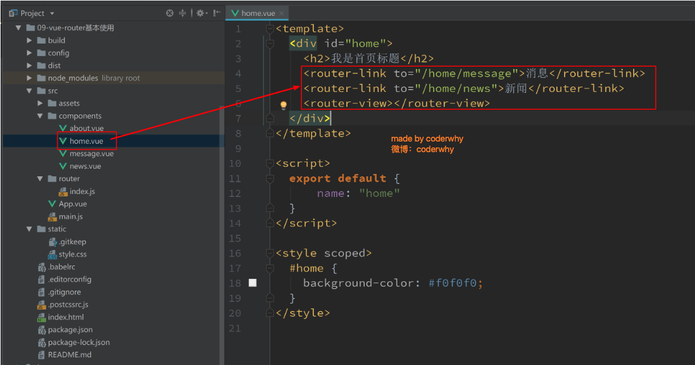


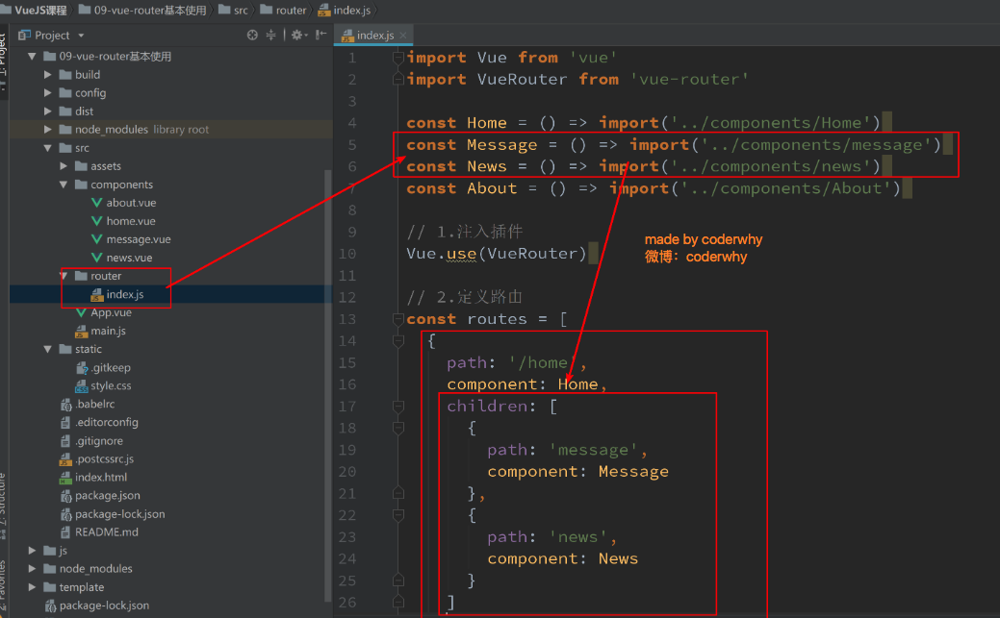


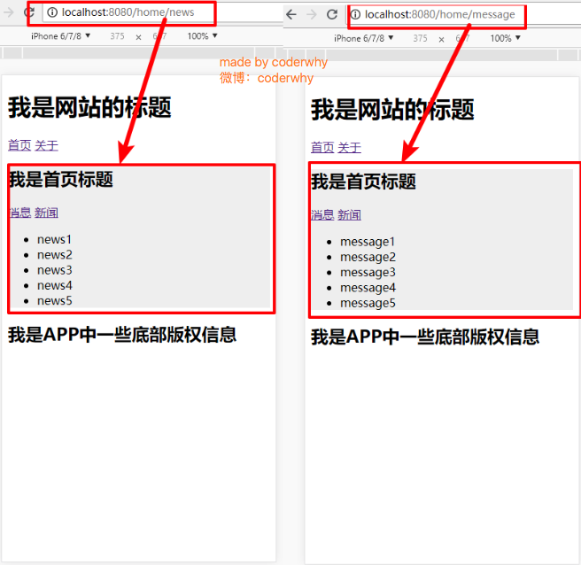


#### 嵌套默认路径

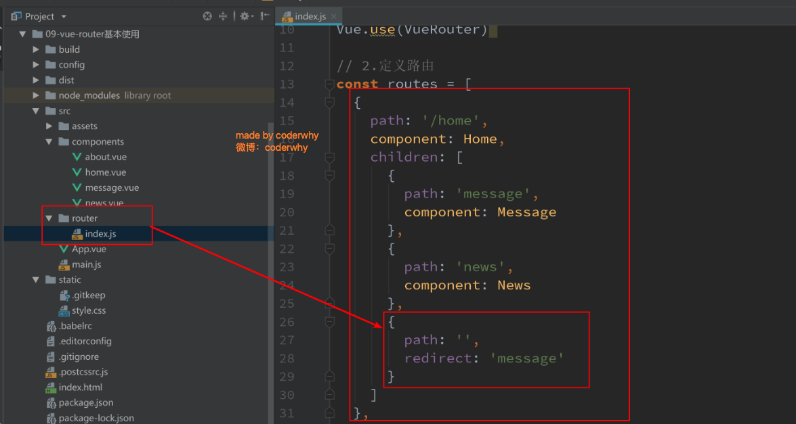


## vue-router参数传递

### 组件准备

创建一个组件, 并且将其配置好

1. 第一步: 创建新的组件Profile.vue 
2. 第二步: 配置路由映射 
3. 第三步: 添加跳转的`<router-link>`

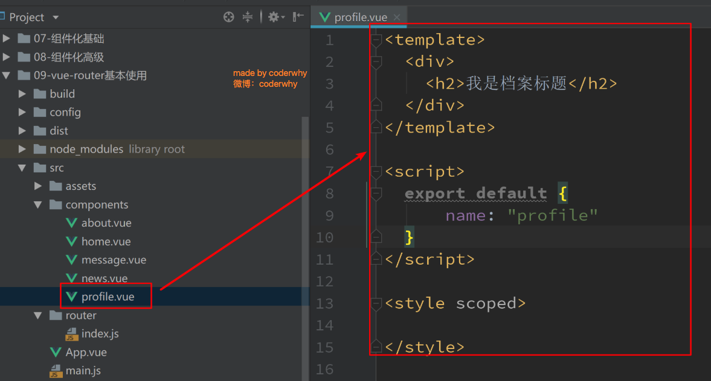


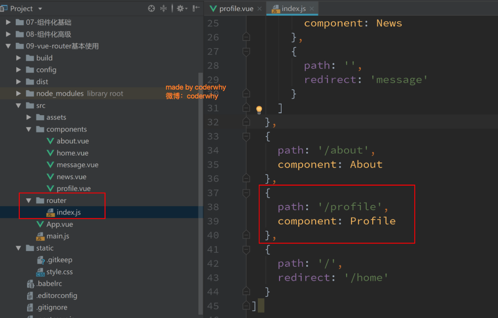


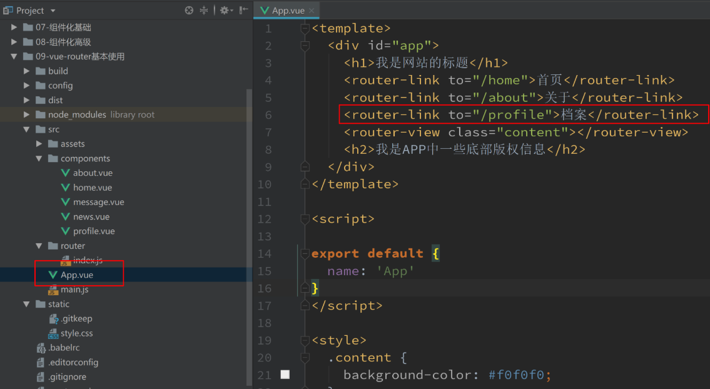

### 传递参数的方式

传递参数主要有两种类型: params和query

#### params的类型:

配置路由格式: /router/:id

传递的方式: 在path后面跟上对应的值

传递后形成的路径: /router/123, /router/abc

#### query的类型:

配置路由格式: /router, 也就是普通配置

传递的方式: 对象中使用query的key作为传递方式

传递后形成的路径: /router?id=123, /router?id=abc

两种使用方式:

1.  <router-link>的方式
2. JavaScript代码方式

#### 传递参数方式一: `<router-link>`

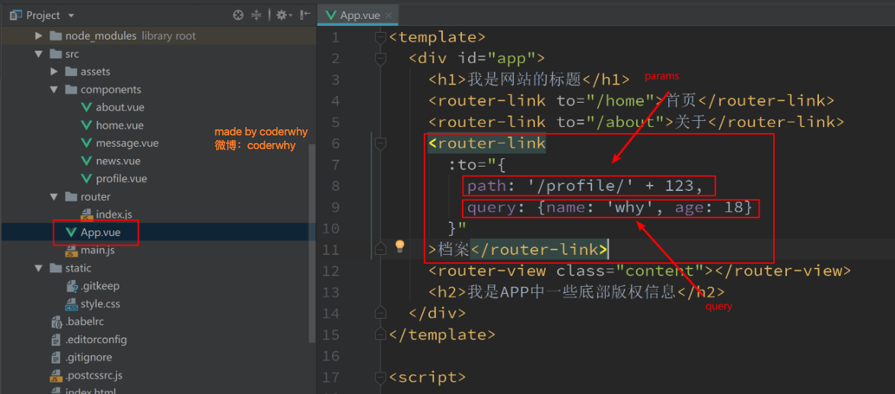

#### 传递参数方式二: JavaScript代码

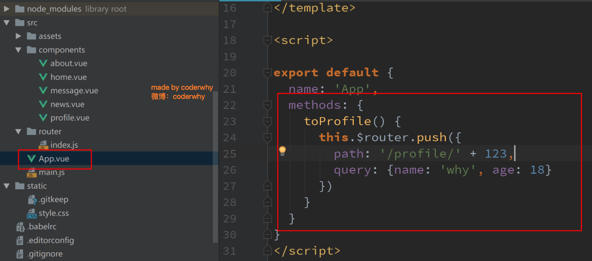


#### 获取参数

获取参数通过$route对象获取的.

在使用了 vue-router 的应用中，路由对象会被注入每个组件中，赋值为 this.$route ，并且当路由切换时，路由对象会被更新。

通过$route获取传递的信息如下:

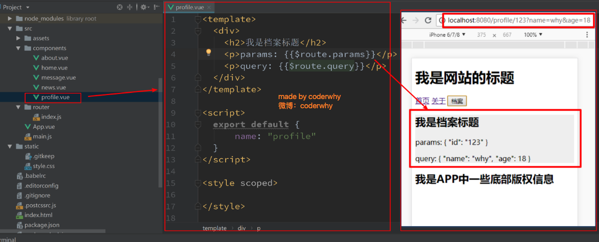


#### $route和$router是有区别的

1. 
   $router为VueRouter实例，想要导航到不同URL，则使用$router.push方法
2. $route为当前router跳转对象里面可以获取name、path、query、params等 

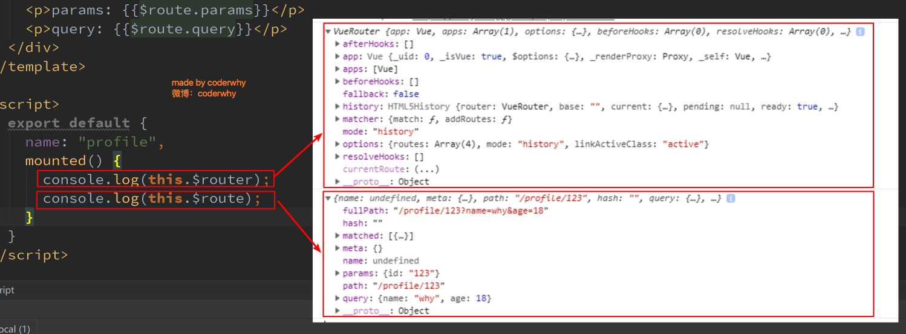


## vue-router导航守卫

### 为什么使用导航守卫

在一个SPA应用中, 如何改变网页的标题

普通的修改方式:

1. 我们比较容易想到的修改标题的位置是每一个路由对应的组件.vue文件中.
2. 通过mounted声明周期函数, 执行对应的代码进行修改。即通过JavaScript来修改`<title>`的内容.window.document.title = '新的标题'.

缺点: 当页面比较多时, 这种方式不容易维护(因为需要在多个页面执行类似的代码).

使用导航守卫方式。

### 导航守卫

vue-router提供的导航守卫主要用来监听监听路由的进入和离开的.

vue-router提供了beforeEach和afterEach的钩子函数, 它们会在路由即将改变前和改变后触发.

### 导航守卫使用

我们可以利用beforeEach来完成标题的修改.

1. 首先, 我们可以在钩子当中定义一些标题, 可以利用meta来定义
2. 其次, 利用导航守卫,修改我们的标题.

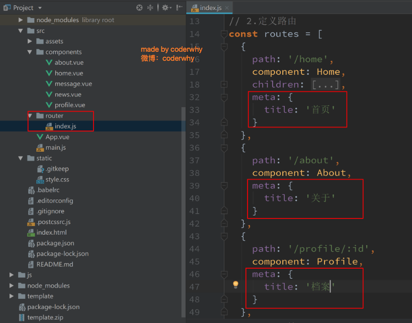


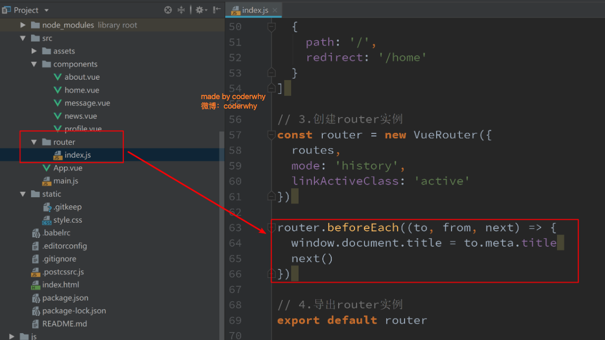


导航钩子的三个参数解析:

1. to: 即将要进入的目标的路由对象.
2. from: 当前导航即将要离开的路由对象.
3. next: 调用该方法后, 才能进入下一个钩子.


### 导航守卫补充

补充一:如果是后置钩子, 也就是afterEach, 不需要主动调用next()函数.

补充二: 上面我们使用的导航守卫, 被称之为全局守卫.

路由独享的守卫.

组件内的守卫.

更多内容, 可以查看官网进行学习:
https://router.vuejs.org/zh/guide/advanced/navigation-guards.html#%E8%B7%AF%E7%94%B1%E7%8B%AC%E4%BA%AB%E7%9A%84%E5%AE%88%E5%8D%AB


## keep-alive

### keep-alive遇见vue-router

keep-alive 是 Vue 内置的一个组件，可以使被包含的组件保留状态，或避免重新渲染。

它们有两个非常重要的属性:

1. include - 字符串或正则表达，只有匹配的组件会被缓存
2. exclude - 字符串或正则表达式，任何匹配的组件都不会被缓存

router-view 也是一个组件，如果直接被包在 keep-alive 里面，所有路径匹配到的视图组件都会被缓存

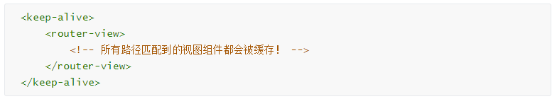

通过create声明周期函数来验证


## TabBar实现思路

1.如果在下方有一个单独的TabBar组件，你如何封装

1. 自定义TabBar组件，在APP中使用
2. 让TabBar出于底部，并且设置相关的样式

2.TabBar中显示的内容由外界决定

1. 定义插槽
2. flex布局平分TabBar

3.自定义TabBarItem，可以传入 图片和文字

1. 定义TabBarItem，并且定义两个插槽：图片、文字。
2. 给两个插槽外层包装div，用于设置样式。
3. 填充插槽，实现底部TabBar的效果

4.传入 高亮图片

1. 定义另外一个插槽，插入active-icon的数据
2. 定义一个变量isActive，通过v-show来决定是否显示对应的icon

5.TabBarItem绑定路由数据

1. 安装路由：npm install vue-router —save
2. 完成router/index.js的内容，以及创建对应的组件
3. main.js中注册router
4. APP中加入`<router-view>`组件

6.点击item跳转到对应路由，并且动态决定isActive

1. 监听item的点击，通过this.$router.replace()替换路由路径
2. 通过this.$route.path.indexOf(this.link) !== -1来判断是否是active

7.动态计算active样式

1. 封装新的计算属性：this.isActive ? {'color': 'red'} : {}


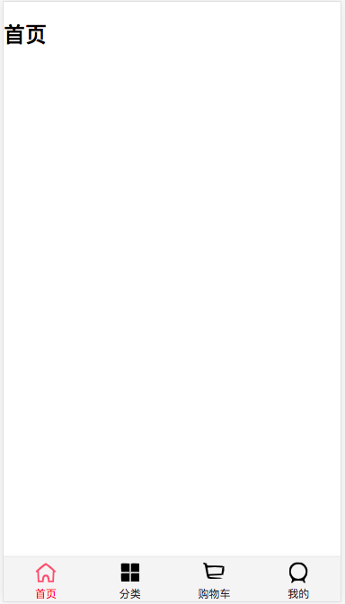


### 代码实现

**tab-bar 组件代码**

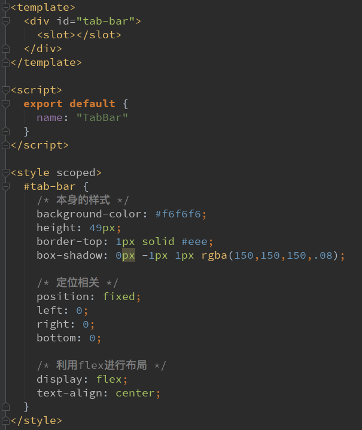


**tab-bar-item 组件代码**

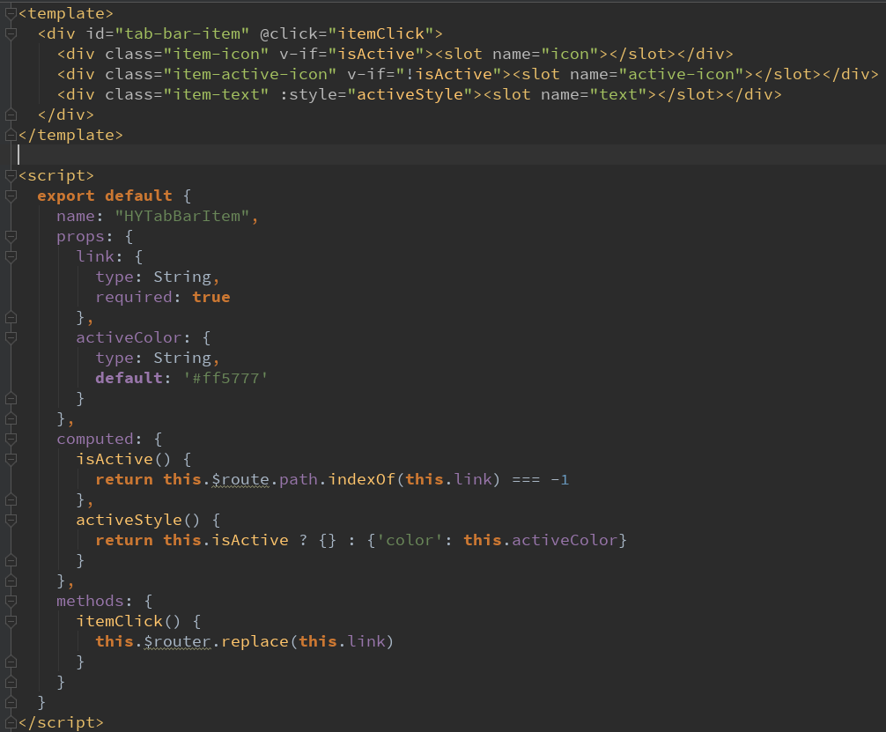
