# Vuex详解

## Vuex是做什么的

在多个组件间共享状态的插件

1. 把需要多个组件共享的变量全部存储在一个对象里面。
2. 然后，将这个对象放在顶层的Vue实例中，让其他组件可以使用。
3. 那么，多个组件是不是就可以共享这个对象中的所有变量属性了呢

## 管理什么状态

什么状态需要在多个组件间共享

1. 比如用户的登录状态、用户名称、头像、地理位置信息等等。
2. 比如商品的收藏、购物车中的物品等等。

## 单界面的状态管理

单个组件中进行状态管理是一件非常简单的事情

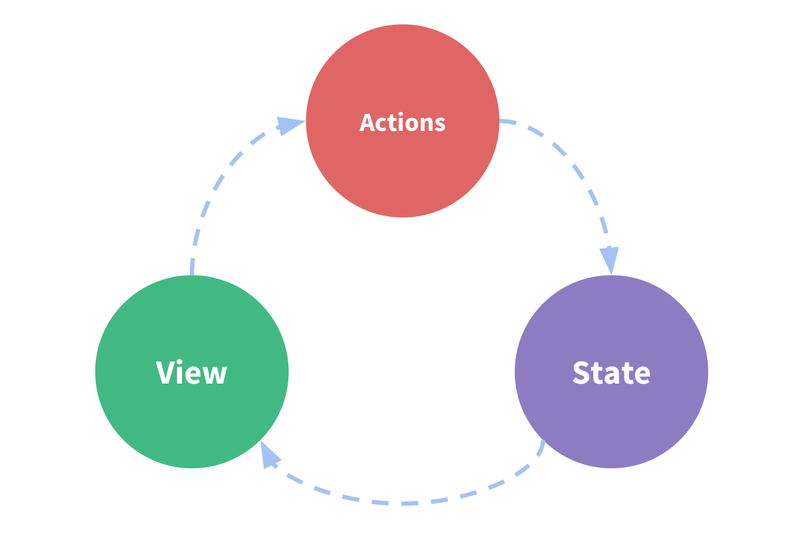

State：不用多说，就是我们的状态。（当作data中的属性）

View：视图层，可以针对State的变化，显示不同的信息。（这个好理解)

Actions：这里的Actions主要是用户的各种操作：点击、输入等等，会导致状态的改变。


## 单界面状态管理的实现

在这个案例中，我们有木有状态需要管理呢？没错，就是个数counter。

1. counter需要某种方式被记录下来，也就是我们的State。
2. counter目前的值需要被显示在界面中，也就是我们的View部分。
3. 界面发生某些操作时（我们这里是用户的点击，也可以是用户的input），需要去更新状态，也就是我们的Actions
   

```html
<template>
	<div class="test">
    <div>当前计数: {{counter}}</div>
    <button @click="counter++">+1</button>
    <button @click="counter--">-1</button>
  </div>
</template>
<script>
export default {
  name: 'hello',
  data() {
    return {
      counter: 0
    };
  }
}
</script>
```


## 多界面状态管理

多界面状态由全局单例模式(大管家)来统一帮助我们管理

Vuex就是为我们提供这个全局单例模式(大管家)的工具。

全局单例模式（大管家）

1. 我们现在要做的就是将共享的状态抽取出来，交给我们的大管家，统一进行管理。
2. 之后，你们每个试图，按照我规定好的规定，进行访问和修改等操作。
3. 这就是Vuex背后的基本思想。


## Vuex状态管理图例

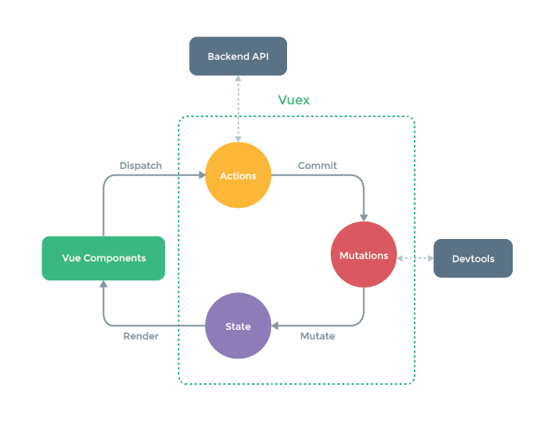


## 简单的案例

```javascript
// store/index.js
import Vuex from 'vuex';
import Vue from 'vue';

Vue.use(Vuex);

const store = new Vuex.Store({
  state: {
    count: 0
  },
  mutations: {
    increment(state) {
      state.count++;
    },
    decrement(state) {
      state.count--;
    }
  }
})

export default store;
```


## 挂载到Vue实例中

其次，让所有的Vue组件都可以使用这个store对象

来到main.js文件，导入store对象，并且放在new Vue中

这样，在其他Vue组件中就可以通过this.$store的方式，获取到这个store对象了

```javascript
import Vue from 'vue';
import App from './App';
import store from './store';


new Vue({
  el: '#app',
  store,
  render: h => h(App)
})
```


## 使用Vuex的count

```html
<template>
	<div id="app">
    <div>当前计数: {{counter}}</div>
    <button @click="counter++">+1</button>
    <button @click="counter--">-1</button>
  </div>
</template>
<script>
export default {
  name: 'App',
  components: {
    
  },
  computed: {
    counter: function() {
      return this.$store.state.count;
    }
  },
  methods: {
    increment: function() {
      this.$store.commit('increment');
    },
    decrement: function() {
      this.$store.commit('decrement');
    }
  }
}
</script>
```


1. 提取出一个公共的store对象，用于保存在多个组件中共享的状态
2. 将store对象放置在new Vue对象中，这样可以保证在所有的组件中都可以使用到
3. 在其他组件中使用store对象中保存的状态即可
4. 通过this.$store.state.属性的方式来访问状态
5. 通过this.$store.commit('mutation中方法')来修改状态

注意事项：

我们通过提交mutation的方式，而非直接改变store.state.count。

这是因为Vuex可以更明确的追踪状态的变化，所以不要直接改变store.state.count的值。


## Vuex核心概念

Vuex有几个比较核心的概念:

1. State
2. Getters
3. Mutation
4. Action
5. Module


## State单一状态树


## Getters

### Getters基本使用

从store中获取一些state变异后的状态，比如下面的Store中：获取年龄大于100的个数。

```javascript
import Vuex from 'vuex';
import Vue from 'vue';

Vue.use(Vue);

const store = new Vuex.store({
  state: {
    count: 0,
    students: [
      {id: 111, name: '孙悟空', age: 500},
      {id: 112, name: '猪八戒', age: 400},
      {id: 113, name: '沙和尚', age: 300},
      {id: 114, name: '小白龙', age: 200},
      {id: 115, name: '唐三藏', age: 30},
    ]
  },
  getters: {
    greaterAgesCount: state => {
      return state.students.filter(s => s.age >= 100).length;
    }
  },
  mutations: {
    increment(state) {
      state.count++;
    },
    decrement(state) {
      state.count--;
    }
  }
})

export default store;
```


### Getters作为参数和传递参数

#### Getters作为参数

```javascript
import Vuex from 'vuex';
import Vue from 'vue';

Vue.use(Vue);

const store = new Vuex.store({
  state: {
    students: [
      {id: 111, name: '孙悟空', age: 500},
      {id: 112, name: '猪八戒', age: 400},
      {id: 113, name: '沙和尚', age: 300},
      {id: 114, name: '小白龙', age: 200},
      {id: 115, name: '唐三藏', age: 30},
    ]
  },
  getters: {
    greaterAgeStus: state => {
      return state.students.filter(s => s.age >= 100);
    },
    greaterAgesCount: (state, getters) => {
      return getters.greaterAgeStus.length;
    }
  },
  mutations: {
  }
})

export default store;
```


getters默认是不能传递参数的, 如果希望传递参数, 那么只能让getters本身返回另一个函数.

```javascript
// ...

const store = new Vuex.store({
  state: {
    students: [
      // ...
    ]
  },
  getters: {
    // ...
    stuByID: state => {
      return id => {
        return state.students.find(s => s.id === id);
      };
    }
  },
  mutations: {
    // ...
  }
})

export default store;
```


## Mutation

### Mutation状态更新

Vuex的store状态的更新唯一方式：提交Mutation

Mutation主要包括两部分：

1. 字符串的事件类型（type）
2. 一个回调函数（handler）,该回调函数的第一个参数就是state。

mutation的定义方式：

```javascript
// ...

const store = new Vuex.store({
  state: {
// ...
  },
  getters: {
// ...
  },
  mutations: {
    increment(state) {
      state.count++;
    },
    decrement(state) {
      state.count--;
    }
  }
})

export default store;
```


通过mutation更新

```javascript
methods: {
  increment: function() {
    this.$store.commit('increment');
  },
    decrement: function() {
      this.$store.commit('decrement');
    }
}
```


### Mutation传递参数

在通过mutation更新数据的时候, 有可能我们希望携带一些额外的参数

参数被称为是mutation的载荷(Payload)

```javascript
mutations: {
  decrement(state, n) {
    state.count -= n;
  }
}
```


```javascript
methods: {
    decrement: function() {
      this.$store.commit('decrement', 2);
    }
}
```


**很多参数需要传递**

1. 这个时候, 我们通常会以对象的形式传递, 也就是payload是一个对象.
2. 这个时候可以再从对象中取出相关的信息.

```javascript
mutations: {
  changeCount(state, payload) {
    state.count = payload.count;
  }
}
```


```javascript
methods: {
    changeCount: function() {
      this.$store.commit('changeCount', {count: 2});
    }
}
```


### Mutation提交风格

Vue还提供了另外一种风格, 它是一个包含type属性的对象

```javascript
methods: {
    changeCount: function() {
      // this.$store.commit('changeCount', {count: 2});
      // 等同于
      this.$store.commit({
        type: 'changeCount',
        count: 2
      });
    }
}
```

```javascript
mutations: {
  changeCount(state, payload) {
    state.count = payload.count;
  }
}
```


### Mutation响应规则

Vuex的store中的state是响应式的, 当state中的数据发生改变时, Vue组件会自动更新.

这就要求我们必须遵守一些Vuex对应的规则:

1. 提前在store中初始化好所需的属性.
2. 当给state中的对象添加新属性时, 使用下面的方式:
   1. 方式一: 使用Vue.set(obj, 'newProp', 123)
   2. 方式二: 用新对象给旧对象重新赋值

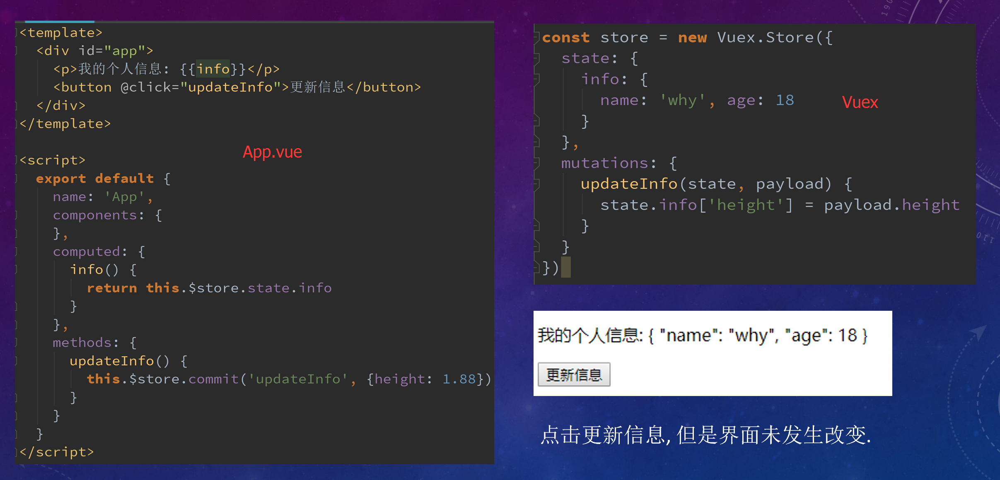


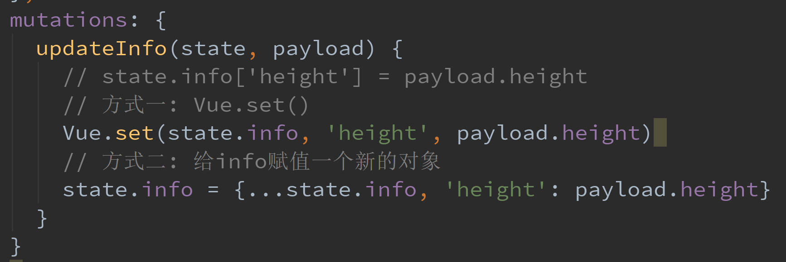

### Mutation常量类型

当我们的项目增大时, Vuex管理的状态越来越多, 需要更新状态的情况越来越多, 那么意味着Mutation中的方法越来越多.

创建一个文件: mutation-types.js, 并且在其中定义我们的常量

```javascript
// mutation_types.js
export const UPDATE_INFO = 'UPDATE_INFO';
```


定义常量时, 我们可以使用ES2015中的风格, 使用一个常量来作为函数的名称.

```javascript
// store/index.js

import * as types from './mutation_types'

mutations: {
  [types.UPDATE_INFO](state, payload) {
    state.info = {...state.info, 'height': payload.height};
  }
}
```


```javascript
import {UPDATE_INFO} from './store/mutation_types';

methods: {
    updateInfo() {
      this.$store.commit(UPDATE_INFO, {height: 30});
    }
}
```


### Mutation同步函数

通常情况下, Vuex要求我们Mutation中的方法必须是同步方法.不要在mutation中进行异步的操作

1. 主要的原因是当我们使用devtools时, 可以devtools可以帮助我们捕捉mutation的快照.
2. 但是如果是异步操作, 那么devtools将不能很好的追踪这个操作什么时候会被完成.


## Action

### Action的基本定义

但是某些情况, 我们确实希望在Vuex中进行一些异步操作, 比如网络请求, 必然是异步的

Action类似于Mutation, 但是是用来**代替Mutation进行异步操作**的.

Action的基本使用代码如下:

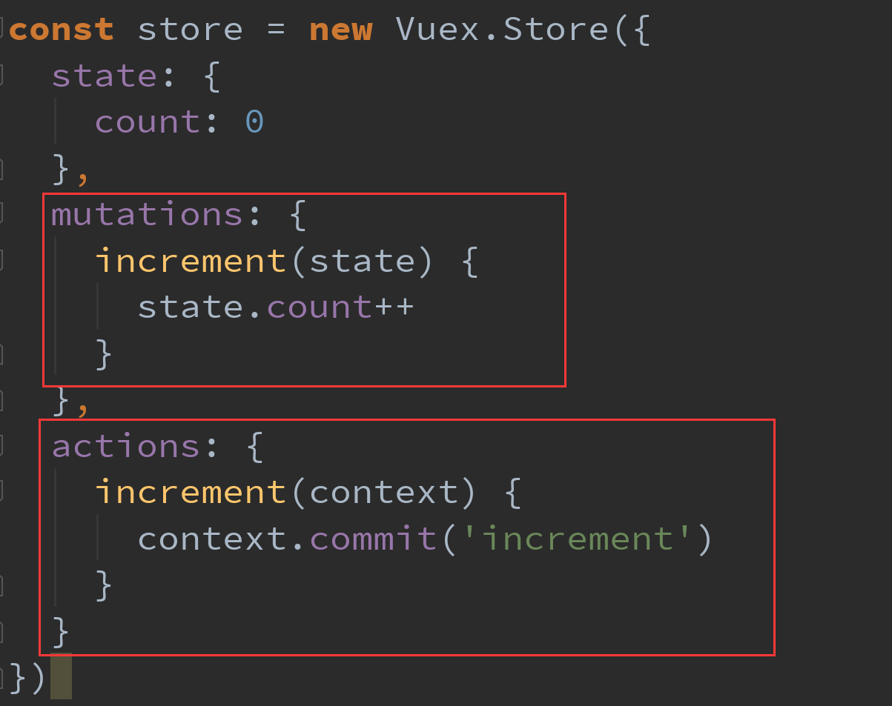


context是和store对象具有相同方法和属性的对象.

也就是说, 我们可以通过context去进行commit相关的操作, 也可以获取context.state等.

这里它们并不是同一个对象。在Vuex中有异步操作, 那么我们就可以在actions中完成了.

### Action的分发

在Vue组件中, 如果我们调用action中的方法, 那么就需要使用dispatch

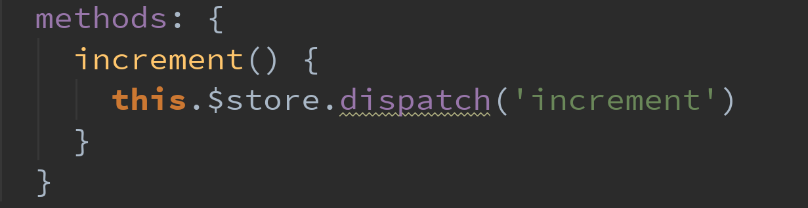


同样的, 也是支持传递payload

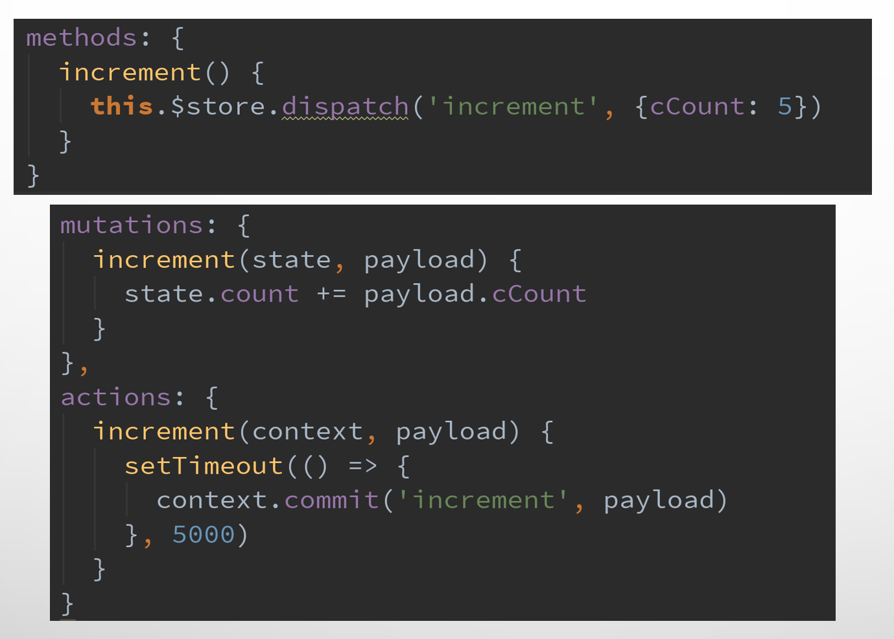


### Action返回的Promise

在Action中, 我们可以将异步操作放在一个Promise中, 并且在成功或者失败后, 调用对应的resolve或reject.

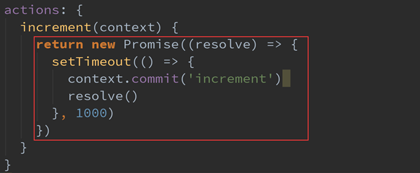


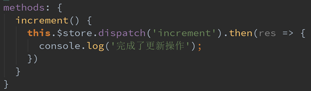


## Module

### 认识Module

store对象变得臃肿时，可以将store分割成模块。

Vuex允许将store分割成模块(Module), 而每个模块拥有自己的state、mutation、action、getters等
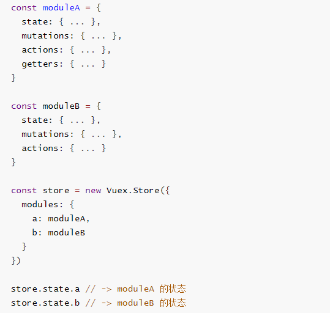


### Module局部状态

在moduleA中添加state、mutations、getters

mutation和getters接收的第一个参数是局部状态对象


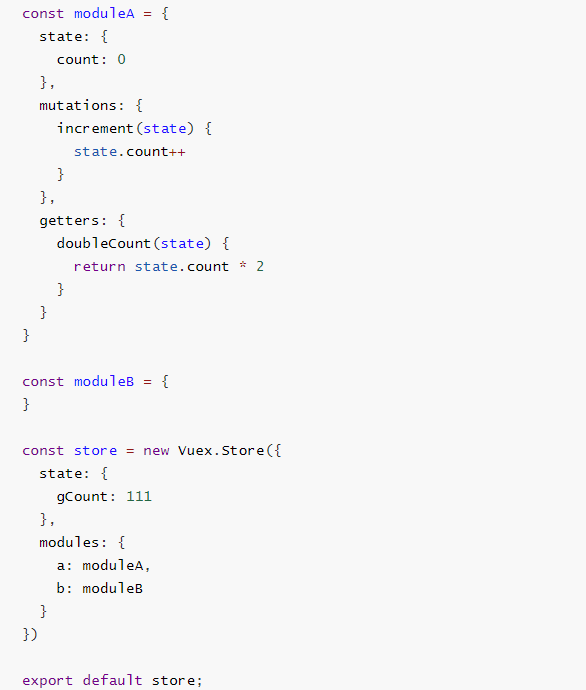


注意:

虽然, 我们的doubleCount和increment都是定义在对象内部的.

但是在调用的时候, 依然是通过this.$store来直接调用的.

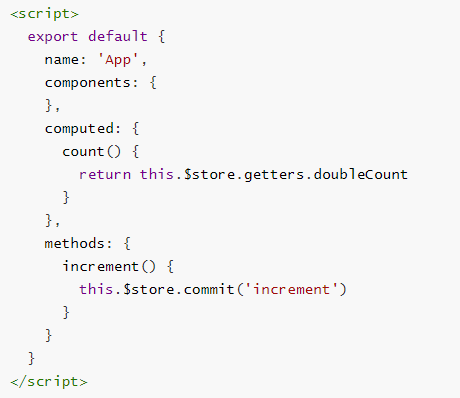


## Actions的写法

接收一个context参数对象

局部状态通过 context.state 暴露出来，根节点状态则为 context.rootState

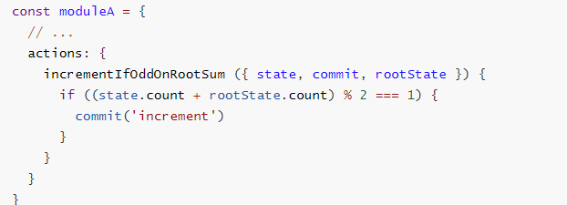


如果getters中也需要使用全局的状态, 可以接受更多的参数


## 项目结构

Vuex帮助我们管理过多的内容时, 好的项目结构可以让我们的代码更加清晰.


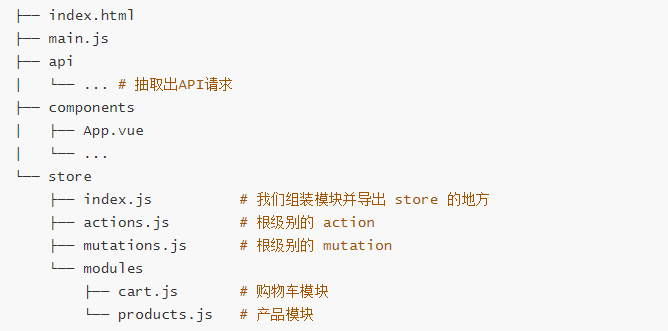


