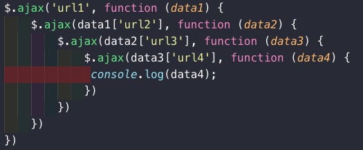
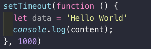
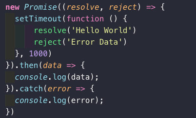
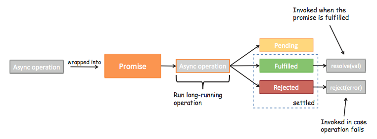
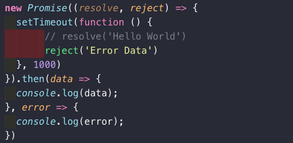
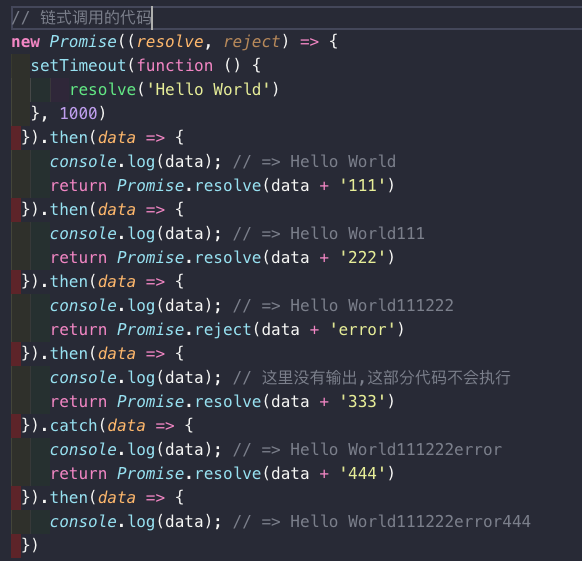
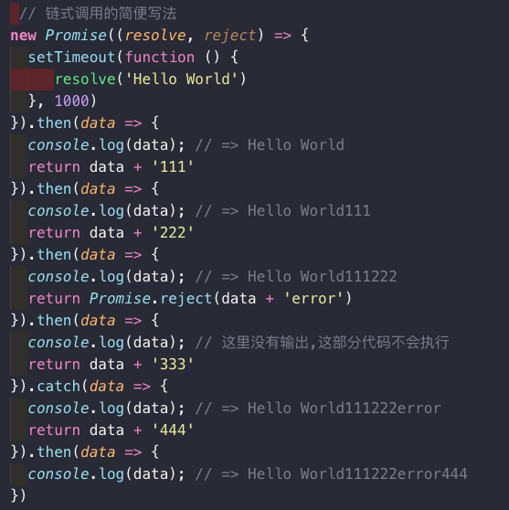

# ES6 Promise

## 什么是Promise

异步编程的一种解决方案


## 网络请求的回调地狱

1. 我们需要通过一个url1从服务器加载一个数据data1，data1中包含了下一个请求的url2
2. 我们需要通过data1取出url2，从服务器加载数据data2，data2中包含了下一个请求的url3
3. 我们需要通过data2取出url3，从服务器加载数据data3，data3中包含了下一个请求的url4
4. 发送网络请求url4，获取最终的数据data4





## 定时器的异步事件






## 定时器异步事件解析

1. new Promise很明显是创建一个Promise对象
2. 参数((resolve, reject) => {})是一个箭头函数。
3. resolve和reject它们两个也是函数，通常情况下，我们会根据请求数据的成功和失败来决定调用哪一个。
   1. 如果是成功的，那么通常我们会调用resolve(messsage)，这个时候，我们后续的then会被回调。
   2. 如果是失败的，那么通常我们会调用reject(error)，这个时候，我们后续的catch会被回调。 

## Promise三种状态

首先, 当我们开发中有异步操作时, 就可以给异步操作包装一个Promise

异步操作之后会有三种状态

1. pending：等待状态，比如正在进行网络请求，或者定时器没有到时间。
2. fulfill：满足状态，当我们主动回调了resolve时，就处于该状态，并且会回调.then()
3. reject：拒绝状态，当我们主动回调了reject时，就处于该状态，并且会回调.catch()







## Promise链式调用

Promise 无论是then还是catch都可以返回一个Promise对象。

代码还可以进行链式调用：

通过Promise包装了一下新的数据，将Promise对象返回了

Promise.resovle()：将数据包装成Promise对象，并且在内部回调resolve()函数

Promise.reject()：将数据包装成Promise对象，并且在内部回调reject()函数




## 链式调用简写

简化版代码：

如果我们希望数据直接包装成Promise.resolve，那么在then中可以直接返回数据

注意下面的代码中，我讲return Promise.resovle(data)改成了return data 结果依然是一样的




## async await

### async

async 作为一个关键字放在函数的前面，表示该函数是一个异步函数，意味着该函数的执行不会阻塞后面代码的执行 异步函数的调用跟普通函数一样

async 是一个函数的修饰符，加上 async 关键词的函数会隐式地返回一个Promise，函数的返回值将作为 Promise  resolve 的值。 要获取 Promise 的返回值应该用 then 方法

```js
async function timeout(){
    return "helloworld";
}
console.log(timeout());
console.log("我在异步函数后面，会先执行谁呢");
// Promise { 'helloworld' }
// 我在异步函数后面，会先执行谁呢
```


```js
async function timeout(){
    return "helloworld";
}
timeout().then((result)=>{
    console.log(result);
});
console.log("我在异步函数后面，会先执行谁呢");

// 我在异步函数后面，会先执行谁呢
// helloworld
```


此时先输出的就是后面的一串文字，说明异步函数的执行没有阻塞后面的代码执行，

加上 `async` 关键词的函数会隐式地返回一个 `Promise`

如果该函数中有一个返回值，当调用该函数时，默认会在内部调用`Promise.solve()` 方法，若函数内部抛出错误，则调用`Promise.reject()`

```js
async function timeout1(flag){
    if(flag){
        return "hello world";
    }else{
        throw new Error("error!!");
    }
}

console.log(timeout1(true));
console.log(timeout1(false));
// Promise {<resolved>: "hello world"}
// Promise {<rejected>: Error: error!!...}
```


既然`async`返回的是一个`Promise` 对象，那么`Promise` 的所有用法他都可以用，如`Promise.catch`捕获异常等

### await

await后面跟的一定是一个Promise，await只能出现在async函数内，await的语义是:必须等到await后面跟的Promise有了返回值，才能继续执行await的下一行代码，听起来是不是跟同步执行代码很类似


`await`即等待，用于等待一个`Promise`对象。

1. 它只能在异步函数 `async function`中使用，否则会报错
2. 如果 `await` 操作符后的表达式的值不是一个 `Promise`，那么该值将被转换为一个 `Promise`。
3. 它的返回值不是`Promise`对象而是`Promise`对象**处理之后的结果**
4.  `await`表达式会暂停当前 `async function`的执行，等待`Promise` 处理完成。
   1. 若 `Promise` 正常处理`(fulfilled)`，其回调的`resolve`函数参数作为 `await` 表达式的值，继续执行 `async function`，
   2. 若 `Promise` 处理异常`(rejected)`，`await` 表达式会把 `Promise` 的异常原因抛出。

```js
async function()
{
let str = await readFile("./a.txt")
if(str){
    let fr2 = await readFile(str)
    if(fr2){
        console.log(fr2)
    }
}
}
```


看起来是不是很完美?跟同步代码比只多了await。相比于Promise写法，它的好处是：

- 代码简洁明了，易于阅读和理解

- 抛出的异常可以被try catch捕捉到

- 对程序员也友好，await是可以步进到下一行代码的

- 不再需要多层.then方法

  假设一个业务分很多步骤完成，并且每个步骤都是异步，依赖上一个步骤的结果。