# 网络模块封装

## 常见的网络请求模块，以及优缺点对比。

Vue中发送网络请求有非常多的方式

选择一: 传统的Ajax是基于XMLHttpRequest(XHR)

为什么不用它呢?

1. 非常好解释, 配置和调用方式等非常混乱.
2. 编码起来看起来就非常蛋疼.
3. 所以真实开发中很少直接使用, 而是使用jQuery-Ajax


选择二: 在前面的学习中, 我们经常会使用jQuery-Ajax

相对于传统的Ajax非常好用.

为什么不选择它呢?

1. 首先, 我们先明确一点: 在Vue的整个开发中都是不需要使用jQuery了.
2. 那么, 就意味着为了方便我们进行一个网络请求, 特意引用一个jQuery, 你觉得合理吗?

jQuery的代码1w+行.

Vue的代码才1w+行.

完全没有必要为了用网络请求就引用这个重量级的框架.


选择三: 官方在Vue1.x的时候, 推出了Vue-resource.

Vue-resource的体积相对于jQuery小很多.

另外Vue-resource是官方推出的.

为什么不选择它呢?

1. 在Vue2.0推出后, Vue作者就在GitHub的Issues中说明了去掉vue-resource, 并且以后也不会再更新.
2. 那么意味着以后vue-reource不再支持新的版本时, 也不会再继续更新和维护.
3. 对以后的项目开发和维护都存在很大的隐患.


选择四: 在说明不再继续更新和维护vue-resource的同时, 作者还推荐了一个框架: axios

1. 
   axios有非常多的优点, 并且用起来也非常方便.


## JSONP的原理和封装

### JSONP原理回顾

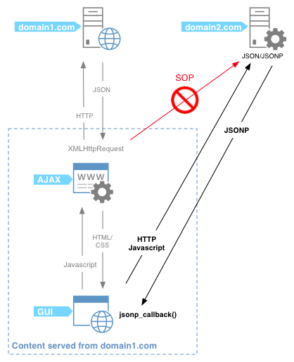

在前端开发中, 我们一种常见的网络请求方式就是JSONP

使用JSONP最主要的原因往往是为了解决跨域访问的问题.

JSONP的原理是什么呢?

JSONP的核心在于通过`<script>`标签的src来帮助我们请求数据.

原因是我们的项目部署在domain1.com服务器上时, 是不能直接访问domain2.com服务器上的资料的.

这个时候, 我们利用`<script>`标签的src帮助我们去服务器请求到数据, 将数据当做一个javascript的函数来执行, 并且执行的过程中传入我们需要的json.

所以, 封装jsonp的核心就在于我们监听window上的jsonp进行回调时的名称.

### JSONP请求封装

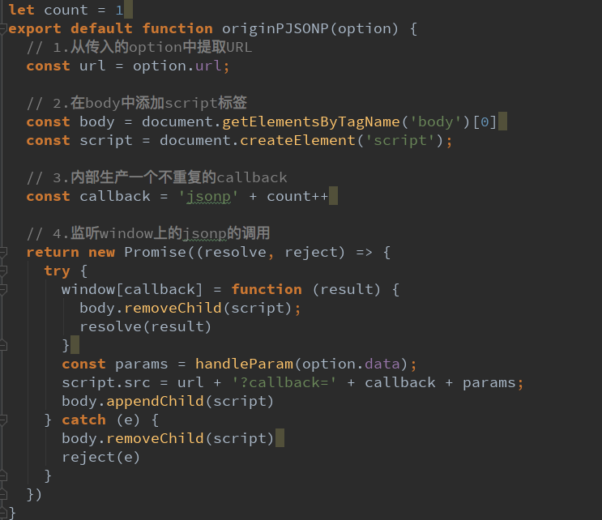


## axios的内容详解


### 认识axios网络模块

功能特点:

1. 在浏览器中发送 XMLHttpRequests 请求
2. 在 node.js 中发送 http请求
3. 支持 Promise API
4. 拦截请求和响应
5. 转换请求和响应数据


补充: axios名称的由来? 个人理解
没有具体的翻译.
axios: ajax i/o system


### 发送基本请求

支持多种请求方式:

1. axios(config)
2. axios.request(config)
3. axios.get(url[, config])
4. axios.delete(url[, config])
5. axios.head(url[, config])
6. axios.post(url[, data[, config]])
7. axios.put(url[, data[, config]])
8. axios.patch(url[, data[, config]])


#### 发送get请求演示

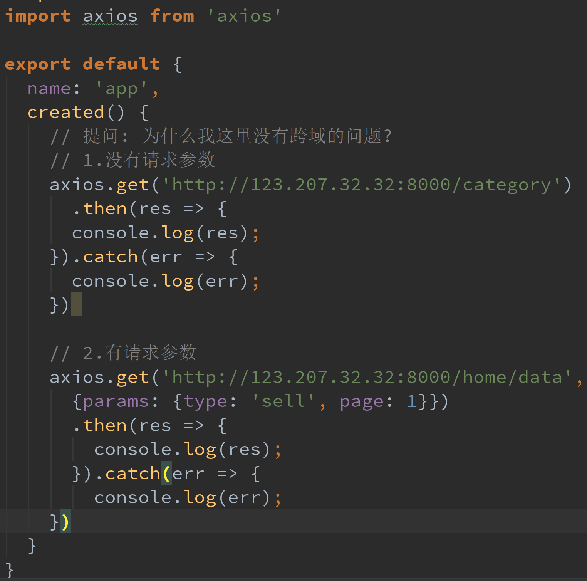


#### 发送并发请求

有时候, 我们可能需求同时发送两个请求

1. 使用axios.all, 可以放入多个请求的数组.
2. axios.all([]) 返回的结果是一个数组，使用 axios.spread 可将数组 [res1,res2] 展开为 res1, res2


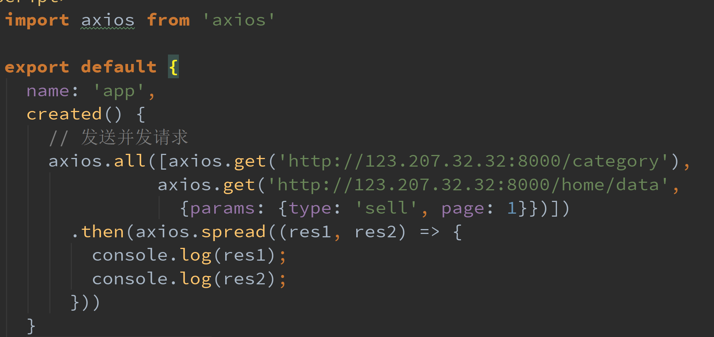


#### 全局配置

在上面的示例中, 我们的BaseURL是固定的

1. 事实上, 在开发中可能很多参数都是固定的.
2. 这个时候我们可以进行一些抽取, 也可以利用axiox的全局配置

```javascript
axios.defaults.baseURL = ‘123.207.32.32:8000’;
axios.defaults.headers.post[‘Content-Type’] = ‘application/x-www-form-urlencoded’;

```


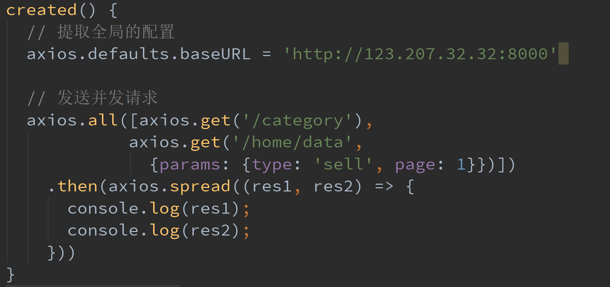


#### 常见的配置选项

1. 请求地址 url: '/user',
2. 请求类型 method: 'get',
3. 请根路径 baseURL: 'http://www.mt.com/api',
4. 请求前的数据处理 transformRequest:[function(data){}],
5. 请求后的数据处理 transformResponse: [function(data){}],

6. 自定义的请求头 headers:{'x-Requested-With':'XMLHttpRequest'},
7. URL查询对象 params:{ id: 12 },
8. 查询对象序列化函数 paramsSerializer: function(params){ }
9. request body data: { key: 'aa'},
10. 超时设置s  timeout: 1000,
11. 跨域是否带Token withCredentials: false,
12. 自定义请求处理 adapter: function(resolve, reject, config){},
13. 身份验证信息 auth: { uname: '', pwd: '12'},
14. 响应的数据格式 json / blob /document /arraybuffer / text / stream  responseType: 'json',

### axios创建实例

当我们从axios模块中导入对象时, 使用的实例是默认的实例.当给该实例设置一些默认配置时, 这些配置就被固定下来了.

当某些配置不一样.比如某些请求需要使用特定的baseURL或者timeout或者content-Type等.

这个时候, 我们就可以创建新的实例, 并且传入属于该实例的配置信息.


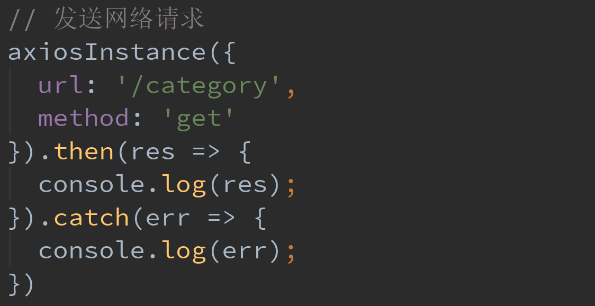


#### axios封装

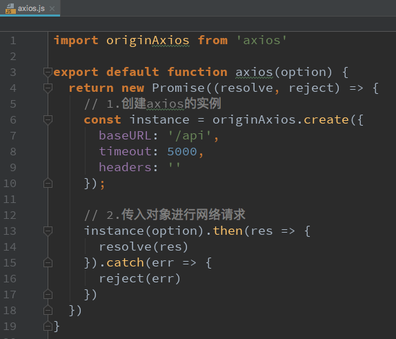


### axios拦截器的使用

axios提供了拦截器，用于我们在发送每次请求或者得到相应后，进行对应的处理。


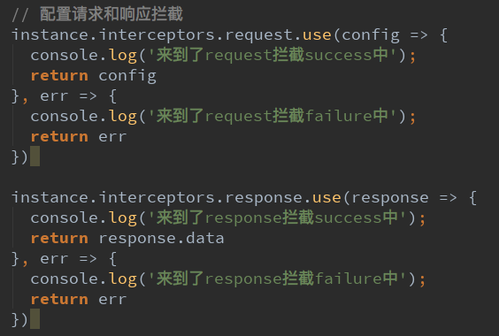


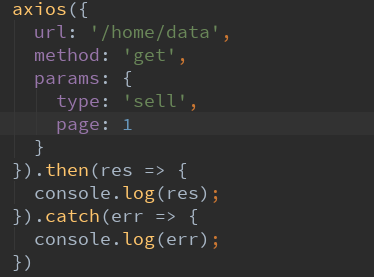


#### 请求拦截可以做到的事情：

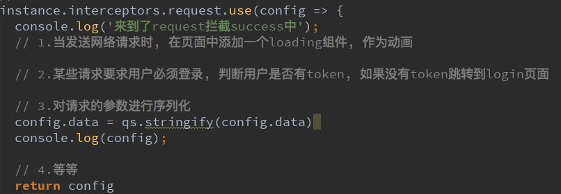


请求拦截中错误拦截较少，通常都是配置相关的拦截

可能的错误比如请求超时，可以将页面跳转到一个错误页面中。


#### 响应拦截中完成的事情：

响应的成功拦截中，主要是对数据进行过滤。


响应的失败拦截中，可以根据status判断报错的错误码，跳转到不同的错误提示页面。


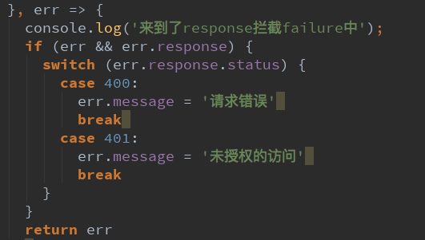