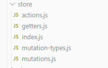

## 一、耦合

- 耦合是指两个或多个体系或运动形式间通过相互作用而彼此影响以至联合起来的现象。
- 对象之间的耦合度就是对象之间的依赖性。对象之间的耦合越高，维护成本越高。

### 解耦：

降低耦合度，让数据模型、业务逻辑和视图显示三层关系降低耦合，把**关联依赖**降到最低，不至于牵一发而动全身。

1. 例：如果两者间需要交互，可以通过接口、通过消息、甚至引入框架，就是不要直接交叉写。
2. 观察者模式：解耦的模式，它使观察者和被观察者的逻辑不再搅在一起，而是彼此独立、互不依赖。例：当用户切换为夜间模式时，被观察者就会通知所有的观察者‘设置改变，大家快蒙上遮罩’

#### 例：封装多个数据的请求

- 从服务器拿数据，就是对网络模块进行封装，再使用网络模块进行对数据请求

1. 封装 request.js 直接在相应的页面做网络请求
2. 单独封装首页的网络请求至 home.js 文件中

- 因为首页可能有多个请求，封装后可对其做统一管理，数据请求的url就不会与首页组件内容耦合
  **使得 home.vue 面向 home.js 开发，可降低耦合度**

```javascript
import {request} from './request'
export function getHomeMultidata() {
    return request({
        url: '/home/multidata'
    })
}
export function getHomeGoods(type, page) {
  return request({
      url: '/home/data',
      params: {
          type,
          page
      }
  })
}

```


## 二、发送网络请求

### created

- 要在组件创建好之后、页面渲染之前发送请求获取数据，在 created 生命周期函数中做请求

### 保存数据

- 获取数据后，将数据保存在 data 中，因为**函数里都是局部变量**，函数一旦执行完，函数里的变量就会被回收掉
- 函数调用时，是将数据压入函数栈里，函数栈就可保存函数调用过程中所有变量。函数调用结束，就会将数据弹出函数栈，即释放函数中的所有变量

### 简化 created 中的代码

created 钩子中只处理主要逻辑，将具体的方法实现放到 methods 中

```javascript
created () {
    // 将created钩子中的代码简化，处理主要逻辑，具体的方法实现交给methods
    // 1.请求多个数据
    this.getHomeMultidata()
    // 2.请求商品数据
    this.getHomeGoods('pop')
    this.getHomeGoods('new')
    this.getHomeGoods('sell')
  },
  methods: {
    // 网络请求相关方法
    getHomeMultidata () {
      getHomeMultidata().then(res => {
    //   console.log(res)
    // this.result = res
    this.banners = res.data.banner.list
    this.recommends = res.data.recommend.list
    })
    },
    getHomeGoods (type) {
      const page = this.goods[type].page + 1
      getHomeGoods(type, page).then(res => {
      this.goods[type].list.push(...res.data.list)
      this.goods[type].page += 1  /* 更新data中的页码 */
      this.$refs.scroll.finishPullUp() // 调用方法，多次上拉加载更多
    })
    }
  }

```


## 三、保存大量数据

### home页面中的分类数据

```javascript
data () {
    return {
        goods: {
          'pop': {page: 0, list:[]},
          'new': {page: 0, list:[]},
          'sell': {page: 0, list:[]}
        },
        currentType: 'pop',
      // ...
    };
}

```


### category页面中的分类数据

```javascript
methods: {
    _getCategory(){
      getCategory().then(res => {
      console.log(res);
      // 1.获取分类数据
      this.categories = res.data.category.list
      // 2.初始化每个类别的子数据
      for(let i=0; i<this.categories.length; i++) {
        this.categoryData[i] = {
          subcategories: {},
          categoryDetail: {
            'pop': [],
            'new': [],
            'sell': []
          }
        }
      }

```


### 在数组中保存数组数据

```javascript
this.goods[type].list.push(...res.data.list)
this.categoryData = {...this.categoryData}

```


## 四、better-scroll

### 设置高度

在相应的组件中为 scroll 组件设置固定高度，才能滚动

#### 计算高度

```css
/* 父元素：height: 100vh; */
/* 滚动元素：*/
height: calc(100% - 98px); 
overflow:hidden;

```


#### 定位

```css
overflow: hidden;
position: absolute;
top: 44px;
bottom: 49px;
left: 0;
right: 0;

```


### probeType

- probe 侦测
- probeType 0 不侦测， 1 延时侦测， 2 手指滚动的过程中才侦测，手指离开后的惯性滚动不侦测，3 侦测所有滚动

#### scroll 组件中配置

```js
// 2.监听滚动的位置
if(this.probeType===2 || this.probeType===3){
  this.scroll.on('scroll', position => {
    // console.log(position)
    this.$emit('scroll',position)
  })

```


#### 使用 scroll 的组件中设置，通过 `@scroll='contentScroll'` 传递事件

```javascript
contentScroll(position) {
  // console.log(position.y)
  // this.showTop = (-position.y) > 1000  绝对值Math.abs
  this.showTop = Math.abs(position.y) > 1000
  // 2.设置吸顶效果
  this.isTabFixed = (-position.y) > this.tabOffsetTop
},

```

#### probeType：3时，才能获取到滚动的 position，可用来设置回到顶部按钮的显示

### pullUpLoad

上拉加载更多

scroll 组件中配置

```javascript
if(this.pullUpLoad){ // pullUpLoad为true时，到达底部，为false的组件不用监听此事件，提升效率
        this.scroll.on('pullingUp',()=>{
          // console.log('bottom'); 到达底部时才触发函数
          this.$emit('pullingUp')
      })

```

使用 scroll 的组件中设置

```javascript
getHomeGoods (type) {
  const page = this.goods[type].page + 1
  getHomeGoods(type, page).then(res => {
      this.goods[type].list.push(...res.data.list)
      this.goods[type].page += 1  /* 更新data中的页码 */
      this.$refs.scroll.finishPullUp() // 调用方法，多次上拉加载更多
    })
}

```


在更新完第一页的数据后，滚动到底部时触发上拉加载更多的方法，这个数据请求要在初始化数据方法的后面执行

```javascript
activated () {
    // 进入时滚动到离开时的位置this.saveY
    this.$refs.scroll.scrollTo(0, this.saveY, 0)
    this.$refs.scroll.refresh() // 进入时再刷新，避免出现小问题
  },

```


由于图片是异步加载的，上拉时高度没有包含图片的高度，需要手动刷新


### 可滚动区域bug($bus解决)

- better-scroll 是根据 `scrollerHeight` 属性决定有多少区域可滚动的，而 scrollerHeight 属性值是根据content中元素的高度决定的
- 遇到数据请求是异步加载时，比如加载异步加载图片时，刚开始的 scrollerHeight 可能没有计算到图片，当图片加载完成后，scrollerHeight 值明显小于想要的值，所以滚动会出现问题
- 监听每一张图片是否加载完成，每一张图片加载完成，都执行一次refresh

1. 可利用 vuex 状态管理器，在 vuex 里设置一个属性，当item里图片加载完成后切换状态，当切换状态后，在home组件中刷新
2. 利用**事件总线**（专门管理事件的，可用于非父子组件间的通信）

```javascript
main.js  Vue.prototype.$bus = new Vue()
item组件  @load='imageLoad'  methods: imageLoad(){this.$bus.$emit('load')}
home组件  mounted () {this.$bus.$on('load',()=>{this.$refs.scroll.refresh()})}

```


利用防抖函数 `debounce`

```javascript
mounted () {
    // 1.监听item中图片加载完成，刷新防抖函数放到了utils.js中，工具库
     const refresh = debounce(this.$refs.scroll.refresh,50)
      // 对监听的事件进行保存，方便离开home组件时取消此事件监听
       this.itemImgListener = () => { refresh() }
       this.$bus.$on('itemImageLoad',() => {
         this.$refs.scroll.refresh()
         refresh() // 此处是闭包，局部变量不会被销毁
     })
       this.$bus.$on('itemImageLoad', this.itemImgListener)
  },

```


## 五、tabControl

### 点击切换数据

```js
methods: {
    itemClick (index) {
      this.currentIndex = index
      this.$emit('tabClick',index) /* 将子组件数据传递到父组件 */
    }
  }

```


```js
tabClick (index) {
      switch (index) {
        case 0:
          this.currentType = 'pop'
          break
        case 1:
          this.currentType = 'new'
          break
        case 2:
          this.currentType= 'sell'
          break
      }

```


### 吸顶效果

1. 获取到 tabControl 的 offsetTop （滚动这个距离后即吸顶）
2. 利用 $el 获取组件中的元素，图片加载完成后 offsetTop 值才正确
3. 监听轮播图图片加载完成

```js
swiperImageLoad () {
      // 获取tabOffsetTop的offsetTop
    this.tabOffsetTop = this.$refs.tabControl2.$el.offsetTop
    },

```


```js
contentScroll(position) {
      // console.log(position.y)
        // this.showTop = (-position.y) > 1000  绝对值Math.abs
        this.showTop = Math.abs(position.y) > 1000
        // 2.设置吸顶效果
        this.isTabFixed = (-position.y) > this.tabOffsetTop
    },

```


两个 tabControl 解决闪退

- 分别设置 ref=“tabControl1” 和2，再拿到 this.$refs.tabControl1.currentIndex
- 再在点击时将其等于index，就可关联两个 tabControl 的点击

```js
tabClick (index) {
      switch (index) {
        case 0:
          this.currentType = 'pop'
          break
        case 1:
          this.currentType = 'new'
          break
        case 2:
          this.currentType= 'sell'
          break
      }
      this.$refs.tabControl1.currentIndex = index
      this.$refs.tabControl2.currentIndex = index
    },

```


## 六、保留home组件离开时的状态和位置

1. 路由组件会自动 destroyed，要用 `keep-alive` ,让组件不自动销毁
2. 离开home组件时，保存一个位置信息 saveY，再进来时，将位置设置为原来保存的位置信息即可
3. 利用生命周期函数 activated(){} 和函数 deactivated(){}
   1. 进入是触发 `activated()`，退出时触发 `deactivated()`
   2. 页面第一次进入，钩子的出发顺序是 `created -> mounted -> activated`，退出时触发deactivated
   3. 当再次进入时，只触发 activated

```js
activated () {
    // 进入时滚动到离开时的位置this.saveY
    this.$refs.scroll.scrollTo(0, this.saveY, 0)
    this.$refs.scroll.refresh() // 进入时再刷新，避免出现小问题
  },
  deactivated () {
    // 保存离开时的位置信息到this.saveY
    this.saveY = this.$refs.scroll.getScrollY()
    // console.log(this.saveY);
    // 2.取消全局事件监听（主页图片加载的监听）因为此时设置了keep-alive，所以离开时调用的是deactivated()
    this.$bus.$off('itemImageLoad',this.itemImgListener)
  },

```


## 七、home组件跳转至详情页

1. 是 GoodsListItem 中的点击导致跳转到详情页，详情页为路由组件
2. 跳转详情页时，要将 item的 id 携带过去，才能根据 id 请求相应的数据
3. 动态绑定id，`path：'/detail/:id'`
4. 再在 item 组件中设置点击事件，改变路径：

```js
itemClick () {
      this.$router.push('/detail/'+this.goodsItem.iid)
    }

```

在 detail 组件中得到 id

```js
 created () {
    // 1.保存传入的id
    this.iid = this.$route.params.iid
    // 2.根据id请求数据
    getDetail(this.iid).then(res => {

```


**利用 $ router 改变路径，利用 $route 可获得当前路由的相关信息 params**


## 八、详情页detail

### 轮播图

由于之前将所有的路由组件 `keep-alive` ,所以此时点每个 goodsitem 都是同样的轮播图，所以要用 `exclude="Detail"`取消对 detail 路由组件的 keep-alive

```html
<keep-alive exclude="Detail">
  <router-view/>
</keep-alive>

```


### 网络请求数据杂乱

数据多，且乱，可在传递给组件时先将数据封装为一个对象，再将那一个对象传给组件

```javascript
export class GoodsParam {
    constructor(info,rule) {
        // images可能没有值，所以要判断一下
      this.image = info.images ? info.images[0] : '';
      this.infos = info.set;
      this.sizes = rule.tables
    }
}

```


在 detail.js 中封装为一个类，**面向对象封装**，就能将三个地方的信息整合在这个类（构造函数）里面，实例就能得到这些数据


### 展示数据

1. 展示数组中的多个图片，用一个img标签遍历
2. 展示的图片较多时，并且是垂直排列的，就会影响 better-scroll 的滚动，就想要将所有图片全部加载完成后再滚动，

```javascript
methods: {
    imgLoad () {
    //   this.counter +=1
    //   判断，等所有的图片都加载完后，只用进行一次的事件发送
    // 类似于防抖函数，防抖函数在detail组件中接收时应用，
    // 但由于detail组件已经做了混入，混入中也有防抖函数，所以可以将防抖函数保存在data中，就可以在detail组件中任意位置都可用了
      if(++this.counter === this.imagesLengeth){
          this.$emit('imgLoad')
      }
    }

```


在watch配置中监视图片的length

```
watch: {
    detailInfo () {
      this.imagesLengeth = this.detailInfo.detailImage[0].list.length
    }
  }

```


得到数据的键名，之后才开始

```html
<template>
    <div v-if="Object.keys(detailInfo).length !== 0 && detailInfo.detailImage[0].list !== null">

```


```shell
    否则会报错：Error in render: "TypeError: Cannot read property '0' of undefined"

```


### 时间数据

服务器返回的时间节点，一定是时间戳（秒），需要用 formatDate 函数转变时间戳为格式化的时间字符串

### 反复使用 goodListItem 组件展示图片

每个数据中图片的路径可能会不一致

```html
<div class="goods-item" @click="itemClick">
        

```


```js
computed: {
    showImage () {
      return this.goodsItem.image || this.goodsItem.img || this.goodsItem.show.img
    }
  },

```


### 监听goodListItem 组件在不同页面展示的图片的加载


#### 利用路由： if判断

- `this.$route.path.indexOf('/home')` 找出路径中有/home的路由组件，发送监听 homeImageLoad
- `this.$route.path.indexOf('/detail')` 对路径中有/detail的路由组件，发送监听detailImageLoad

```javascript
methods: {
    imageLoad () {
      // 1. 利用路由的路径判断发送哪个事件
       if(this.$route.indexOf('/home')){
         this.$bus.$emit('homeImageLoad')
       }else if(this.$route.indexOf('/detail')){
         this.$bus.$emit('detailImageLoad')
       }
    },

```


#### 离开组件时取消监听

在 goodListItem 里面仍然只发送一个 imageLoad 图片加载事件

```js
methods: {
    imageLoad () {
      this.$bus.$emit("itemImageLoad")
    },

```

在 home 组件中的生命周期函数 deactivated() 离开组件时触发的函数中做出设置：取消全局事件监听 `this.$bus.$off`

```javascript
deactivated () {
    // 保存离开时的位置信息到this.saveY
    this.saveY = this.$refs.scroll.getScrollY()
    // console.log(this.saveY);
    // 2.取消全局事件监听（主页图片加载的监听）因为此时设置了keep-alive，所以离开时调用的是deactivated()
    this.$bus.$off('itemImageLoad',this.itemImgListener)
  },

```


this.$bus.$off如果只传一个参数，意味着所有组件中这个事件监听都将被取消，利用第二个参数：函数，指定取消的位置，这个函数就是监听这个事件的函数，即mounted()中this.b u s . bus.bus.on后面跟的函数，要拿到这个函数就要将其保存到data里

```javascript
mounted () {
    // 可利用混入，减少重复代码
    // 1.监听item中图片加载完成，刷新防抖函数放到了utils.js中，工具库
     const refresh = debounce(this.$refs.scroll.refresh,50)
      // 对监听的事件进行保存，方便离开home组件时取消此事件监听
       this.itemImgListener = () => { refresh() }
       this.$bus.$on('itemImageLoad',() => {
       // this.$refs.scroll.refresh()
       refresh() // 此处是闭包，局部变量不会被销毁
     })
       this.$bus.$on('itemImageLoad', this.itemImgListener)
  },

```


再在Detail组件中设置 imageLoad 图片加载事件的监听

```js
 mounted () {
    // 利用mixin混入后，代替了下面的代码
       const refresh = debounce(this.$refs.scroll.refresh,50)
       this.itemImgListener = () => { refresh() }
      //  在此组件中监听itemImageLoad图片加载事件
       this.$bus.$on('itemImageLoad', this.itemImgListener)

```


没有对 Detail 组件keep-alive，所以在离开组件时取消图片加载事件的监听，要用 destroyed() 生命周期函数取消事件

```js
destroyed () {
    // 离开组件时取消图片加载监听事件
    this.$bus.$off('itemImageLoad', this.itemImgListener)
  },

```


## 九、mixin 混入

两个或多个组件中有公共代码，可以用 mixin 抽取出来

在 common 文件夹下创建 mixin.js

```js
// mixin 混入，此mounted 函数将与组件内的 mounted 函数合并，不冲突
// 混入时写的哪个函数，导入后就能实现相应函数的功能
import BackTop from 'components/content/backTop/BackTop'
// 封装回到顶部按钮
export const backTopMixin = { // 创建混入对象
  data () {
    return {
      showTop: false
    }
  },
  components: {
    BackTop
  },
  methods: {
    backTop () {
      this.$refs.scroll.scrollTo(0,0)
    }
  }
}

```


在需要的组件中导入

```javascript
import {itemListenerMixin} from 'common/mixin.js'
// 混入
  mixins: [itemListenerMixin],

```


## 十、详情页中navbar与内容的联动

### 点击 navbar 改变样式

1. 先拿到每个 navbar 对应的 index
2. 在 navbar 组件中传递点击事件时，同时将 index 传出去
3. 在 detail 组件中接收事件时 index 就是函数参数

```javascript
clickTitle (index) {
      this.currentIndex = index
      this.$emit('clickTitle', index)
    },

```


### 点击 navbar 跳转至相应位置

1. 获取到对应组件元素的 offsetTop
2. 再监听点击事件，进行跳转

```javascript
methods: {
    imgLoad () {
      this.$refs.scroll.refresh()
      this.getTopYs()
    },

```


```javascript
created () {
// 4. 为topYs设置防抖
    this.getTopYs = debounce(() => {
      this.topYs = []
      this.topYs.push(0)
      this.topYs.push(this.$refs.params.$el.offsetTop)
      this.topYs.push(this.$refs.comment.$el.offsetTop)
      this.topYs.push(this.$refs.recommend.$el.offsetTop)
      this.topYs.push(Number.MAX_VALUE) // 在数组末尾增加一个无限大的值，为了之后对数组做遍历
      console.log(this.topYs)
    },100)

```


```javascript
// 点击跳转
clickTitle (index) {
      // console.log(index);
      this.$refs.scroll.scrollTo(0,-this.topYs[index],1000)
    },

```


### 滚动内容区域与标题联动

1. 拿到内容区的滚动位置 position，监听滚动
2. 用 position.y 与当前组件的高度（保存在了topYs数组中）做对比

#### 3.1 普通做法

先 遍历，再判断高度的大小，为了防止对比频繁可将当前的index值保存在data中

```javascript
contentScroll (position) { // 根据scroll组件发出的scroll事件，获取到position值
    // 1.获取y值
      const positionY = - position.y
      // 2.将y值与组件内容高度做对比
      // console.log(this.topYs[0]); // 这里是undefined，得不到它的值，并且即使得到了也应该为负值，
      // console.log(positionY);
      let length = this.topYs.length
      // for(let i in this.topYs)  此方法获取的 i为字符串 要用parseInt(i) 或者 i*1 的方法将其转为数值
       for(let i=0;i<length;i++){
      // 1.普通做法
         if(this.currentIndex !== i && ((i < length -1 && positionY >= this.topYs[i] && positionY < this.topYs[i+1]) || (i === length -1 && positionY >= this.topYs[i]))){
        

```


#### 3.2 hack做法

**以空间换时间，提升性能**，因为要比较 i 和 i+1 ,所以可在数组后面再添加一个无限大的值`Number.MAX_VALUE`，并且遍历时只遍历到 i < length - 1

```javascript
this.getTopYs = debounce(() => {
      this.topYs = []
      this.topYs.push(0)
      this.topYs.push(this.$refs.params.$el.offsetTop)
      this.topYs.push(this.$refs.comment.$el.offsetTop)
      this.topYs.push(this.$refs.recommend.$el.offsetTop)
      this.topYs.push(Number.MAX_VALUE) // 在数组末尾增加一个无限大的值，为了之后对数组做遍历

```


```javascript
for(let i=0;i<length-1;i++){
          if(this.currentIndex !== i && (i<length-1 && positionY >= this.topYs[i] && positionY < this.topYs[i+1])){
            this.currentIndex = i
          console.log(i); // 因为此时打印非常频繁，所以将当前index保存为一个变量，在两个不等的情况下才打印，就不会很频繁
          console.log(this.topYs[i]); // 此处的值是正值
          this.$refs.nav.currentIndex = this.currentIndex
        }

```


## 十一、点击加入购物车

**加入购物车要携带商品的 iid，所以需要使用 `vuex` 来集中管理数据的变化**

在detail组件中获取到需要展示的商品的信息，封装到对象product中

```javascript
addToCart () {
      // 1.获取购物车需要展示的信息，因为有多个信息，所以可以放在一个对象里
      const product = {}
      product.image = this.topImages[0]
      product.title = this.goods.title
      product.desc = this.goods.desc
      product.price = this.goods.realPrice
      product.iid = this.iid // id一定要传，因为id是商品的唯一标识，是将id传给服务器获取到对应的商品


```


再将数据传递到store中

- 不能直接改变state中的数据this.$store.state.cartList.push(product)，因为改变 state 中的数据最好使用 mutations 或 actions 方法

```javascript
addToCart () {
      // 1.获取购物车需要展示的信息，因为有多个信息，所以可以放在一个对象里
      const product = {}
      product.image = this.topImages[0]
      product.title = this.goods.title
      product.desc = this.goods.desc
      product.price = this.goods.realPrice
      product.iid = this.iid // id一定要传，因为id是商品的唯一标识，是将id传给服务器获取到对应的商品

      // 2.将商品添加到购物车里
       this.$store.commit('addCart',product) commit是将product提交到store中mutations里的方法 addCart

```


在 store 中的 addCart 方法中接收数据，并将数据添加到 state 的常量中去

```javascript
addCart(state,payload){
        let oldProduct = state.cartList.find(item => item.iid === payload.iid)
        if(oldProduct){
             oldProduct.count += 1 
        }else{
            payload.count =1
             state.cartList.push(payload)
        }
    }

```


### 重构 mutations 中代码

- mutations 的唯一目的就是修改 state 的状态，所以 mutations 中的每个方法尽可能要单一，方便 devtools 查看 state 中状态的改变
- 但此时一个方法addCart,又要将数量加1，又要添加新的商品，同一个方法处理了两个改变。所以要将有逻辑判断的方法放到actions里操作，再给mutations操作来追踪变化

```javascript
mutations: {
    addCounter(state,payload){      [重构代码，将mutations中原本管理两个状态的一个方法函数放到actions里，并拆分成两个mutations方法函数]
        payload++
    },
    addToCart(state,payload){
        state.cartList.push(payload)
    }
},
actions: {
    //addCart(context,payload)
    addCart({state,commit},payload){
        let oldProduct = state.cartList.find(item => item.iid === payload.iid)
        if(oldProduct){
            commit('addCounter',oldProduct)    [commit,提交给state中mutations里的addCounter方法]
        }else{
            payload.count = 1
            commit('addToCart',payload)
        }
    }
}

```


### 重构 store 中代码

将 store 中的每个方法单独抽取到一个 js 文件中去




将 mutations 中的变量用常量代替

```js
// 定义为常量
export const ADD_COUNTER = 'add_counter'
export const ADD_TO_CART = 'add_to_cart'

```


可使用 mapState 映射函数

```js
import {mapGetters} from 'vuex' // 可以将方法解构
computed: {
    //   1.普通写法
    // cartLength () {
    // //   return this.$store.state.cartLish.length  将方法封装到getters之前的写法
    //   return this.$store.getters.cartLength   封装到getters之后的写法
    // }
    // 2.利用mapGetters解构 ， 还可用 mapState , mapActions
    ...mapGetters(['cartLength'])
  }

```


mapActions 必须放在 methods 里，因为 actions 里都是一些方法


### 添加购物车成功的弹窗 toast

- 添加成功 --> 弹出提示
- 在vuex里做了某个操作，想让外面的组件监听这一操作是否成功，就要用到 `promise`
- vuex 中的 actions 中的方法函数可以返回 promise 对象


```js
addCart(context,payload){ // dispatch可以返回一个promise，可用来监听事件成功与否，据此做弹窗toast效果
      return new Promise((resolve,reject) => {
        let oldProduct = context.state.cartList.find(item => item.iid === payload.iid)
        if(oldProduct){
            // oldProduct.count += 1 这样写也可以，但是无法在devtools中监视到状态变化
            // 将数量加1的情况分发到一个特定的方法中
            context.commit(ADD_COUNTER,oldProduct) // commit 提交到store中mutations里的方法addCounter中去
            resolve('当前商品数量+1')
            reject('wrong')
        }else{
            payload.count =1
            // context.state.cartList.push(payload)
            // 将添加商品的情况分发到另一个特定的方法中，使得mutations中的方法只对应一种改变
            context.commit(ADD_TO_CART,payload)
            resolve('添加新的商品')
        }
      })
    }

```


### 将 Toast 组件封装为插件

toast文件夹下新建 index.js

```js
const obj = {}
export default obj
```


在 main.js 中导入

```js
import toast from 'components/common/toast' // 1.引入插件
// 2.安装插件,就相当于调用了toast的install函数方法
Vue.use(toast) 

```


返回 index.js 中配置插件

```js
import Toast from './Toast' // 将toast组件导入进来，好添加组件中的元素
const obj = {}
obj.install = function(Vue){
    // 1.创建组件构造器
    const toastConstructor = Vue.extend(Toast)
    // 2.用new的方式，根据组件构造器，可以创建一个组件对象
    const toast = new toastConstructor()
    // 3.将组件对象手动地挂载到某一个元素上
    toast.$mount(document.createElement('div')) // 将toast组件对象挂载到div上
    // 4.挂载完之后，toast.$el对应的就是div
    document.body.appendChild(toast.$el)
    Vue.prototype.$toast = toast // 将toast组件对象放在vue原型上，使得其他任意组件都可使用$toast方法使用toast组件对象
}
export default obj

```


## 十二、cart 组件数据展示


### navbar上商品的数量

- 可将实时展示的购物车的数量用 vuex 的 `getters` 做封装，再引入vuex 的 `mapGetters` 做解构引入

```js
computed: {
    //   1.普通写法
    // cartLength () {
    // //   return this.$store.state.cartLish.length  将方法封装到getters之前的写法
    //   return this.$store.getters.cartLength   封装到getters之后的写法
    // }
    // 2.利用mapGetters解构 ， 还可用 mapState , mapActions
    ...mapGetters(['cartLength'])
  }

```


```js
// getters.js 中
export default {
    cartLength (state) {
       return state.cartList.length
    },
    cartList (state) {
        return state.cartList
    }
}

```


### 购物车商品的展示

#### 刷新界面

由于新加入的商品可能未被 better-scroll 所获取，所以导致不能滚动，可以在进入购物车时就做一次刷新

```js
activated () {
    // console.log('0000');
    this.$refs.scroll.refresh()
  }

```


#### 商品的选中状态

商品状态要保存到 state 中

- 记录商品的**选中状态**，不能用属性记录，要在商品对应的对象模型里记录，之后修改也是修改对象模型里的某个属性来进行修改
- **对象模型**即 cartList[商品1，商品2] 中的商品模型，为商品模型设置一个 checked 属性，记录它的选中与否

```js
[ADD_TO_CART](state,payload){
        payload.checked = true // 购物车中商品是否选中的属性，默认添加即选中
        state.cartList.push(payload)
      }

```

 

```vue
<cart-list-item  v-for="(item,index) in cartList" 
            :key="index" 
            :item-info='item'>
</cart-list-item>
<script>
computed: {
    ...mapGetters(['cartList'])
  },
</script>
```


- 因为模型发生改变，界面才发生改变，在 mutations 中添加payload.check=true，相当于对 cartList 中的商品对象 itemInfo 添加了一个属性 check

```js
methods: {
    checkClick () {
      this.itemInfo.checked = !this.itemInfo.checked
    } 
  }

```


#### 底部信息汇总

##### 计算总价

通过 `filter` 选出被选中的商品，再通过 `reduce` 计算总额

```js
computed: {
    ...mapGetters(['cartList']),
    totalPrice () {
    //   return '￥' + this.$store.state.cartList.filter(item => {
      return '￥' + this.cartList.filter(item => {  // mapGetters结构之后这样写
          return item.checked}).reduce((preValue,item) => {
              return preValue + item.price * item.count
          },0).toFixed(2) // toFixed(2) 计算结果保留2位小数
    },

```


##### 设置全选按钮

- 初始状态：购物车没有商品时默认不选中

```js
isSelectAll () {
      if(this.cartList.length === 0) return false  // 购物车中没有商品时，默认不选中

```


- 只要有一个未被选中，则不选中全选按钮，用 `find` 性能最高

```js
isSelectAll () {
        // 1. filter会将数组全部遍历完
        // if(this.cartList.length === 0) return false
    //   return !(this.cartList.filter(item => !item.checked).length) // 对未被选中的商品长度进行取反，0取反为true
    // 2.简单遍历，也会全部遍历完
    // for(let item of this.cartList){
    //     if(!item.checked){ // 没有选中的情况为真
    //             return false
    //         }
    //     }
    //         return true
    // 3. find 只找到一个就不找了，性能会高一点
      if(this.cartList.length === 0) return false  // 购物车中没有商品时，默认不选中
      return !(this.cartList.find(item => !item.checked)) // (括号里面有值的情况下再取反，结果就为false)
    }

```


## 十三、fastclick

解决移动端300ms延迟

```js
import FastClick from 'fastclick'
// 解决移动端300ms延迟
FastClick.attach(document.body)

```


## 十四、图片懒加载

图片需要显示在屏幕时再加载

安装：`npm i vue-lazyload -s`

```js
import VueLazyLoad from 'vue-lazyload'
Vue.use(VueLazyLoad, {
  loading: require('./assets/img/common/placeholder.png')
})

```


使用

```html
 
```


## 十五、px2vm

webpack 配置，移动端适配

1. 安装 npm i postcss-px-to-viewport --save-dev 只是开发时依赖，只在打包过程中帮助转化
2. 修改 postcss.config.js 文件


## 十六、 服务器

- 服务器也是一台电脑（没有显示器，只有主机），24小时开着，为用户提供服务
- 大部分公司都没有自己的服务器主机，因为自己买主机还要建一个机房，还要考虑散热问题，还有维护主机的成本，所以一般都会租借阿里云、华为云、腾讯云的服务器
- 服务器、主机就必须要有一个操作系统，window(.net)/linux ->安装tomcat/nginx(服务器上的软件、服务器) [nginx可有效处理并发项目、反向代理]
- build打包之后有一个dist文件夹，将dist文件夹放到服务器里就行

### 部署nginx

#### nginx 版本

mainline version 主力做的版本，开发版

stable version 最新稳定版，生产环境上建议使用的版本

legacy version 遗留的老版本的稳定版

#### 将自己的电脑变成一台服务器，在window上面部署nginx

- 下载nginx
- 将打包生成的dist文件夹放入nginx文件夹下就可通过localhost访问

#### 远程部署，需要安装一些软件再操作

- linux ubantu操作系统，就可通过图形化界面的方式来进行管理
- linux centos操作系统，稳定性更强
  - 在远程主机上通过linux centos 来部署nginx，
  - 安装：通过终端命令来安装nginx