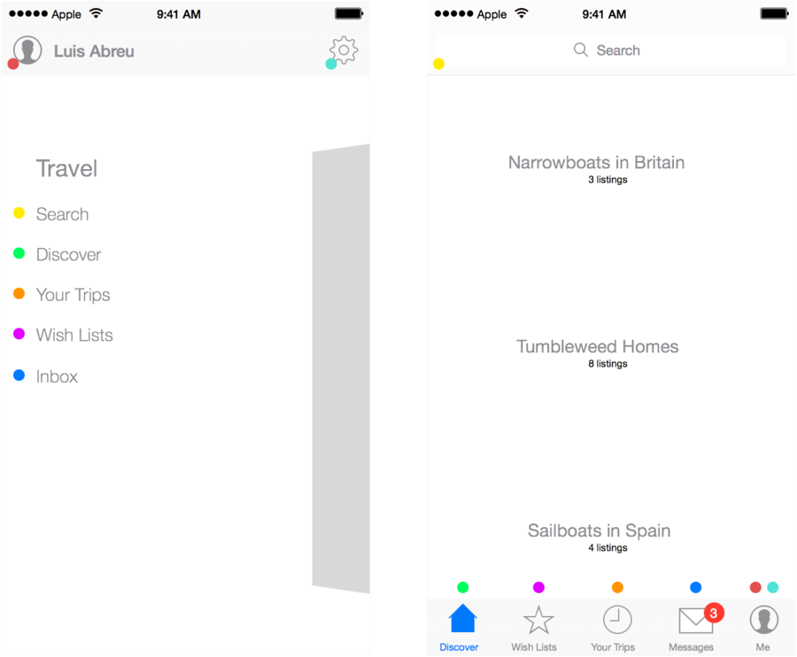
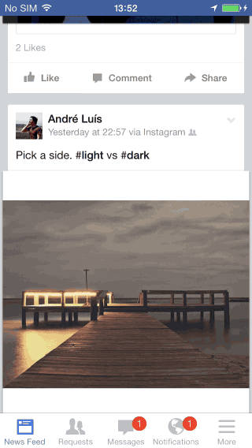
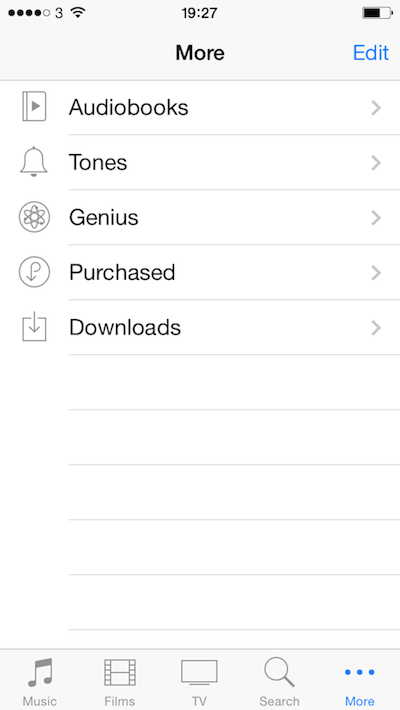

## 侧拉菜单——弊大于利的导航模式

## 一、问题所在

1. 难于发现
2. 效率低下
3. 在某些平台下，和平台固有的导航设计模式有所冲突
4. 无法一瞥既得

### 1.难于发现

“如果看不到，那么自然便想不到”

在默认状态下，侧边菜单（汉堡菜单）的内容是隐藏的

传统的经验是：最重要、最常使用的功能放置在首屏。然而汉堡菜单打破了这一惯例。用户首先要去了解汉堡菜单是可以激活/关闭的——尽管汉堡菜单现在极为流行，但是很多应用都会在用户初次使用时提示用户，否则一些新手用户很可能无法在主屏上找到主要功能。

### 2.效率低下

当用户知道在侧边可以开启导航菜单后，新的问题出现了：这种设计模式会强迫，逼迫用户打开应用之后立马开启侧边菜单，否则无法进行操作。

相对于下面传统的标签栏导航设计，我们可以看到，传统的设计模式，所有功能/元素直接陈列在主屏幕中，用户打开应用后可以立即操作。

### 3.和平台固有的导航模式有所冲突

在iOS平台下，问题尤为突出，和iOS标准的导航设计模式有所冲突，iOS中，一般左上角是返回。而汉堡菜单的开启图标，一般也位于右上角。

### 4.无法一瞥既得

设计者简化了视觉，却提高了应用的理解难度（以及操作复杂度）——好看的未必适用。

### 5.认知问题

为了节省屏幕空间而违背一些最基本的人机交互定则？应用需要有焦点区域，应用需要有明确的导航，让用户知道自己身处层级的何处。

## 二、解决之道

汉堡菜单设计模式不太实用，仅仅在个别案例中有效。

**解决方案是重新审视信息架构**

上图便是改动方案，左图中的彩色小点转换为右图中标签栏中的标签。

### 谨记:

1.要在标签栏中清晰的展示用户所处的功能界面。

2.要保证所有功能元素的可见性和可达性。

3.不要有导航手势的冲突。

解决了侧边菜单所导致的交互问题之后，其实用标签栏导航同样可以节省屏幕空间：根据滚动方向来选择是否隐藏导航栏——请看Facebook应用和Safari。固定的标签栏能够清晰的暗示用户当前所处的位置。

[忍不住多说几句]网站不要无脑抄袭iOS的导航模式，对于某些重形网站来说，重新审视一遍信息架构，再进行移动端设计，比完全照搬iOS导航模式的效果要好得多。

### 3.如何扩展标签栏导航模式

下图所给的案例全部基于iOS，可以解决标签栏扩容问题。

某些情况下，应用的功能点超过了5个（标签栏大致可以容纳5个标签），可是如果需要扩展怎么办？目前主流的标签栏导航模式中，都采用下图这种办法，提供了一个“更多”图标，点击后会进入另外一个界面，这种效果并不理想，因为跟侧拉菜单一样——功能被隐藏了。如果要扩展的内容超多，可以考虑使用这种方法。

另外一种方法可以参考Rookie，可以滑动标签栏。但是也有缺点，容错率较低，点击手势和滚动手势可能会冲突，可能会出现误操作。

第二种方法，更适合交互操作的选择，导航功能上稍微弱一点。

