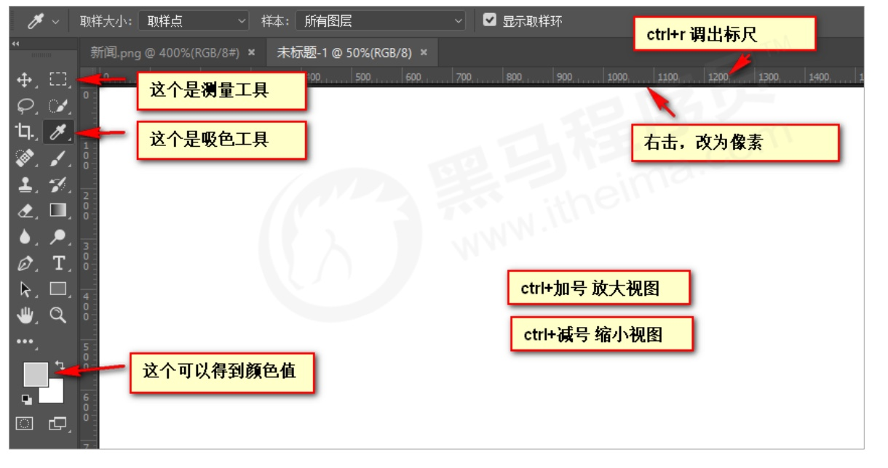

# 工具使用

## Snipaste

Snipaste 是一个简单但强大的截图工具，也可以让你将截图贴回到屏幕上. 

常用快捷方式:

F1 可以截图. 同时测量大小, 设置箭头 书写文字等

F3 在桌面置顶显示

点击图片, alt 可以取色 (按下shift 可以切换取色模式)

按下esc 取消图片显示

## VScode

### 插件推荐

| 插件                     | 说明                           |
| ------------------------ | ------------------------------ |
| Chinese                  | 中文语言包                     |
| Open in Browser          | 右击选择浏览器打开html文件     |
| JS-CSS-HTML Formatter    | 每次保存，都会格式化代码       |
| Auto Rename Tag          | 自动重命名配对的HTML/XML标签   |
| CSS Peek                 | 追踪至样式                     |
| escook-theme             | 黑马刘龙彬老师主题             |
| Community Material Theme | 设置颜色主题                   |
| Live Server              | 自动监测代码修改并在浏览器响应 |
| vscode-icons             | 设置文件图标作主题             |

## Chrome 调试工具

Chrome 浏览器提供了一个非常好用的调试工具，可以用来调试我们的 HTML 结构和 CSS 样式。

**使用调试工具**

① Ctrl+滚轮 可以放大开发者工具代码大小。 

② 左边是 HTML 元素结构，右边是 CSS 样式。 

③ 右边 CSS 样式可以改动数值（左右箭头或者直接输入）和查看颜色。 

④ Ctrl + 0 复原浏览器大小。 

⑤ 如果点击元素，发现右侧没有样式引入，极有可能是类名或者样式引入错误。

⑥ 如果有样式，但是样式前面有黄色叹号提示，则是样式属性书写错误。

## VSCode使用Emmet语法

Emmet语法的前身是Zencoding，它使用缩写，来提高html/css的编写速度Vscode内部已经集成该语法。

快速生成HTML结构语法
快速生成CSS样式语法

### 1 快速生成HTML结构语法

生成标签直接输入标签名按tab健即可比如div 然后tab键.就可以生成
 

如果想要生成多个相同标签加上"就可以了比如div*3 就可以快速生成3个div
如果有父子级关系的标签,可以用> 比如ul>li就可以了
如果有兄弟关系的标签,用+就可以了比如div+p
如果生成带有类名或者id名字的，直接写.demo或者#two tab 健就可以了
如果生成的div类名是有顺序的,可以用自增符号$
如果想要在生成的标签内部写内容可以用{}表示

### 2 快速生成CSS样式语法

CSS基本采取简写形式即可。

比如w200按tab可以生成width: 200px;
比如Ih26按tab可以生成line-height: 26px;

### 3 快速格式化代码

Shift + Alt + F

也可以设置当我们保存页面的时候自动格式化代码：

vsCode 代码格式化（Ctrl+S自动格式化代码+保存）

只需要设置一次即可，以后都可以自动保存格式化代码

## PS

### PS 基本操作

因为网页美工大部分效果图都是利用 PS（Photoshop）来做的，所以以后我们大部分切图工作都是在 PS 里面完成。 

选择 文件，打开 ：可以打开我们要测量的图片

Ctrl+R：可以打开标尺，或者 选择 视图 标尺

右击标尺，把里面的单位改为像素

Ctrl+ 加号(+)可以放大视图， Ctrl+ 减号(-)可以缩小视图

按住空格键，鼠标可以变成小手，拖动 PS 视图

用选区拖动 可以测量大小

Ctrl+ D 可以取消选区，或者在旁边空白处点击一下也可以取消选区

因为网页美工大部分效果图都是利用 PS（Photoshop）来做的，所以以后我们大部分切图工作都是在 PS 里面完成。

### PS切图

PS 有很多的切图方式：图层切图、切片切图、PS 插件切图等。

👉图层切图
最简单的切图方式：右击图层 ➡导出 PNG 切片。

👉切片切图
利用切片选中图片
利用切片工具手动划出
导出选中的图片
文件菜单➡存储为 web 设备所用的格式➡选择我们要的图片格式➡存储

👉PS插件切图🔥
Cutterman 是一款运行在 Photoshop 中的插件，能够自动将你需要的图层进行输出，以替代传统的手工 “导出 web 所用格式” 以及使用切片工具进行挨个切图的繁琐流程。

官网：Cutterman官网

注意：Cutterman 插件要求你的 PS 必须是完整版，不能是绿色版，所以大家需要安装完整版本

## 浏览器兼容性查看工具

**页面布局技术选型**

网站：https://caniuse.com/
